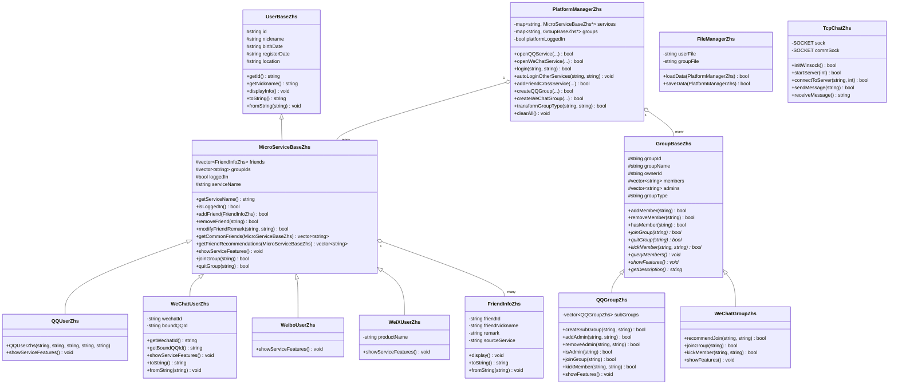

2024软件学院C++课程设计


课程设计目的：

1、熟悉利用面向对象的方法以及C++的编程思想来完成系统的设计； 

2、锻炼学生在设计的过程中，建立清晰的类层次，应用继承和多态等面向对象的编程思想；

3、通过本课程设计，加深对面向对象程序设计课程所学知识的理解，熟练掌握和巩固C++语言的基本知识和语法规范,深刻体会面向对象的编程思想，掌握使用面向对象程序设计语言C++，学会编写结构清晰、风格良好的C++语言程序，从而具备利用计算机编程分析解决综合性实际问题的初步能力。

课程设计题目：模拟即时通信系统实现

一、题目描述

   基于社交的即时通信是腾*公司的主要业务，先后有QQ、微信、微博等服务，可能还将继续推出微商、微唱、微走、微笑等产品。这些软件既可以独立提供服务，又互相辉映关联。腾*公司希望对各系统进行整合，形成统一的立体社交软件平台。现请完成该平台的设计并实现。要求如下：

   1、用户基本信息：

   号码ID，昵称，出生时间，T龄（号码申请时间）、所在地、好友列表、群列表。

   微博与QQ共享ID，微信采用独立ID，但是可以与QQ号码绑定对应。其他微X产品也分为这两种情况。

   2、好友管理

   （1）实现各功能好友信息的添加、修改、删除、查询的功能。

   （2）可以查询微X之间各自共同好友。如微信可以添加QQ推荐好友。

   3、群管理

   （1）设定每个微X功能已有1001、1002、1003、1004、1005、1006等群号。

   （2）加入群、退出群、挨T、查询群成员等。

   （3）不同微X之间群的理念不同，比如：QQ群可以申请加入，而微信群则只能推荐加入；QQ群允许设置临时讨论组（子群），微信群则不允许；QQ群有以群主为核心的管理员制度，而微信群仅有群主为特权账号。

   4、开通管理

   用户可以选择自己开通该平台的N个微X服务。

   5、登录管理

   各微X之间只要有一个服务登录，则其它服务简单确认后视为自动登录。

   6、功能展示要求（main函数）

   （1）设计约定。开通服务情况、群成员信息和好友信息可以预先保存到文件中，在系统启动时将这些信息加载到内存中；

   （2）一个服务登录后，本人开通的其它所有服务均进入开通状态。

   （3）服务之间可以依据本人开通的任意另外一个服务的好友添加好友。

   （4）展示一个服务当前群的特色功能；在群成员数据不受伤害的前提下，动态变换为其他类型群的管理特色。

   （5）实现QQ的点对点的TCP通信的收发功能。(选做）提示：

        a）需要加载ws2_32.lib静态库，打开头文件winsock.h。

        b）百度IP地址、端口等概念；

　　　　c）百度socket编程，关注bind、listen、accept、connect、send、receive等函数用法。

二、技术层次要求及说明

　　1、基本层次。

　　   完成上述功能要求，所采用技术不限，比如采用纯面向过程思想实现；

　　2、支持对象层次。

　　   正确完成了类的切割，利用对象技术实现。

　　   （1）容器类主要包括：例如，微X成员管理。

　　   （2）其它主要类包括：例如，微X信息、群信息、好友信息。

　　3、抽象、封装层次

　　   采用了继承或者组合实现复用，对数据成员提供了必要的接口保护；

　　   （1）抽象出了基础类，并被其它功能复用；

　　   （2）如好友维护、群信息维护等操作均应该提供接口形式；

　　4、面向对象层次

　　   支持多态功能，支持依据设计原则的优化。

　　    好友管理、群管理等；

　　5、优化提高层次

　　   （1）提供简便菜单，以1、2等数字区分几类功能，并允许返回菜单；

       （2）I/O操作支持。基本功能中，已有设定信息，在初始化时候可以固化在程序代码中，也可以存放在文件中，每次容器实例化时读入，析构时写回文件中，以实现断电保存。

　　   （3）可扩展性支持，需要考虑群、好友等与主要服务之间的关系；

　　   （4）灵活性支持。群的管理模式动态可变；

　　   （5）程序有必要的注释；

　　   （6）可以采用UML工具画出简单类图

　　   （7）为防止不诚信行为，要求类的设计均以独立文件存在，且所有的类名称后面应有自己的姓名缩写，如张三设计的QQ信息类名称：TencentZhS。

三、设计步骤(参考 )：

在清楚上述系统功能要处理是什么的基础上，考虑用如下方式来设计

1、确定所需的类及其相互间的关系。  

   （1）要从问题中归纳出一个概念或实体，从这些概念或实体出发建立相应的类。

（2）尽量使类小而简单，以使其看起来容易理解。

（3）充分利用封装以增加类的可靠性，以便使用时保证更加可靠。

（4）通过继承建立类族，以方便使用多态性。 

2、确定每个类的实现。

   （1）考虑类的对象应该如何构造和析构。

   （2）考虑类的成员函数的建立。

   （3）综合考虑各个类在命名和功能方面有哪些共性。

3、细化有关的类，描述他们之间的相互关系，即类关系和对象关系。

4、描述本系统的界面，通过分别定义成员的不同属性，为抽象和实现提供分离的接口。  

四、设计工具

1、设计工具：建议使用.net 系列中的C++ 编译器，但不局限于此。

2、不提倡使用MFC和可视化开发技术。

五、设计报告

（报告的具体格式附后）

六、考核方式

1、在设计结束前的最后一天检查程序并接受质疑。

2、检查程序前须提交设计报告（按提交报告的先后顺序检查程序）。

七、考核标准：

 参照5个技术层次划分。

八、课程设计后作业（不考核）

   引入可视化设计，在本课程设计基础上实现可视化QQ即时通信功能，包括： 多人聊天；聊天记录查询。需要涉及知识如下：

　　1、网络通信编程；

 2、可视化编程；

 3、多线程编程；

 4、数据库编程；

 


《面向对象程序课程设计》课程设计报告


班级：			学号：			姓名：

一、 设计任务分析

本次课程设计的题目为"模拟即时通信系统实现"。该系统要求基于腾*公司的社交即时通信业务（QQ、微信、微博等微X产品），设计并实现一个统一的立体社交软件平台。

**系统主要功能需求包括：**

1. **用户基本信息管理**：号码ID、昵称、出生时间、T龄、所在地、好友列表、群列表。其中微博与QQ共享ID，微信采用独立ID但可与QQ绑定。
2. **好友管理**：实现各功能好友信息的添加、修改、删除、查询，支持查询微X之间的共同好友，支持跨服务好友推荐与添加。
3. **群管理**：设定1001、1002等群号，实现加入群、退出群、踢出成员、查询群成员等功能。不同微X群的管理理念不同（QQ群可申请加入、支持子群和管理员制度；微信群只能推荐加入、无子群、仅有群主特权）。
4. **开通管理**：用户可自主选择开通N个微X服务。
5. **登录管理**：各微X之间只要有一个服务登录，其它服务简单确认后视为自动登录。
6. **功能展示（main函数）**：要求从文件加载数据，展示自动登录、跨服务加好友、群的特色功能动态变换，以及QQ点对点TCP通信（选做）。

**技术层次要求涵盖五个层次**：从纯面向过程到支持对象、抽象封装、面向对象（继承与多态），再到优化提高层次（菜单、文件I/O、可扩展性、灵活性、注释、UML类图、类名加姓名缩写等）。

二、 设计方案

### 2.1 总体设计思路

本系统采用**分层抽象、继承多态**的面向对象设计思想，将问题域中的实体抽象为类，通过类的层次结构实现代码复用和功能扩展。总体架构分为三层：

- **基类层**：抽象出共性，定义通用接口
- **派生类层**：继承基类，重写特色功能，体现多态
- **管理类层**：容器聚合，统一管理对象生命周期和业务逻辑

### 2.2 类的层次结构

系统中主要的类及其关系如下：

- **用户类族**：`UserBaseZhs` → `MicroServiceBaseZhs` → `QQUserZhs` / `WeChatUserZhs` / `WeiboUserZhs` / `WeiXUserZhs`
- **群类族**：`GroupBaseZhs`（抽象基类）→ `QQGroupZhs` / `WeChatGroupZhs`
- **好友类**：`FriendInfoZhs`
- **管理类**：`PlatformManagerZhs`（平台容器管理）、`FileManagerZhs`（数据持久化）
- **网络类**：`TcpChatZhs`（选做，Winsock通信）

### 2.3 UML类图



### 2.4 技术层次体现

| 层次 | 本设计中的体现 |
|------|----------------|
| 基本层次 | 完成所有功能要求，采用菜单驱动交互 |
| 对象层次 | 正确切割类：User、Group、Friend、Manager等容器/实体类 |
| 抽象封装 | `UserBaseZhs`、`GroupBaseZhs`、`MicroServiceBaseZhs`作为抽象基类被复用；数据成员protected/private，提供getter/setter接口保护 |
| 面向对象 | `GroupBaseZhs`定义纯虚函数，`QQGroupZhs`与`WeChatGroupZhs`重写实现多态；`showServiceFeatures()`虚函数在各级服务中体现不同特色 |
| 优化提高 | 文件I/O持久化；菜单可返回；群类型动态变换保留数据；可扩展的`WeiXUserZhs`；所有类名后加姓名缩写`Zhs`；详细注释 |

三、详细设计

### 3.1 用户类族设计

**`UserBaseZhs`** 作为最顶层基类，封装所有微X服务共享的用户基本信息（ID、昵称、出生时间、T龄、所在地）。提供虚函数 `displayInfo()`、`toString()`、`fromString()`，为后续多态扩展和文件序列化提供基础。

**`MicroServiceBaseZhs`** 公有继承 `UserBaseZhs`，增加了好友列表（`vector<FriendInfoZhs>`）、群ID列表、登录状态和服务名称。提供了好友增删改查、共同好友计算、跨服务好友推荐等核心接口，所有方法均声明为 `virtual`，支持派生类重写。

**具体服务类**：
- `QQUserZhs`：与微博共享ID体系，重写 `showServiceFeatures()` 展示QQ特色（子群、管理员制度、TCP通信）。
- `WeChatUserZhs`：增加 `wechatId` 和 `boundQQId`，重写序列化方法（使用 `#` 分隔符避免与基类 `|` 冲突）。
- `WeiboUserZhs`、`WeiXUserZhs`：分别实现微博和扩展微X产品。

**关键代码：共同好友计算**

```cpp
vector<string> MicroServiceBaseZhs::getCommonFriends(const MicroServiceBaseZhs& other) const {
    vector<string> common;
    for (const auto& f : friends) {
        if (other.hasFriend(f.getFriendId())) {
            common.push_back(f.getFriendId());
        }
    }
    return common;
}
```

### 3.2 群类族设计（多态核心）

**`GroupBaseZhs`** 定义了群的通用数据成员（群号、群名、群主、成员列表、管理员列表）和一组**纯虚函数**：`joinGroup()`、`quitGroup()`、`kickMember()`、`queryMembers()`、`showFeatures()`、`getDescription()`。

**`QQGroupZhs`** 重写特色功能：
- `joinGroup()`：模拟"申请-审批"模式，直接同意并加入
- 支持临时讨论组（子群），通过 `vector<QQGroupZhs> subGroups` 实现
- 管理员制度：`addAdmin()` / `removeAdmin()` 仅允许群主操作
- 踢人权限：群主和管理员均可踢出普通成员

**`WeChatGroupZhs`** 重写特色功能：
- `joinGroup()`：直接拒绝，提示"需群成员推荐"
- `recommendJoin()`：模拟推荐加入流程
- `kickMember()`：仅群主有踢人权限
- `showFeatures()` 明确声明"无子群、无管理员制度"

**关键代码：群类型动态变换（成员数据无损）**

```cpp
bool PlatformManagerZhs::transformGroupType(const string& groupId, const string& newType) {
    GroupBaseZhs* oldGroup = groups[groupId];
    string gid = oldGroup->getGroupId();
    string gname = oldGroup->getGroupName();
    string owner = oldGroup->getOwnerId();
    vector<string> mems = oldGroup->getMembers();

    GroupBaseZhs* newGroup = nullptr;
    if (newType == "QQ") newGroup = new QQGroupZhs(gid, gname, owner);
    else if (newType == "微信") newGroup = new WeChatGroupZhs(gid, gname, owner);

    // 保留成员数据
    for (const auto& m : mems) newGroup->addMember(m);
    // QQ群保留原管理员
    QQGroupZhs* qqg = dynamic_cast<QQGroupZhs*>(newGroup);
    if (qqg) { ... }

    delete oldGroup;
    groups[groupId] = newGroup;
    return true;
}
```

### 3.3 平台管理类设计

**`PlatformManagerZhs`** 是系统的核心容器与管理类，内部维护两个 `map`：
- `services`：存储所有已开通的微X服务（key格式：`用户ID@服务名`）
- `groups`：存储所有群对象（key：群号）

**登录管理**：`login()` 方法在指定服务登录成功后，调用 `autoLoginOtherServices()` 遍历同用户的其他服务，自动将其设为已登录状态。

**跨服务好友添加**：`addFriendCrossService()` 根据目标好友ID和其服务类型，创建 `FriendInfoZhs` 并添加到源服务的好友列表中。

### 3.4 文件持久化设计

**`FileManagerZhs`** 负责数据的断电保存。采用**文本文件**格式，以 `|` 和 `,` / `;` 作为分隔符：
- `data/users.txt`：存储所有服务账号信息
- `data/groups.txt`：存储所有群信息

序列化策略：基类提供 `toString()` / `fromString()`，派生类（如 `WeChatUserZhs`）通过扩展分隔符（`#`）追加特有字段，保证向上兼容。

系统启动时（`initData()`），若文件不存在则创建预设数据并保存；若文件存在则加载。程序退出时自动调用 `saveData()` 写回。

### 3.5 选做：QQ点对点TCP通信

**`TcpChatZhs`** 基于 Winsock2 实现：
- `initWinsock()`：初始化 WSA
- `startServer(port)`：`socket()` → `bind()` → `listen()`
- `acceptConnection()`：`accept()` 获取客户端连接
- `connectToServer(ip, port)`：`socket()` → `connect()`
- `sendMessage()` / `receiveMessage()`：基于 `send()` / `recv()` 的阻塞式收发

该类作为独立模块，不影响主体功能，在菜单"6. 选做：QQ点对点TCP通信"中调用。

四、总结与体会

### 4.1 程序设计的优点

1. **层次清晰**：通过 `UserBaseZhs` → `MicroServiceBaseZhs` → 具体服务类的三级继承，实现了从通用到特殊的平滑扩展。
2. **多态应用充分**：`GroupBaseZhs` 的纯虚函数设计使得 QQ 群和微信群可以在同一接口下展现完全不同的管理特色，且支持运行时动态变换。
3. **可扩展性好**：新增一种微X产品（如微商、微唱）时，只需继承 `MicroServiceBaseZhs` 并重写 `showServiceFeatures()`，无需修改现有代码。
4. **数据持久化**：采用文件读写实现断电保存，满足课程设计要求。

### 4.2 存在的问题与解决方案

**问题1：微信用户序列化与基类分隔符冲突**
- 现象：`MicroServiceBaseZhs` 使用 `|` 分隔字段，`WeChatUserZhs` 追加 `wechatId` 和 `boundQQId` 时也用 `|`，导致文件反序列化时字段错位。
- 解决：在 `WeChatUserZhs::toString()` 中改用 `#` 作为基类与微信特有字段的分隔符，`fromString()` 中先按 `#` 切分再分别解析。

**问题2：MinGW编译器路径嵌套**
- 现象：系统 PATH 中未找到 `g++`，实际路径为 `D:\mingw64\mingw64\bin\g++.exe`。
- 解决：使用绝对路径调用编译器，并添加 `-static-libgcc -static-libstdc++` 参数静态链接运行库，避免目标机器缺少 DLL。

**问题3：类间循环依赖**
- 现象：`MicroServiceBaseZhs` 需要包含 `FriendInfoZhs`，而 `GroupBaseZhs` 与 `MicroServiceBaseZhs` 存在潜在耦合。
- 解决：采用**前向声明**和**指针/ID间接引用**策略，`MicroServiceBaseZhs` 中存储 `vector<string> groupIds` 而非 `vector<GroupBaseZhs*>`，降低耦合度。

### 4.3 对本次课程设计的认识

通过本次课程设计，我对面向对象程序设计的核心思想有了更深刻的理解。**继承**不仅仅是代码复用，更重要的是建立了"is-a"的语义关系；**多态**使得同一接口可以响应不同的行为，这在群管理特色差异的实现中得到了充分体现。**封装**则通过 protected/private 成员和 getter/setter 接口，保证了数据的安全性。

此外，我在实践中体会到，良好的类设计是项目可维护性的基础。前期花时间梳理类层次结构（如先抽象 `UserBaseZhs` 和 `GroupBaseZhs`），虽然增加了设计工作量，但后期新增功能（如扩展微X产品、动态变换群类型）时非常顺畅。这让我认识到：面向对象设计的价值，在需求变更时才能真正显现。


