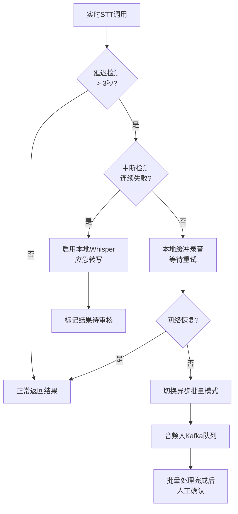
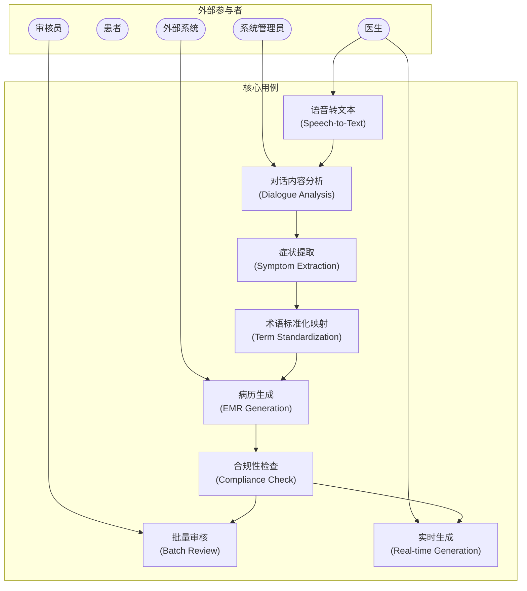
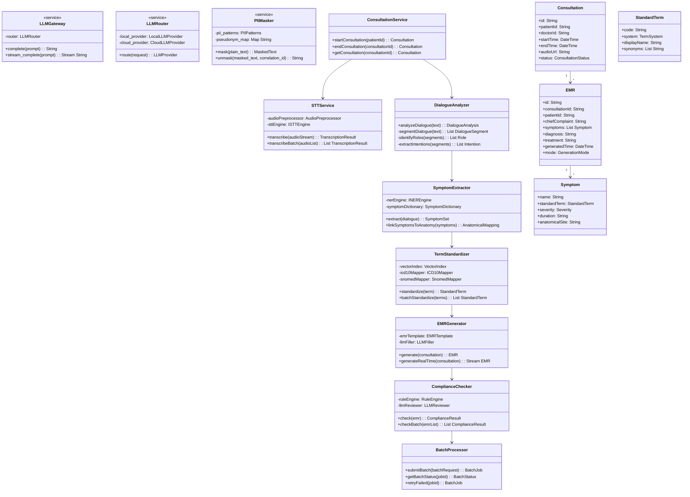
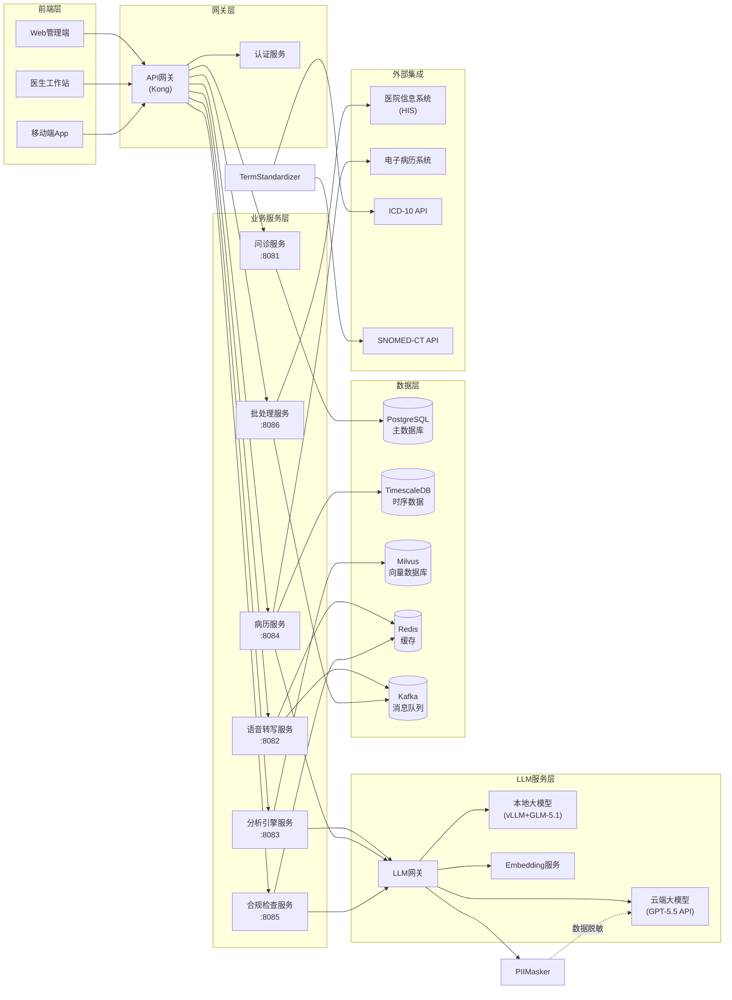
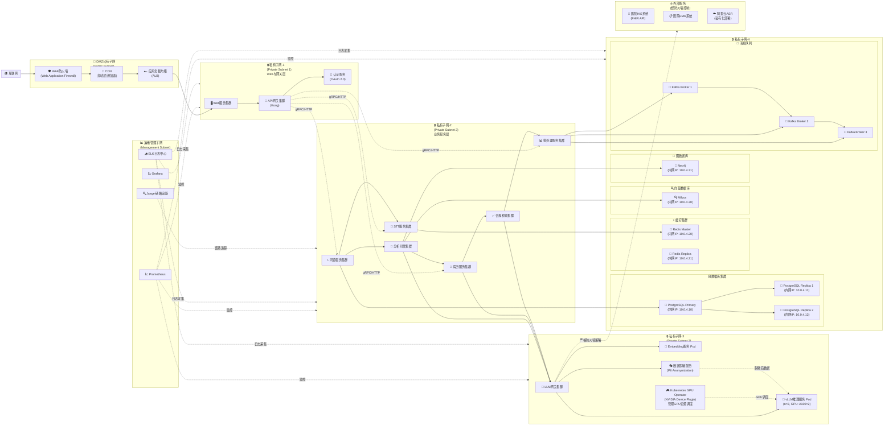
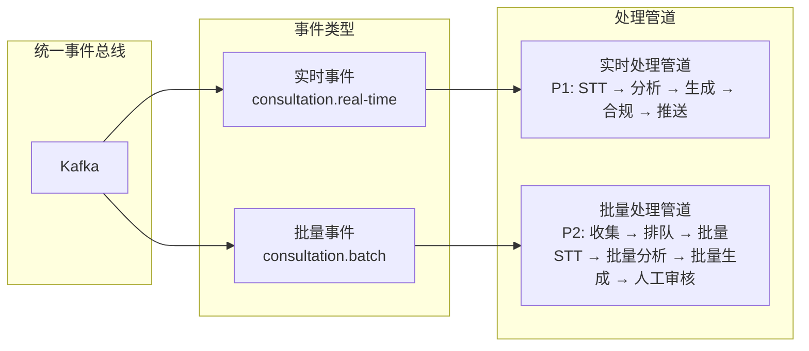
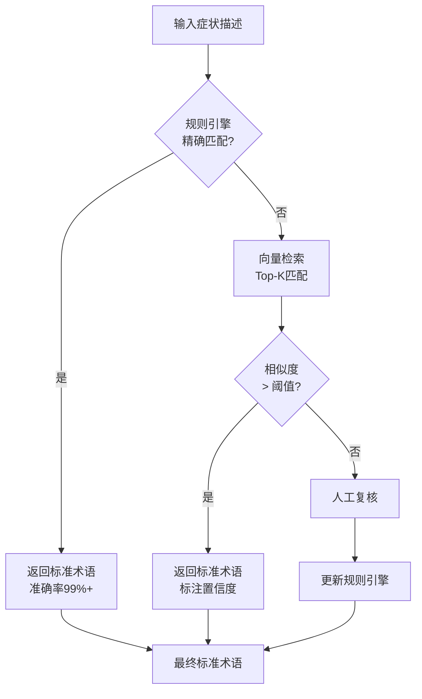
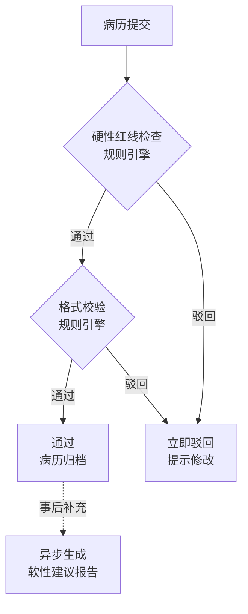
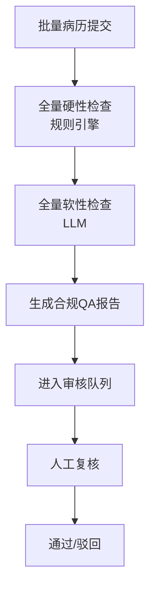
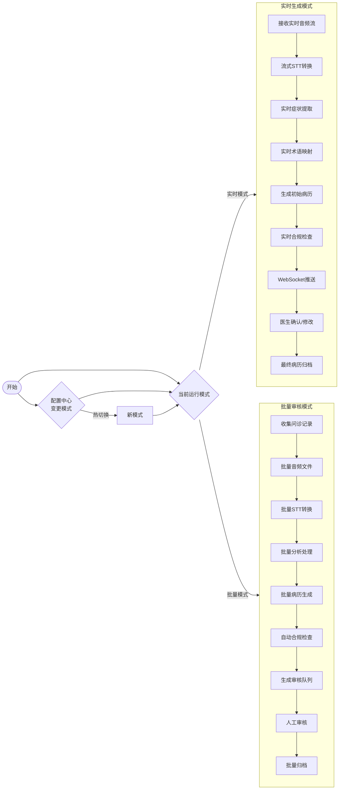

# 智能医疗问诊记录分析平台 - 架构设计文档

## 一、项目概述

### 1.1 背景与目标

本项目旨在构建一个智能医疗问诊记录分析平台，通过AI技术自动分析医患对话录音/文本，提取关键医疗信息，生成结构化电子病历，并确保符合医疗合规性要求。

**核心价值**：

- 减轻医生文书工作负担，提升问诊效率
- 标准化医疗术语，保证病历质量一致性
- 自动化合规检查，降低医疗纠纷风险

***

## 二、架构风格选择论证

### 2.1 备选方案

|        风格       | 描述                           | 典型场景           |
| :-------------: | ---------------------------- | -------------- |
|  **方案A：微服务架构**  | 将业务拆分为独立部署的服务单元，通过API/消息队列通信 | 大规模、高并发、多团队协作  |
| **方案B：模块化单体架构** | 单一部署单元，内部按业务模块划分，保持模块间松耦合    | 中小规模、快速迭代、团队精简 |

### 2.2 对比分析

|     维度     |   微服务架构（方案A）   |   模块化单体（方案B）  |
| :--------: | :------------: | :-----------: |
|  **部署复杂度** |  高（需K8s/容器编排）  |    低（单一部署包）   |
|   **扩展性**  |  水平扩展，按需扩展单个服务 |  整体扩展，资源利用率较低 |
|  **开发效率**  |  初期快，后期服务治理复杂  | 初期快，后期模块解耦成本高 |
|   **容错性**  |   单服务故障不影响全局   | 单点故障可能导致系统不可用 |
| **技术栈灵活性** |     可异构技术栈     |     统一技术栈     |
|  **运维成本**  | 高（需专业DevOps团队） |       低       |
|  **团队适配**  |   多团队（10人以上）   |   小团队（5人以下）   |
|  **性能开销**  |  网络通信延迟，序列化开销  |   进程内调用，低延迟   |

### 2.3 本项目选择

**推荐方案：微服务架构**

**选择理由**：

1. **业务边界清晰**：语音转文本、症状提取、术语映射、合规检查本质上是独立能力域
2. **LLM组件独立演进**：大模型技术迭代快，需独立部署和快速切换
3. **合规性隔离**：合规检查模块可能需要独立审计
4. **扩展性需求**：实时病历生成与批量审核模式需要不同的资源配比
5. **医疗行业特性**：医疗系统生命周期长（10年+），需避免技术债务积累

**潜在代价**：

- 初期建设成本较高
- 需要引入服务治理（服务发现、限流、熔断）
- 网络通信引入额外延迟（需优化）

***

## 三、非功能性需求量化指标

### 3.1 性能指标

|      指标     |         量化目标        | 说明           |
| :---------: | :-----------------: | ------------ |
|  **实时模式延迟** |       P95 < 3秒      | 从对话结束到病历生成完成 |
| **批量模式吞吐量** |       100份/分钟       | 批量审核场景下的处理能力 |
| **STT响应时间** |     < 1.5秒/分钟音频     | 语音转文本处理速度    |
|   **并发支持**  | 实时模式50并发 / 批量模式20并发 | 两种模式分别支持的并发量 |

### 3.2 可用性指标

|      指标     |     量化目标    | 说明                |
| :---------: | :---------: | ----------------- |
|  **系统可用性**  |    99.9%    | 允许年度停机时间 < 8.76小时 |
| **核心服务可用性** |    99.95%   | STT、合规检查服务更高要求    |
|  **故障恢复时间** | MTTR < 30分钟 | 重大故障平均恢复时间        |
|   **灾备要求**  |     同城双活    | 满足医疗数据安全要求        |

### 3.3 数据安全指标

|      指标     |     量化目标    | 说明        |
| :---------: | :---------: | --------- |
|   **数据加密**  |   AES-256   | 静态数据加密    |
|   **传输加密**  |   TLS 1.3   | 网络传输加密    |
|   **等保合规**  |     三级等保    | 医疗行业强制要求  |
| **HIPAA合规** | 满足美国HIPAA标准 | 如涉及跨境医疗数据 |

### 3.4 场景适应性分析

#### 3.4.1 实时生成模式场景

**典型场景**：急诊、住院查房

| 场景特征 | 架构适应性策略 |
|:---:|:---:|
| 高优先级、低延迟 | 独立实时处理管道，绕过消息队列直连STT服务 |
| 实时音频流 | WebSocket + SSE双向通道，实时推送转写结果 |
| 突发流量 | 启用STT服务弹性扩展，LLM服务预热 |
| 不可重试 | 降级到规则引擎+本地小模型，保留人工复核入口 |

#### 3.4.2 批量审核模式场景

**典型场景**：门诊、体检、历史病历处理

| 场景特征 | 架构适应性策略 |
|:---:|:---:|
| 大批量、低优先级 | 统一进入Kafka队列，批量消费 |
| 人工复核环节 | 审核任务入队，在线审核工作台 |
| 资源集中消耗 | 定时任务批处理，避开业务高峰期 |
| 错误可重试 | 失败消息重试机制，死信队列人工处理 |

#### 3.4.3 模式切换适应性

| 切换场景 | 架构响应 |
|---|---|
| 实时→批量 | 配置中心动态调整，事件路由规则变更 |
| 批量→实时 | 抢占实时处理资源，批量任务暂停 |
| 同时运行 | 双管道并行，独立资源池 |

#### 3.4.4 降级与容灾机制

##### 3.4.4.1 STT服务降级策略

| 故障场景 | 检测条件 | 降级策略 | 恢复机制 |
|:---:|:---:|:---:|:---:|
| **实时STT延迟过高** | P95延迟 > 3秒阈值 | 前端切换为本地缓存录音模式，提示"网络波动，转为离线录制" | 网络恢复后自动无缝切换回实时模式 |
| **STT服务中断** | 连续3次心跳失败 | 启用本地Whisper应急转写（降低准确率但保证可用性） | 服务恢复后，本地转写结果可补充修正 |
| **STT网络抖动** | 单次响应超时 > 5秒 | 前端显示"正在重试"，启用本地录音缓冲 | 自动重试3次，失败后进入异步批量队列 |



##### 3.4.4.2 LLM服务降级策略

| 故障场景 | 检测条件 | 降级策略 | 影响评估 |
|:---:|---|---|---|
| **本地LLM不可用** | 连续5次推理超时 | 自动切换到本地备用模型（更小的7B模型降级为3B模型） | 准确率下降约10%，但保证可用性 |
| **云端LLM降级** | 网络不可达或API超时 | 仅使用本地LLM，关闭云端降级通道 | 复杂诊断建议能力下降 |
| **云端LLM恢复** | API可用性探测成功 | 自动恢复混合部署模式 | 无感知切换 |

##### 3.4.4.3 数据持久化与容灾

| 故障场景 | 应对策略 | RPO/RTO指标 |
|:---:|---|:---:|
| **数据库主节点故障** | PostgreSQL自动主从切换（< 30秒） | RPO < 5分钟，RTO < 15分钟 |
| **Kafka消息堆积** | 消费者弹性扩展，启用峰值队列 | 消息不丢失，但处理延迟增加 |
| **Redis缓存穿透** | 启用本地缓存（LRU）+ 降级到数据库直查 | 延迟增加，但功能正常 |
| **全链路中断** | 启用离线模式，本地记录，问诊不中断 | 网络恢复后自动同步 |

***

## 四、关键技术组件选型对比

### 4.1 数据库选型

|     组件     | 备选方案                          | 选型              | 理由                                                                        |
| :--------: | ----------------------------- | --------------- | ------------------------------------------------------------------------- |
| **关系型数据库** | PostgreSQL vs MySQL vs Oracle | **PostgreSQL**  | 1. 丰富的JSON支持，适合半结构化病历数据<br>2. 成熟的事务支持，保证数据一致性<br>3. 全文检索能力，支持症状搜索<br>4. 医疗行业广泛使用，生态成熟 |
|  **时序数据库** | InfluxDB vs TimescaleDB       | **TimescaleDB** | 基于PostgreSQL，运维成本低，与主库技术栈统一                                               |
|  **向量数据库** | Milvus vs Pinecone vs Qdrant  | **Milvus**      | 1. 开源可控，支持私有部署<br>2. 医疗术语向量化需本地化<br>3. 高性能向量检索                                    |
|   **缓存层**  | Redis vs Memcached            | **Redis**       | 1. 支持丰富数据结构<br>2. 集群模式成熟<br>3. 医学影像特征缓存                                           |

### 4.2 消息队列选型

|    组件    | 备选方案                          | 选型                           | 理由                                                                         |
| :------: | ----------------------------- | ---------------------------- | -------------------------------------------------------------------------- |
| **消息队列** | Kafka vs RabbitMQ vs RocketMQ | **Kafka**                    | 1. 高吞吐（百万级/秒），适合批量处理<br>2. 消息持久化，保证审计追溯<br>3. 生态完善，与Flink/Spark集成良好<br>4. 医疗场景需要消息回溯能力 |
| **实时消息** | WebSocket vs SSE              | **SSE (Server-Sent Events)** | 1. 轻量，无需双向握手<br>2. HTTP兼容，易穿透防火墙<br>3. 浏览器原生支持                                     |

### 4.3 API协议选型

| 组件 | 备选方案 | 选型 | 选择理由 |
|:---:|---|---|---|
| **内部API** | gRPC vs REST | **gRPC** | 1. **Protocol Buffers**：序列化效率比JSON高3-5倍<br>2. **双向流**：支持客户端/服务端流式调用，适合STT<br>3. **强类型**：IDL定义接口，编译时检查<br>4. **HTTP/2**：多路复用，减少连接开销 |
| **外部API** | REST vs GraphQL vs HL7 FHIR | **REST + FHIR双协议** | 1. **医疗行业标准**：HIS/EMR系统对接多为REST<br>2. **FHIR互操作性**：针对外部医院信息系统（HIS）的对接，提供符合 **FHIR R4** 标准的 RESTful API，确保电子病历数据在不同医疗机构间的互操作性<br>3. **文档完善**：OpenAPI/Swagger生态成熟，符合等保审计要求 |
| **HL7集成** | HL7 V2 vs HL7 V3 vs FHIR | **FHIR（推荐）** | 1. **现代化标准**：FHIR是HL7最新一代标准，支持JSON/RESTful<br>2. **互操作性强**：支持与国际医疗系统（如ICD-10/SNOMED-CT）对接<br>3. **开发者友好**：相比V2/V3更易实现和维护 |
| **流式传输** | WebSocket vs SSE vs gRPC Streaming | **gRPC Streaming** | 1. **流式STT**：音频流→gRPC流→转写结果流<br>2. **双向流**：客户端推送控制命令（暂停/恢复）<br>3. **背压机制**：服务端可控制消费速率 |
| **API网关** | Kong vs APISIX vs AWS API Gateway | **Kong** | 1. **插件生态**：认证(JWT)、限流、缓存、日志插件完善<br>2. **性能优秀**：OpenResty底层，高并发低延迟<br>3. **服务发现**：与K8s、Docker Compose集成<br>4. **医疗案例**：国内多家医院有落地案例 |

### 4.4 LLM部署方式选型

| 组件 | 备选方案 | 选型 | 选择理由 |
|:---:|---|---|---|
| **LLM推理引擎** | 本地开源模型(vLLM) vs 云端API vs 混合 | **混合部署** | 1. **本地部署**：GLM-5.1/Qwen 3 等开源模型满足基础推理，数据不出网<br>2. **云端降级**：复杂推理（多轮对话、复杂诊断）自动切换到GPT-5.5 / Claude 4.7等最新闭源模型<br>3. **成本优化**：日常问诊用本地，疑难杂症用云端 |
| **数据脱敏层** | - | **PII Anonymization（必须）** | ⚠️ **安全红线**：将医疗录音或文本发往公有云 LLM 是极度危险的（违反 HIPAA 和国内数据出境规定）。**在发送给任何外部LLM之前，必须先经过数据脱敏组件**，将患者姓名、身份证号、联系方式等PII替换为假名/脱敏ID，返回后再进行数据映射复原 |
| **Embedding服务** | 本地部署 vs 云服务 | **本地部署** | 1. **数据安全**：医疗术语向量必须本地化<br>2. **延迟敏感**：本地部署QPS更高<br>3. **成本**：批量术语向量化云端成本高 |
| **模型服务框架** | vLLM vs Ollama vs TGI | **vLLM** | 1. **高吞吐**：PagedAttention显存管理，吞吐量提升3倍<br>2. **OpenAI兼容**：API与OpenAI对齐，切换成本低<br>3. **连续批处理**：可变长度序列批量推理，GPU利用率高 |
| **语音转写（STT）** | 阿里云ASR vs 腾讯ASR vs Whisper本地 | **阿里云ASR（私有化）** | 1. **医疗垂类模型**：阿里云医疗ASR准确率更高<br>2. **流式支持**：支持实时流式转写<br>3. **私有化部署**：数据敏感场景必须使用私有化版本 |

***

## 五、技术视图

### 5.1 功能需求模型

#### 5.1.1 用例图



#### 5.1.2 一级用例说明

|        用例       | 参与者     | 描述                                | 实现说明                                |
| :-------------: | ------- | --------------------------------- | ----------------------------------- |
|  **UC1 语音转文本**  | 医生、患者   | 将医患对话音频转换为文本                      | 调用STT服务（阿里云ASR/腾讯ASR），支持实时流式和批量两种模式 |
|  **UC2 对话内容分析** | 系统管理员   | 理解对话语义结构，识别医患交互意图                 | 使用LLM进行对话分段、意图识别、角色标注               |
|   **UC3 症状提取**  | 系统      | 从对话中提取症状、疾病、部位等实体                 | 基于医疗NER模型，结合规则引擎增强                  |
| **UC4 术语标准化映射** | 系统      | 将口语化描述映射到标准医疗术语（ICD-10/SNOMED-CT） | 向量检索+规则映射双重机制                       |
|   **UC5 病历生成**  | 医生、外部系统 | 生成结构化电子病历文档                       | 模板填充+LLM生成混合模式                      |
|  **UC6 合规性检查**  | 系统      | 检查病历是否符合医疗规范和法规要求                 | 规则引擎+LLM双重校验                        |
|   **UC7 批量审核**  | 审核员     | 批量处理历史病历，进行质量审核                   | 异步任务队列，支持人工复核环节                     |
|   **UC8 实时生成**  | 医生      | 实时生成当前问诊的病历                       | WebSocket推送，支持在线编辑                  |

### 5.2 核心类结构图



### 5.3 子系统（组件）关系图



### 5.4 系统部署图



**网络隔离策略说明**：

| 子网类型 | 组件 | 访问控制策略 |
|:---:|---|---|
| **DMZ公有子网** | CDN, ALB, WAF | 接收公网流量，入口处部署WAF防护 |
| **私有子网-1** | Web, API网关, 认证服务 | 仅允许DMZ子网访问，启用安全组 |
| **私有子网-2** | 业务服务集群 | 仅允许私有子网-1访问，严格端口限制 |
| **私有子网-3** | LLM推理, 数据脱敏 | **最严格隔离**，仅允许私有子网-2访问，**禁止直接访问公网** |
| **私有子网-4** | 数据库, 缓存, 向量库, 图数据库, Kafka | **仅允许私有子网-2和-3访问**，数据库仅允许内网IP |
| **运维管理子网** | 监控, 日志, 链路追踪 | 独立子网，仅允许运维人员访问 |

**安全组规则示例**：

| 源子网 | 目标组件 | 端口 | 协议 | 说明 |
|:---:|---|:---:|:---:|---|
| DMZ | Web服务 | 443 | HTTPS | WAF健康检查 |
| 私有子网-1 | API网关 | 8080 | HTTP | API路由 |
| 私有子网-2 | 业务服务 | 8081-8086 | gRPC | 内部服务调用 |
| 私有子网-2 | PostgreSQL | 5432 | TCP | **仅内网IP访问** |
| 私有子网-3 | vLLM | 8001 | HTTP | LLM推理调用 |
| 私有子网-3 | 外部服务 | 443 | HTTPS | **必须经过PII脱敏** |

**GPU资源管理说明**：

| 组件 | 说明 | 作用 |
|:---:|---|---|
| **NVIDIA Device Plugin** | K8s原生GPU调度插件 | 将GPU作为可调度资源暴露给K8s |
| **GPU Operator** | NVIDIA官方K8s Operator | 自动管理GPU驱动、CUDA运行时、容器运行时 |
| **vLLM Pod配置** | `nvidia.com/gpu: 2` | 每个Pod申请2块A100 GPU，支持张量并行 |
| **弹性伸缩** | HPA + GPU指标 | 基于GPU利用率自动扩缩容（阈值：70%利用率） |

```yaml
# vLLM Pod GPU资源配置示例
resources:
  limits:
    nvidia.com/gpu: 2        # 每Pod使用2块A100
    memory: "64Gi"
    cpu: "16"
  requests:
    nvidia.com/gpu: 2
    memory: "32Gi"
    cpu: "8"
```

***

## 六、关键设计决策记录

### 6.1 决策点1：LLM部署策略（本地部署 vs 纯云服务）

#### 6.1.1 背景

医疗数据具有高度敏感性，不能离开医院网络边界，但纯本地部署的大模型在推理能力上可能不如云端大模型。

#### 6.1.2 备选方案

|        方案       | 描述                          |
| :-------------: | --------------------------- |
|   **A1：纯本地部署**  | 使用开源模型（GLM-5.1、Qwen 3）完全本地化部署 |
|   **A2：纯云服务**   | 使用GPT-5.5 API、Claude 4.7等云端LLM服务  |
| **A3：混合部署（推荐）** | 核心推理本地部署，复杂推理降级到云端          |

#### 6.1.3 评估依据

1. **数据安全**：医疗数据不能出内网，本地部署是刚需
2. **推理能力**：本地开源模型与GPT-5.5存在代差
3. **成本**：云端LLM调用成本高，批量场景不可接受
4. **可用性**：纯本地部署存在单点故障风险

#### 6.1.4 最终选择

**A3：混合部署**

#### 6.1.5 潜在代价

- 需要维护两套LLM集成代码
- 降级切换逻辑增加系统复杂度
- 混合部署带来额外的运维负担

***

### 6.2 决策点2：实时生成 vs 批量审核 模式切换机制

#### 6.2.1 背景

系统需要同时支持实时病历生成（急诊场景）和批量审核后生成（门诊场景）两种模式，且需支持运行时切换。

#### 6.2.2 备选方案

|         方案        | 描述                     |
| :---------------: | ---------------------- |
|   **B1：两套独立系统**   | 部署两套独立系统，分别处理实时和批量模式   |
|   **B2：配置驱动单系统**  | 单一系统，通过配置切换业务逻辑        |
| **B3：事件驱动架构（推荐）** | 统一事件总线，根据事件类型路由到不同处理管道 |

#### 6.2.3 评估依据

1. **资源利用率**：独立系统资源无法共享，浪费严重
2. **切换灵活性**：业务场景可能随时切换，需要热切换能力
3. **一致性**：两套系统可能导致病历格式不一致
4. **扩展性**：新模式加入时，独立系统需改两处

#### 6.2.4 最终选择

**B3：事件驱动架构**



#### 6.2.5 潜在代价

- Kafka引入额外的延迟（毫秒级，可接受）
- 事件模式设计需要前期充分论证
- 分布式事务复杂度增加

***

### 6.3 决策点3：医疗术语标准化映射策略

#### 6.3.1 背景

医生口述语言与标准医疗术语存在较大差异，需要将口语化描述准确映射到ICD-10/SNOMED-CT等标准术语体系。

#### 6.3.2 备选方案

|        方案       | 描述                            |
| :-------------: | ----------------------------- |
|   **C1：纯规则映射**  | 基于字典+规则的映射表，人工维护映射关系          |
|   **C2：纯向量检索**  | 使用Embedding模型将术语向量化，通过向量相似度匹配 |
| **C3：混合策略（推荐）** | 规则引擎处理高频确定性映射，向量检索处理低频模糊映射    |

#### 6.3.3 评估依据

1. **准确率**：医疗术语要求高准确率，纯AI存在幻觉风险
2. **覆盖率**：规则引擎无法覆盖所有口语化表达
3. **可解释性**：医疗场景需要映射结果可解释、可追溯
4. **性能**：向量检索延迟需控制在可接受范围

#### 6.3.4 最终选择

**C3：混合策略**



#### 6.3.5 潜在代价

- 规则引擎需要医学专家参与维护
- 向量数据库需要定期更新（术语库更新）
- 人工复核环节增加处理延迟

***

### 6.4 决策点4：合规检查实现策略

#### 6.4.1 背景

医疗病历需要符合HIPAA、等保三级等合规要求，合规检查模块需要覆盖问诊全流程。

#### 6.4.2 备选方案

|           方案          | 描述                       |
| :-------------------: | ------------------------ |
|      **D1：纯规则引擎**     | 基于预定义规则进行合规检查            |
|     **D2：纯LLM检查**     | 使用大模型进行语义级别的合规判断         |
| **D3：规则+LLM双层检查（推荐）** | 规则引擎处理硬性合规要求，LLM处理软性合规建议 |

#### 6.4.3 评估依据

1. **硬性合规**：有些合规要求是明确规则（如必填项、格式要求），规则引擎更可靠
2. **软性合规**：有些合规需要语义理解（如描述是否清晰、是否漏诊），LLM更有优势
3. **审计要求**：规则引擎的检查结果更易于审计追溯
4. **误杀率**：纯LLM可能导致过多误报，影响医生效率

#### 6.4.4 最终选择

**D3：规则+LLM双层检查**

| 检查类型 | 示例 | 实现方式 |
|:---:|---|---|
| **硬性合规** | 必填项缺失、主诉为空、诊断矛盾 | 规则引擎 |
| **软性合规** | 病历描述不清晰、用药剂量异常、疑似漏诊 | LLM |
| **格式合规** | 日期格式、病历编号格式 | 规则引擎 |
| **语义合规** | 症状与诊断匹配度、治疗方案合理性 | LLM |

#### 6.4.5 合规策略的实时/批量差异化设计

为兼顾**实时性**（急诊场景）与**完整性**（门诊批量场景），系统采用**合规灰度**机制：

##### 6.4.5.1 实时急诊模式：合规快车道

| 合规层级 | 检查内容 | 响应要求 | 说明 |
|:---:|---|:---:|---|
| **硬性红线（必须）** | 必填项、药物禁忌、诊断矛盾 | < 100ms | 任何一项不通过则**立即驳回** |
| **格式校验（必须）** | 日期格式、病历编号 | < 50ms | 快速格式校验 |
| **软性建议（跳过）** | 疑似漏诊、剂量建议 | **跳过** | 为保证P95<3秒延迟，实时模式不执行LLM检查 |
| **详细报告（跳过）** | 合规QA报告 | **跳过** | 事后可补充生成 |



##### 6.4.5.2 批量门诊模式：全量合规审查

| 合规层级 | 检查内容 | 响应要求 | 说明 |
|:---:|---|:---:|---|
| **全量硬性检查** | 必填项、药物禁忌、诊断矛盾 | < 500ms/份 | 每份病历必须通过 |
| **全量软性检查** | 疑似漏诊、剂量异常、症状诊断一致性 | < 2秒/份 | LLM深度分析 |
| **合规QA报告** | 生成完整合规报告 | < 5秒/份 | 供审核员参考 |
| **历史趋势分析** | 科室/医师合规率统计 | 批量汇总 | 支持管理决策 |



##### 6.4.5.3 差异化策略对比

| 维度 | 实时急诊模式 | 批量门诊模式 |
|:---:|:---:|:---:|
| **响应时间目标** | P95 < 3秒 | < 30分钟/批次 |
| **硬性合规** | ✅ 100%执行 | ✅ 100%执行 |
| **软性合规** | ❌ 跳过 | ✅ 100%执行 |
| **合规报告** | ❌ 跳过 | ✅ 详细生成 |
| **人工复核** | 可选 | 强制 |
| **容错策略** | 降级到本地小模型 | 进入死信队列重试 |
| **典型场景** | 急诊抢救、住院查房 | 门诊、术后审核 |

##### 6.4.5.4 模式切换时的合规处理

| 切换场景 | 合规响应 |
|---|---|
| **实时→批量** | 实时模式积压的病历自动进入批量合规队列 |
| **批量→实时** | 正在进行的软性检查暂停，优先完成硬性检查 |
| **同时运行** | 独立合规检查线程，互不影响 |

#### 6.4.6 具体医学场景示例

为更好地理解合规检查的业务含义，以下列举**真实的医学场景**：

##### 6.4.6.1 硬性合规规则示例（规则引擎实现）

| 合规规则 | 医学依据 | 触发条件 | 处置方式 |
|:---:|---|---|---|
| **抗生素用药合规** | 《抗菌药物临床应用指导原则》 | 处方中包含抗生素（如阿莫西林、头孢类），但无感染性诊断依据（无"肺炎"、"扁桃体炎"等诊断） | **驳回**：必须先有关联感染诊断才能开具抗生素 |
| **特殊药品双签** | 《处方管理办法》 | 处方中包含管制药品（吗啡、杜冷丁等） | **驳回**：必须具备麻醉药品处方权的医师双签 |
| **检查项目匹配** | 医疗服务项目规范 | 同时开具"腹部CT"和"腹部B超"且检查部位完全相同 | **警告**：疑似重复检查，需说明理由 |
| **诊断必填项** | 《电子病历基本规范》 | 主诉为空、现病史为空、诊断为空任一情况 | **驳回**：病历关键字段不能为空 |

##### 6.4.6.2 软性合规规则示例（LLM实现）

| 合规规则 | 医学依据 | 触发条件 | 处置方式 |
|:---:|---|---|---|
| **疑似漏诊提示** | 临床诊疗规范 | 患者描述"发热、咳嗽3天、胸痛"，但诊断仅为"上呼吸道感染" | **建议**：需排除肺部感染可能，建议补充胸部影像学检查 |
| **用药剂量异常** | 药品说明书+临床指南 | 阿莫西林剂量为"每次5g"（正常为0.5-1g） | **警告**：剂量异常偏高，需确认 |
| **症状-诊断矛盾** | 临床逻辑 | 主诉"腹泻3天"，诊断"便秘" | **建议**：症状与诊断不一致，请复核 |
| **病历描述清晰度** | 病历书写规范 | 主诉描述"不适"、"不好"等模糊词汇超过2次 | **建议**：建议使用更具体的症状描述 |

##### 6.4.6.3 医学场景案例

**案例1：抗生素合规检查**

```text
患者主诉：咳嗽、咳痰3天
医生诊断：急性上呼吸道感染
处方：阿莫西林胶囊 0.5g tid

系统检测：
1. 规则引擎检查：抗生素使用但无感染诊断依据 → 触发硬性合规
2. LLM检查：症状"咳嗽、咳痰"可能为病毒感染，非细菌感染指征

系统响应：
❌ 驳回处方，提示："使用阿莫西林需提供细菌感染诊断依据，
   或修改诊断为'细菌性上呼吸道感染'"
```

**案例2：疑似漏诊检查**

```text
患者主诉：右下腹疼痛，伴恶心，食欲不振，持续2天
医生诊断：急性胃炎

系统检测：
1. 症状分析：右下腹疼痛为阑尾炎典型症状
2. LLM检查：症状组合"右下腹痛+恶心+食欲不振"高度提示阑尾炎可能

系统响应：
⚠️ 警告提示："根据症状分析，建议排除阑尾炎可能，
   是否需要补充腹部B超或CT检查？"
```

#### 6.4.7 潜在代价

- 两套系统增加集成复杂度
- LLM检查结果的一致性需要监控
- 需要定期更新规则库和Prompt模板

***

## 七、核心算法伪代码

### 7.1 症状提取算法

```python
class SymptomExtractor:
    def extract(self, dialogue_text: str) -> List[Symptom]:
        # Step 1: 实体识别
        entities = self.ner_engine.recognize(dialogue_text)

        # Step 2: 过滤非症状实体
        symptoms = [e for e in entities if e.type == "SYMPTOM"]

        # Step 3: 症状标准化
        standardized_symptoms = []
        for symptom in symptoms:
            standard_term = self.term_standardizer.standardize(symptom)
            symptoms_with_context = self.enrich_with_context(
                standard_term,
                dialogue_text
            )
            standardized_symptoms.append(symptoms_with_context)

        # Step 4: 症状关联（症状 -> 部位 -> 时间）
        linked_symptoms = self.link_symptoms(
            standardized_symptoms,
            dialogue_text
        )

        return linked_symptoms

    def enrich_with_context(self, symptom, dialogue):
        # 使用LLM补充症状的严重程度、持续时间等属性
        prompt = f"""
        根据以下对话上下文，补充症状'{symptom}'的详细信息：
        对话内容：{dialogue}

        请返回JSON格式：
        {{
            "severity": "严重/中等/轻微",
            "duration": "持续时间",
            "trigger": "诱发因素",
            "accompanying_symptoms": ["伴随症状"]
        }}
        """
        return self.llm.complete(prompt)
```

### 7.2 术语标准化映射算法

```python
class TermStandardizer:
    def standardize(self, raw_term: str) -> StandardTerm:
        # 策略1: 精确匹配
        exact_match = self.exact_match_index.get(raw_term)
        if exact_match:
            return exact_match

        # 策略2: 同义词匹配
        synonyms = self.synonym_index.get(raw_term)
        if synonyms:
            return self.pick_best_match(synonyms)

        # 策略3: 向量检索
        vector = self.embedding_model.encode(raw_term)
        candidates = self.vector_index.search(vector, top_k=5)

        # 策略4: 后处理验证
        validated = self.validate_candidates(candidates, raw_term)

        if validated:
            return self.pick_best_match(validated)
        else:
            return StandardTerm(
                original=raw_term,
                status="UNMAPPED",
                requires_human_review=True
            )

    def validate_candidates(self, candidates, original):
        # 使用LLM验证候选术语是否与原术语语义等价
        validated = []
        for candidate in candidates:
            similarity = self.compute_semantic_similarity(
                original,
                candidate.display_name
            )
            if similarity > self.threshold:
                candidate.confidence = similarity
                validated.append(candidate)
        return validated
```

***

## 八、实时生成 vs 批量审核 模式详细设计

### 8.1 模式对比

|     维度    |  实时生成模式 |  批量审核模式  |
| :-------: | :-----: | :------: |
|  **典型场景** | 急诊、住院查房 |   门诊、体检  |
| **SLA要求** |  < 3秒响应 | < 30分钟完成 |
|  **人工介入** |    无    |   审核员复核  |
|  **资源消耗** |   即时高   |   峰值集中   |
|  **容错要求** | 高（不可重试） | 中（可批量重试） |
|  **审计要求** |   完整日志  |   批量报告   |

### 8.2 模式切换流程



### 8.3 统一事件模型

```json
{
  "event": {
    "type": "consultation.completed",
    "mode": "REALTIME | BATCH",
    "consultationId": "uuid",
    "timestamp": "ISO8601",
    "payload": {
      "audioUrl": "string",
      "duration": 3600,
      "participants": ["doctor_id", "patient_id"],
      "metadata": {
        "department": "string",
        "visitType": "OUTPATIENT | EMERGENCY | INPATIENT"
      }
    },
    "routing": {
      "targetPipeline": "REALTIME_PIPELINE | BATCH_PIPELINE",
      "priority": "HIGH | NORMAL | LOW",
      "retryPolicy": {
        "maxRetries": 3,
        "backoff": "EXPONENTIAL"
      }
    }
  }
}
```

***


## 九、AI使用声明与反思

### 9.1 AI生成内容列表

在本次架构设计文档的编写中，以下内容由AI辅助生成或初步起草，后经本小组人工修改和完善：

- **UML与架构图代码（部分）**：文档中的大部分 Mermaid 绘图代码（包括用例图、类图、子系统关系图和部署图）由AI基于我们提供的文本结构初步生成，我们随后对连线逻辑和节点命名进行了人工校对与微调。
- **技术选型对比基础数据**：第四章“关键技术组件选型”中的部分客观对比指标（如数据库的优缺点、Kafka与RabbitMQ的吞吐量对比等）由AI检索提炼，最终结论由小组讨论敲定。
- **核心算法伪代码框架**：第七章中的“症状提取算法”与“术语标准化映射算法”的面向对象结构和函数签名由AI辅助构建，具体的业务逻辑（如混合策略的判断流）由人工补充完成。
- **统一事件模型JSON结构**：第八章中用于模式切换的 `consultation.completed` 事件 JSON Schema 草案由AI生成。

### 9.2 采纳与未采纳的AI建议及理由

在与AI进行架构探讨的过程中，我们批判性地评估了AI给出的多项架构建议：

#### 9.2.1 被采纳的建议

1. **采用 Kafka 事件驱动架构处理模式切换（对应决策点2）**
   - **AI原建议**：针对实时与批量模式的切换，AI建议不要部署两套独立系统，而是引入事件总线（Event Bus）通过路由分发处理。
   - **采纳理由**：该建议极大地优化了系统的资源利用率，且符合高内聚低耦合的设计原则。我们据此设计了基于 Kafka 的双管道处理架构，较好地解决了复杂模式切换中的痛点。

2. **LLM 混合部署策略（对应决策点1）**
   - **AI原建议**：在处理医疗敏感数据时，鉴于隐私合规，建议采用“本地开源模型为主，云端闭源模型为辅”的混合架构，非必要不上云。
   - **采纳理由**：该方案非常契合医疗行业的强监管属性（满足等保三级及数据不出院要求），同时在系统成本与复杂推理能力之间取得了极佳的平衡。

#### 9.2.2 未被采纳的建议

- **采用 Service Mesh（服务网格如 Istio）进行全面服务治理**
  - **AI原建议**：在微服务架构选型时，AI建议直接引入全套的 Istio 进行流量管理、微服务安全隔离和可观测性追踪。
  - **拒绝理由**：存在明显的过度设计（Over-engineering）。考虑到本平台目前处于初期阶段，团队规模和业务复杂度有限，贸然引入重量级的 Service Mesh 会带来不可接受的运维成本和不必要的网络延迟。我们最终选择通过轻量级的 API Gateway (Kong) 配合代码级别的基础服务发现来实现早期的治理需求。

### 9.3 总结：AI的帮助与局限性

#### AI帮助最大的环节：
- **发散性思维与原型快速构建**：面对庞大繁杂的系统需求，AI帮助我们快速梳理了微服务的初始边界（如拆分出问诊、STT、病历生成、合规检查等核心模块）。
- **效率工具与排版**：AI在繁琐的文档格式化工作（如 Markdown 表格排版、Mermaid 架构图代码编写）中极大提升了小组的产出效率，使我们能够将核心精力集中在“架构决策（ADR）”的逻辑推敲上。

#### AI存在的局限性：
- **缺乏特定行业深度语境**：AI给出的医疗合规建议（如等保、HIPAA）往往停留在泛泛而谈的层面，较难针对具体医院的实际 HIS 系统对接协议（如针对 HL7/FHIR 的具体字段映射）给出落地的集成方案，这部分依然极度依赖人工查阅专业文献来补充。
- **容易陷入“技术堆砌”陷阱**：如果不加人工约束，AI倾向于无脑推荐当下最流行、最复杂的技术栈组合（如强推 K8s + Istio + Serverless 的全家桶），而往往忽略了架构设计中至关重要的“研发成本、团队维护能力、特定场景适配度”等现实的非功能性约束。

***

## 十、总结与展望

### 10.1 核心成果总结

本架构设计文档针对“智能医疗问诊记录分析平台”提供了端到端的完整架构解决方案。通过系统的梳理与权衡，我们确立了以下核心架构基盘：

1. **架构风格定型**：选择了边界清晰的**微服务架构**，搭配轻量级 API 网关，兼顾了初期的开发效率与后期的系统弹性演进。
2. **非功能性指标量化**：明确了系统在急诊（P95 < 3秒）与门诊（100份/分钟）两类核心场景下的性能 SLA，并确立了 99.9% 的系统可用性红线。
3. **技术栈与中间件收敛**：基于“成熟、稳定、开源”原则，选定了 PostgreSQL（含 TimescaleDB）、Kafka、Redis 等经过企业级验证的中间件，并通过混合部署 vLLM 与云端大模型 API 构建了兼顾隐私与能力的 AI 底座。
4. **关键决策（ADR）闭环**：详实记录了包括“LLM混合部署、事件驱动的模式切换、混合策略的术语映射、灰度合规检查”在内的 4 个核心架构决策，为后续的代码实现扫清了逻辑障碍。

### 10.2 核心设计原则回顾

回顾整个设计过程，我们始终恪守以下三大架构原则：
- **安全与合规优先**：医疗数据不出院、PII 强制脱敏拦截，在系统底层设计中植入了满足等保三级和 HIPAA 标准的基因。
- **成本与收益平衡**：拒绝盲目追求“纯大模型”或“纯规则”，在术语映射和合规检查中创造性地采用了**“规则引擎（兜底） + LLM（增强）”**的双保险架构。
- **灵活的场景适应性**：通过 Kafka 事件总线，实现了同一套微服务底座在“实时低延迟”与“批量高吞吐”两种截然不同业务模式间的优雅切换。

### 10.3 未来演进愿景

随着医疗机构数字化转型的深入，本平台未来可在以下维度进行架构平滑演进：
1. **多模态问诊融合**：在现有的音频和文本分析基础上，引入对医疗影像（CT、B超）、患者体征数据的多模态联合分析模型。
2. **医疗 Agent 化**：从目前的“被动生成与检查”，升级为能够主动提供诊疗建议、查阅最新医学文献的“主动型医疗智能体（Medical Agent）”。
3. **跨院际知识联邦**：在保证患者隐私的前提下，探索基于联邦学习（Federated Learning）的跨医院区域性专科术语库的联合训练架构。


***
