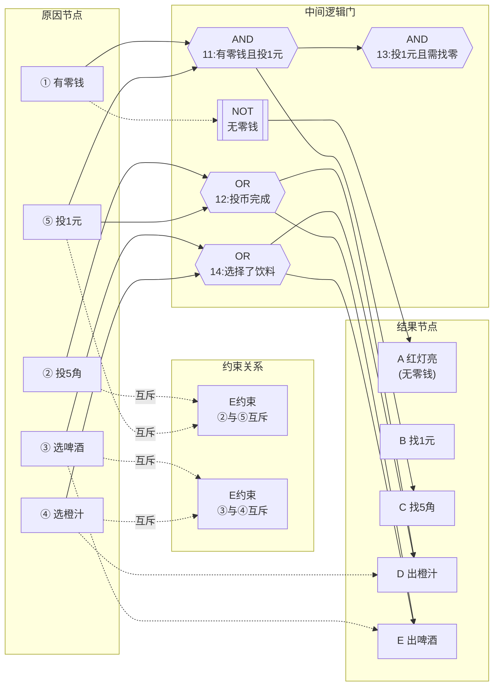

<h1 align="center">吉林大学软件学院</h1>

<h1 align="center">案例作业报告</h1>

**课程名称：软件质量保证与测试**

**案例主题：黑盒测试方法—因果图法**

**案例题目：10-自动售货机**

**学生学号：55000000**

**学生姓名：**

**提交日期：**

【案例主题】黑盒测试方法—因果图法

【案例题目】10-自动售货机

【案例目标】

以自动售货机的测试用例设计为例学习因果图的使用方法。

【案例内容】

有一个处理单价为5角的盒装饮料的自动售货机。自动售货机一次只能售卖一瓶饮料，饮料分"橙汁"和"啤酒"两种，售货机每次只接收一个5角或一个1元的硬币。

用户使用售货机的方法如下：

1. 自动售货机中有一个显示是否有零钱的红灯，当自动售货机内有零钱时，红灯灭并显示"有零钱找"，当自动售货机内没有零钱找时，红灯亮并显示"无零钱找"。

2. 无论自动售货机中是否有零钱找，当投入5角钱，并按下"橙汁"或"啤酒"的按钮时，则相应的饮料就会被送出。

3. 当自动售货机没有零钱找时，若投入1元钱，按下"橙汁"或"啤酒"的按钮，则退出投入的1元硬币。

4. 当自动售货机有零钱找时，若投入1元钱，按下"橙汁"或"啤酒"的按钮，则送出5角硬币并把相应饮料送出。

【案例作业步骤】

1、找出原因和结果，并对原因和结果进行统一标号

分析一下【案例内容】中对自动售货机的售货过程的描述，列出题中所描述的相应条件，作为原因和结果。

（1）找出原因

请在下面选出【案例内容】中描述的所有原因：

备注：选项前面的标号代表原因的标号。

①有零钱

②投5角

③选啤酒

④选橙汁

⑤投1元

⑥出啤酒

⑦找1元

⑧红灯亮

⑨找5角

⑩出橙汁

| - | |
| --- | --- |
| 你的答案： | ①②③④⑤ |

（2）找出结果

请在下面选出【案例内容】中描述的所有结果：

备注：选项前面的标号代表结果的标号。

A.红灯亮

B.找1元

C.找5角

D.出橙汁

E.出啤酒

F.投1元

G.投5角

H.有零钱

I.选啤酒

J.选橙汁

| - | |
| --- | --- |
| 你的答案： | ACDE |

2、明确所有原因之间的约束关系

（1）确定哪些原因之间存在着约束关系

①请选出描述原因之间约束关系正确的所有选项：

A.原因②与原因⑤之间属于异关系

B.原因②与原因⑤之间属于或关系

C.原因③与原因④之间属于异关系

D.原因③与原因④之间属于或关系

| - | |
| --- | --- |
| 你的答案： | AC |

3、明确所有输出结果之间的约束关系

（1）确定哪些结果之间存在着约束关系

由于此题中多个原因组合只能导出确定的一个或一组结果,即同步程序的计算过程是确定的,不存在输入确定，输出不定的情况。因此,这里结果之间的约束关系可以省略不画。

4、画出因果图

根据第2步和第3步的分析过程，使用画图工具，画出本案例的因果图，保存为.jpg格式文件，粘贴在下方。

答案：

以下是本案例的因果图，采用Mermaid语法绘制，从左到右展示了原因节点（左侧）通过逻辑门连接到结果节点（右侧）的完整逻辑关系。图中包含AND（与）、OR（或）、NOT（非）逻辑门以及E约束（异关系）标注。

**因果图说明：**
- **原因节点**（左侧）：①有零钱、②投5角、③选啤酒、④选橙汁、⑤投1元
- **E约束**：原因②（投5角）与⑤（投1元）为异关系（不能同时发生）；原因③（选啤酒）与④（选橙汁）为异关系（不能同时选择）
- **中间逻辑门**：
  - AND11 = ① AND ⑤（有零钱且投1元）→ 满足找5角的条件
  - OR12 = ② OR ⑤（投5角或投1元）→ 投币完成
  - AND13 = 11（即① AND ⑤）→ 投1元且需要找零
  - OR14 = ③ OR ④（选啤酒或选橙汁）→ 选择了饮料
  - NOT1 = NOT ① → 无零钱时红灯亮
- **结果节点**（右侧）：A红灯亮（无零钱时）、B找1元（不可能发生）、C找5角（有零钱且投1元时）、D出橙汁、E出啤酒
- 出饮料的条件：投币完成(12) AND 选择了饮料(14)，且不能是无零钱时投1元的情况（此时退币不出饮料）

5、根据因果图,建立判定表,并去除无效用例

①本案例判定表可作出共有（ 32 ）条用例的判定表。

②根据判定表的原理，在表5-1、表5-2和表5-3中作出本案例的判定表，并去除（删除用例数据则代表去除）无效用例后保存（注意：判定表中的标号与上面步骤的找出的原因、结果标号不需要对应）。

表5-1

| 序号 | - |01 | 02 | 03 | 04 | 05 | 06 | 07 | 08 | 09 | 10 |
| --- | --- | --- | --- | --- | --- | --- | --- | --- | --- | --- | --- |
| 原因 | 1 | 0 | 0 | 0 | 0 | 0 | 0 | 0 | 0 | 0 | 0 |
| 2 | 0 | 0 | 0 | 0 | 0 | 0 | 0 | 0 | 1 | 0 | 0 |
| 3 | 0 | 0 | 0 | 0 | 1 | 1 | 1 | 1 | 0 | 0 | 0 |
| 4 | 0 | 0 | 1 | 1 | 0 | 0 | 0 | 0 | 0 | 1 | 1 |
| 5 | 0 | 1 | 0 | 1 | 0 | 1 | 0 | 1 | 0 | 0 | 1 |
| 中间结果 | 11 | 0 | 0 | 0 | 0 | 0 | 0 | 0 | 0 | 0 | 0 |
| 12 | 0 | 1 | 0 | 1 | 0 | 1 | 0 | 1 | 0 | 0 | 0 |
| 13 | 0 | 1 | 0 | 1 | 0 | 1 | 0 | 1 | 0 | 0 | 1 |
| 14 | 0 | 0 | 1 | 1 | 1 | 1 | 0 | 0 | 1 | 1 | 1 |
| 结果 | A | 1 | 1 | 1 | 1 | 1 | 1 | 1 | 1 | 0 | 0 |
| B | 0 | 0 | 0 | 0 | 0 | 0 | 0 | 0 | 0 | 0 | 0 |
| C | 0 | 0 | 0 | 0 | 0 | 0 | 0 | 0 | 0 | 0 | 0 |
| D | 0 | 0 | 0 | 0 | 0 | 0 | 0 | 0 | 0 | 1 | 0 |
| E | 0 | 0 | 0 | 0 | 0 | 0 | 0 | 0 | 0 | 0 | 1 |
| 测试用例 | - |无零钱无投币无选饮料 | 无零钱投1元无选饮料 | 无零钱选橙汁无投币 | 无零钱投1元选橙汁 | 无零钱选啤酒无投币 | 无零钱投1元选啤酒 | 无效 | 无效 | 无零钱投5角选橙汁 | 无零钱投5角选啤酒 |

由于一个表会使所填写的内容很拥挤，所以判定表的部分内容填入表5-2中。

表5-2

| 序号 | - |11 | 12 | 13 | 14 | 15 | 16 | 17 | 18 | 19 | 20 |
| --- | --- | --- | --- | --- | --- | --- | --- | --- | --- | --- | --- |
| 原因 | 1 | 0 | - || - |1 | 1 | 1 | 1 | 1 | 1 |
| 2 | 1 | - || - |0 | 0 | 0 | 0 | 0 | 0 | 0 |
| 3 | 0 | - || - |0 | 0 | 0 | 1 | 1 | 1 | 1 |
| 4 | 1 | - || - |0 | 0 | 1 | 0 | 0 | 1 | 1 |
| 5 | 0 | - || - |0 | 1 | 0 | 0 | 1 | 0 | 1 |
| 中间结果 | 11 | 0 | - || - |0 | 0 | 0 | 0 | 0 | 0 |
| 12 | 0 | - || - |0 | 0 | 0 | 0 | 0 | 0 | 0 |
| 13 | 1 | - || - |0 | 1 | 0 | 0 | 1 | 0 | 1 |
| 14 | 1 | - || - |0 | 0 | 1 | 1 | 1 | 1 | 1 |
| 结果 | A | 1 | - || - |0 | 0 | 0 | 0 | 0 | 0 |
| B | 0 | - || - |0 | 0 | 0 | 0 | 0 | 0 | 0 |
| C | 0 | - || - |0 | 0 | 0 | 0 | 0 | 0 | 0 |
| D | 1 | - || - |0 | 0 | 0 | 0 | 0 | 0 | 0 |
| E | 0 | - || - |0 | 0 | 0 | 0 | 0 | 0 | 0 |
| 测试用例 | - |无零钱投5角选橙汁 | - || - |有零钱无投币无选饮料 | 有零钱投1元无选饮料 | 有零钱选橙汁无投币 | 有零钱投1元选橙汁 | 有零钱选啤酒无投币 | 有零钱投1元选啤酒 |

由于一个表会使所填写的内容很拥挤，所以判定表的部分内容填入表5-3中。

表5-3

| 序号 | - |21 | 22 | 23 | 24 | 25 | 26 | 27 | 28 | 29 | 30 | 31 | 32 |
| --- | --- | --- | --- | --- | --- | --- | --- | --- | --- | --- | --- | --- | --- |
| 原因 | 1 | 1 | 1 | - || 1 | - |1 | - |1 | - || |
| 2 | 0 | 0 | - || 1 | - |1 | - |1 | - || - ||
| 3 | 1 | 1 | - || 0 | - |0 | - |0 | - || - ||
| 4 | 0 | 0 | - || 0 | - |1 | - |1 | - || - ||
| 5 | 0 | 1 | - || 0 | - |0 | - |0 | - || - ||
| 中间结果 | 11 | 0 | 0 | - || 0 | - |0 | - |0 | - || |
| 12 | 0 | 0 | - || 0 | - |0 | - |0 | - || - ||
| 13 | 0 | 1 | - || 1 | - |1 | - |1 | - || - ||
| 14 | 1 | 1 | - || 0 | - |1 | - |1 | - || - ||
| 结果 | A | 0 | 0 | - || 0 | - |0 | - |0 | - || |
| B | 0 | 0 | - || 0 | - |0 | - |0 | - || - ||
| C | 0 | 1 | - || 0 | - |0 | - |0 | - || - ||
| D | 0 | 0 | - || 0 | - |1 | - |0 | - || - ||
| E | 0 | 1 | - || 0 | - |0 | - |1 | - || - ||
| 测试用例 | - |有零钱选啤酒无投币 | 有零钱投1元选啤酒 | - || 有零钱投5角无选饮料 | - |有零钱投5角选橙汁 | - |有零钱投5角选啤酒 | - || |

③去除无效用例后，剩余有效用例共（ 11 ）条。
