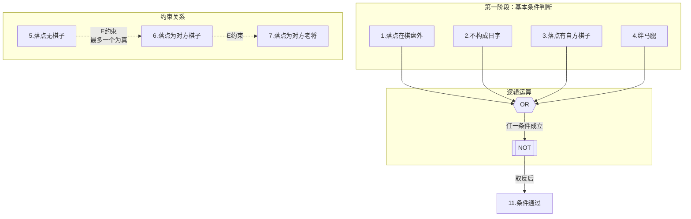
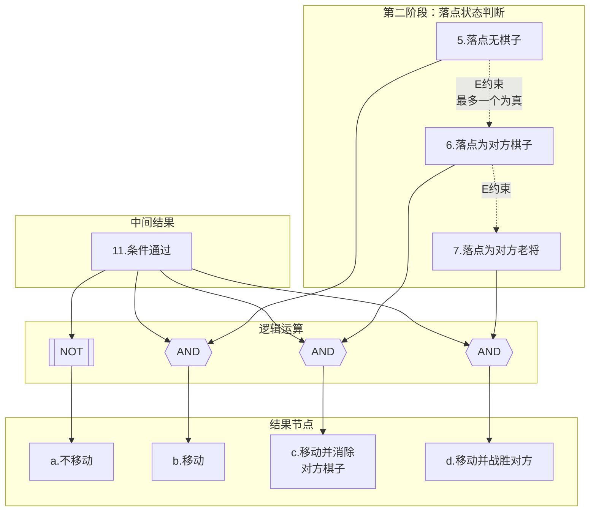

<h1 align="center">吉林大学软件学院</h1>

<h1 align="center">案例作业报告</h1>

**课程名称：软件质量保证与测试**

**案例主题：黑盒测试方法—因果图法**

**案例题目：11-象棋跳马**

**学生学号：55000000**

**学生姓名：**

**提交日期：**

【案例主题】黑盒测试方法—因果图法

【案例题目】11-象棋跳马

【案例目标】

通过"象棋跳马"案例学习采用因果图法设计测试用例。

【案例内容】

象棋跳马问题的规格说明如下：

1. 如果落点在棋盘外,则不移动棋子；

2. 如果落点与起点不构成日字型，则不移动棋子；

3. 如果在落点方向的邻近交叉点有棋子(绊马腿)，则不移动棋子；

4. 落点处有己方棋子,则不移动棋子；

5. 如果不属于1-4条，落点处无棋子，则移动棋子；

6. 如果不属于1-4条，落点处为对方棋子（非老将），则移动棋子并除去对方棋子；

7. 如果不属于1-4条，且落点处为对方老将，则移动棋子，并提示战胜对方，游戏结束。

【案例作业步骤】

1、找出所有原因和结果，并对原因和结果进行统一标号

分析一下【案例内容】中对象棋跳马的规格说明，列出题中所描述的相应条件，作为原因和结果。

①请在下面选出【案例内容】中描述的所有原因：

备注：选项前面的标号代表原因的标号。

1.落点在棋盘外

2.不构成日字

3.落点有自方棋子

4.绊马腿

5.落点无棋子

6.落点为对方棋子

7.落点为对方老将

8.没有落点

9.构成日字

10.移动棋子

| - | |
| --- | --- |
| 你的答案： | 1234567 |

②请在下面选出【案例内容】中描述的所有结果：

备注：选项前面的标号代表结果的标号。

a.不移动

b.移动

c.移动己方棋子消除对方棋子

d.移动并战胜对方

e.不移动并战胜对方

| - | |
| --- | --- |
| 你的答案： | abcd |

2、明确所有原因之间的约束关系

确定哪些原因之间存在着约束关系（E、I、O、R)。

（1）写出所有原因之间的约束关系

原因（ 567 ）（填入阿拉伯数字如：123）之间属于（ E ）（填入E、I、O或R）关系。

（2）画出原因与结果之间的因果图

在桌面打开画图工具，画完图之后，将其截图，保存为（.jpg）格式，然后粘贴到下方。

答案：

以下是象棋跳马案例的第一阶段因果图，展示了原因1-4如何通过OR和NOT逻辑门决定中间结果11（条件是否通过）。同时标注了原因5、6、7之间的E约束（异关系）。

**第一阶段因果图说明：**
- **原因1-4**（左侧）为基本条件判断，任何一个条件为真（落点不合格），都将导致不移动
- **OR门**：原因1、2、3、4通过OR门连接，表示只要任一条件为真，则条件不通过
- **NOT门**：对OR的结果取反，即四个条件全为假时，中间结果11（条件通过）才为真
- **中间结果11**：当落点在棋盘内、构成日字、无自方棋子、不绊马腿时，11=1
- **E约束**（右侧虚线）：原因5（落点无棋子）、6（落点为对方棋子）、7（落点为对方老将）之间为互斥关系，最多只能有一个为真

3、明确所有输出结果之间的约束关系

确定哪些结果之间存在着约束关系（E、I、O、R、M）

根据第1步找出的结果，分析题中与结果相关的语句，可以判断出结果之间属于"O"关系。这里不需要画出。

4、画出因果图

根据第2步原因和原因之间的约束关系，第3步结果和结果之间的约束关系找出什么样的原因组合会产生哪种结果。

在下面画出最后的因果图（粘贴.jpg图像）。

答案：

以下是象棋跳马案例的第二阶段因果图，展示了在中间结果11（条件通过）的基础上，如何根据原因5-7（落点状态）决定最终结果a-d。同时展示了中间结果11为假时，直接导致结果a（不移动）。

**第二阶段因果图说明：**
- **中间结果11**：来自第一阶段的结果，表示基本条件是否通过（落点在棋盘内、构成日字、无自方棋子、不绊马腿）
- **NOT逻辑**：当11为假（条件不通过）时，结果a（不移动）为真
- **AND逻辑**：当11为真时，根据落点的不同状态产生不同结果：
  - 11 AND 5（落点无棋子）→ b（移动）
  - 11 AND 6（落点为对方棋子）→ c（移动并消除对方棋子）
  - 11 AND 7（落点为对方老将）→ d（移动并战胜对方）
- **E约束**：原因5、6、7为互斥关系，三者中最多只有一个为真
- **O约束**：结果a、b、c、d之间为互斥关系（O约束），一次跳马只会产生一个确定的结果

5、根据因果图建立决策表

（1）画出决策表

完成表5-1、5-2。

"序号"列填入相应的原因编号，结果编号，原因、结果栏填入"1"（"1"表示为真）、"0"（"0"表示为假）或可以为空（空表示不填写内容）；

测试用例一栏填入"Y"（"Y"表示有测试用例）、为空（"空"表示没有测试用例，不填写内容）。

注意，表5-1中将中间结点11当做结果，表5-2中将中间结点当做原因。

本案例可作出共有（ 16 ）条用例的判定表。（填入阿拉伯数字）

表5-1

| 序号 | - |01 | 02 | 03 | 04 | 05 | 06 | 07 | 08 | 09 | 10 | 11 | 12 | 13 | 14 | 15 | 16 |
| --- | --- | --- | --- | --- | --- | --- | --- | --- | --- | --- | --- | --- | --- | --- | --- | --- | --- |
| 原因 | 1 | 0 | 0 | 0 | 0 | 0 | 0 | 0 | 0 | 1 | 1 | 1 | 1 | 1 | 1 | 1 | 1 |
| 2 | 0 | 0 | 0 | 0 | 1 | 1 | 1 | 1 | 0 | 0 | 0 | 0 | 1 | 1 | 1 | 1 |
| 3 | 0 | 0 | 1 | 1 | 0 | 0 | 1 | 1 | 0 | 0 | 1 | 1 | 0 | 0 | 1 | 1 |
| 4 | 0 | 1 | 0 | 1 | 0 | 1 | 0 | 1 | 0 | 1 | 0 | 1 | 0 | 1 | 0 | 1 |
| 结果 | 11 | 1 | 0 | 0 | 0 | 0 | 0 | 0 | 0 | 0 | 0 | 0 | 0 | 0 | 0 | 0 | 0 |
| - |0 | 0 | 0 | 0 | 0 | 0 | 0 | 0 | 0 | 0 | 0 | 0 | 0 | 0 | 0 | 0 |
| 测试用例 | - |Y | Y | Y | Y | Y | Y | Y | Y | Y | Y | Y | Y | Y | Y | Y | Y |

表5-2

| 序号 | - |01 | 02 | 03 | 04 | 05 | 06 | 07 | 08 | 09 | 10 | 11 | 12 | 13 | 14 | 15 | 16 |
| --- | --- | --- | --- | --- | --- | --- | --- | --- | --- | --- | --- | --- | --- | --- | --- | --- | --- |
| 原因 | 11 | 0 | 0 | 0 | 0 | 1 | 1 | 1 | 1 | 1 | 1 | 1 | 1 | 1 | 1 | 1 | 1 |
| 5 | 0 | 0 | 0 | 0 | 1 | 1 | 1 | 1 | 0 | 0 | 0 | 0 | 1 | 1 | 1 | 1 |
| 6 | 0 | 0 | 1 | 1 | 0 | 0 | 1 | 1 | 0 | 0 | 1 | 1 | 0 | 0 | 1 | 1 |
| 7 | 0 | 1 | 0 | 1 | 0 | 1 | 0 | 1 | 0 | 1 | 0 | 1 | 0 | 1 | 0 | 1 |
| 结果 | a | 1 | 1 | 1 | 1 | 0 | 0 | 0 | 0 | 0 | 0 | 0 | 0 | 0 | 0 | 0 | 0 |
| b | 0 | 0 | 0 | 0 | 1 | 0 | 0 | 0 | 0 | 0 | 0 | 0 | 0 | 0 | 0 | 0 |
| c | 0 | 0 | 0 | 0 | 0 | 0 | 1 | 0 | 0 | 0 | 0 | 0 | 0 | 0 | 0 | 0 |
| d | 0 | 0 | 0 | 0 | 0 | 1 | 0 | 0 | 0 | 0 | 0 | 0 | 0 | 0 | 0 | 0 |
| 测试用例 | - |Y | - |Y | - |Y | - |Y | - || - || Y | - || |

（2）去除无效用例

将两表整合起来，根据潜在的约束条件删除无效用例，写出最后所有原因与结果的决策表。

依次列举所有的组合情况，将最后的用例数据填入表5-3、表5-4（表5-4是表5-3的续表）。

去除无效用例后,剩余有效用例共（ 10 ）条。（填入阿拉伯数字）

表5-3

| 序号 | - |01 | 02 | 03 | 04 | 05 | 06 | 07 | 08 | 09 | 10 |
| --- | --- | --- | --- | --- | --- | --- | --- | --- | --- | --- | --- |
| 原因 | 1 | 1 | 0 | 0 | 0 | 1 | 1 | 0 | 0 | 0 | 0 |
| 2 | 0 | 1 | 0 | 0 | 1 | 0 | 1 | 0 | 0 | 0 | 0 |
| 3 | 0 | 0 | 1 | 0 | 0 | 1 | 1 | 0 | 0 | 0 | 0 |
| 4 | 0 | 0 | 0 | 1 | 0 | 0 | 0 | 0 | 0 | 0 | 0 |
| 5 | 0 | 0 | 0 | 0 | 0 | 0 | 0 | 1 | 0 | 0 | 0 |
| 6 | 0 | 0 | 0 | 0 | 0 | 0 | 0 | 0 | 1 | 0 | 0 |
| 7 | 0 | 0 | 0 | 0 | 0 | 0 | 0 | 0 | 0 | 1 | 0 |
| 结果 | a | 1 | 1 | 1 | 1 | 1 | 1 | 0 | 0 | 0 | 0 |
| b | 0 | 0 | 0 | 0 | 0 | 0 | 0 | 1 | 0 | 0 | 0 |
| c | 0 | 0 | 0 | 0 | 0 | 0 | 0 | 0 | 1 | 0 | 0 |
| d | 0 | 0 | 0 | 0 | 0 | 0 | 0 | 0 | 0 | 1 | 0 |
| 测试用例 | - |Y | Y | Y | Y | Y | Y | Y | Y | Y | Y |
| 实际结果 | - |不移动 | 不移动 | 不移动 | 不移动 | 不移动 | 不移动 | 移动 | 移动并消除 | 移动并战胜 | |

表5-4

| 序号 | - |11 | 12 | 13 | 14 | 15 | 16 | 17 | 18 | 19 | 20 |
| --- | --- | --- | --- | --- | --- | --- | --- | --- | --- | --- | --- |
| 原因 | 1 | - || - || - || - || - ||
| 2 | - || - || - || - || - || |
| 3 | - || - || - || - || - || |
| 4 | - || - || - || - || - || |
| 5 | - || - || - || - || - || |
| 6 | - || - || - || - || - || |
| 7 | - || - || - || - || - || |
| 结果 | a | - || - || - || - || - ||
| b | - || - || - || - || - || |
| c | - || - || - || - || - || |
| d | - || - || - || - || - || |
| 测试用例 | - || - || - || - || - || |
| 实际结果 | - || - || - || - || - || |
