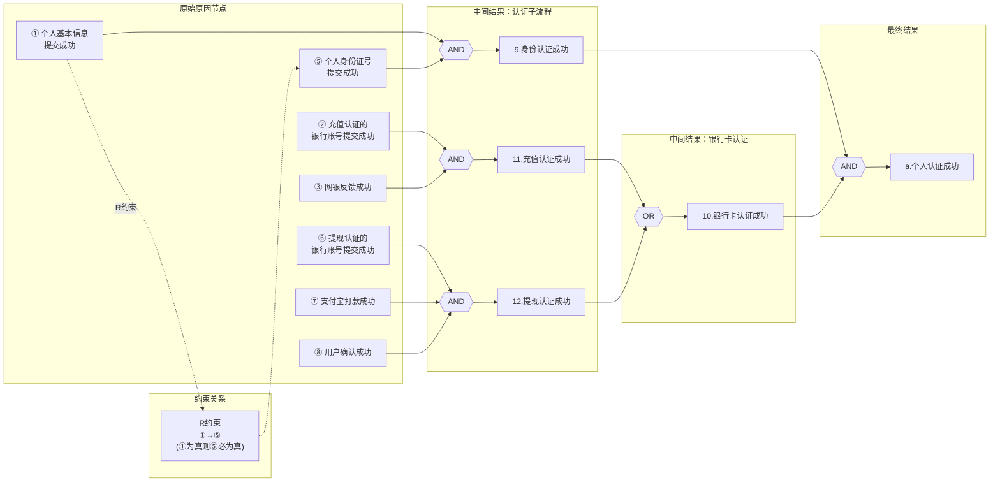
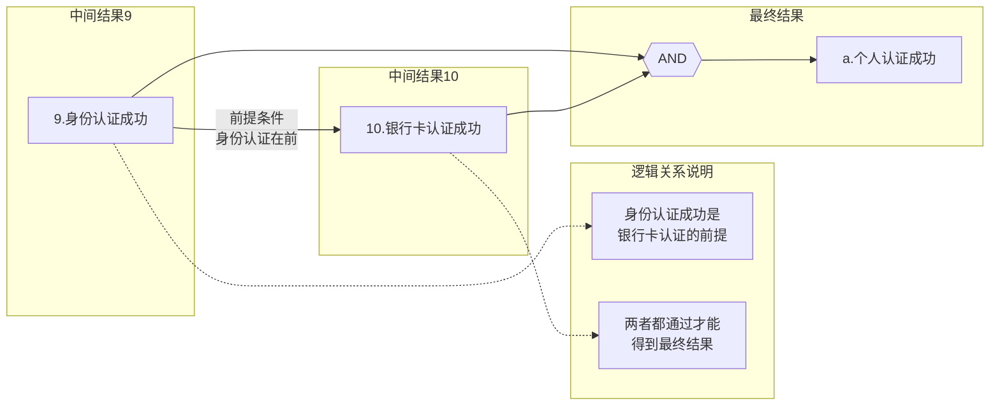

<h1 align="center">吉林大学软件学院</h1>

<h1 align="center">案例作业报告</h1>

**课程名称：软件质量保证与测试**

**案例主题：黑盒测试方法—因果图法**

**案例题目：12-个人认证**

**学生学号：55000000**

**学生姓名：**

**提交日期：**

【案例主题】黑盒测试方法—因果图法

【案例题目】12-个人认证

【案例目标】

以"个人认证流程"案例为例学习采用因果图法设计测试用例。

【案例内容】

个人认证实名认证中，分为两部分：个人身份认证和银行卡认证。

个人身份认证成功之后才能进行银行卡认证。这两者都通过后，认为个人认证成功。

个人身份认证的流程是：提交个人基本信息——>提交身份证件号。

银行卡认证分为两种：提现认证和充值认证。只要其中一种认证成功，就不可以进行另一种认证了。其中一种认证没有成功，可以选择另一种认证。

提现认证的流程是：用户提交正确的银行帐号——>个人认证给用户的银行卡中随机打款——>用户确认金额，认证成功。

充值认证的流程是：用户提交正确的银行帐号——>充值成功——>网银反馈，认证成功。

【案例作业步骤】

1、找出所有原因和结果，并对原因和结果进行统一标号

首先，我们需要对个人认证流程问题的测试项目进行整体分析，了解个人认证的过程，根据了解的内容列出题中所描述的原因和结果。

（1）找出原因

请在下面选出【案例内容】中描述的所有原因：

备注：选项前面的标号代表原因的标号。

①个人基本信息提交成功

②充值认证的银行账号提交成功

③网银反馈成功

④身份认证成功

⑤个人身份证号提交成功

⑥提现认证的银行账号提交成功

⑦支付宝打款成功

⑧用户确认成功

⑨银行卡认证成功

⑩充值成功

| - | |
| --- | --- |
| 你的答案： | ①②③⑤⑥⑦⑧ |

（2）找出中间结果

表1-2

| 编号 | 原因 |
| --- | --- |
| 9 | 身份认证成功 |
| 10 | 银行卡认证成功 |
| 11 | 充值认证成功 |
| 12 | 提现认证成功 |

（3）找出结果

请在下面选出【案例内容】中描述的所有结果：

备注：选项前面的标号代表结果的标号。

A.身份认证成功

B.用户确认成功

C.个人认证成功

D.提现认证成功

E.网银反馈成功

F.银行卡认证成功

| - | |
| --- | --- |
| 你的答案： | C |

2、明确所有原因之间的约束关系

①请选出描述原因之间约束关系正确的所有选项：

A.原因①与原因⑤之间属于要求关系

B.原因②与原因⑤之间属于要求关系

C.原因②与原因⑩之间属于互斥关系

D.原因③与原因⑧之间属于或关系

| - | |
| --- | --- |
| 你的答案： | A |

3、明确所有输出结果之间的约束关系

确定哪些结果之间存在着约束关系（E、I、O、R、M)。本题只有"个人认证成功"一种结果，所以不存在约束关系。

4、画出因果图

根据第3步原因和原因之间的约束关系，结果和结果之间的约束关系找出什么样的原因组合会产生哪种结果。

使用画图工具，画完图之后，将其截图，保存为（.jpg）格式，粘贴到下方。

答案：

以下是个人认证案例的完整因果图，采用Mermaid语法绘制。图中展示了从原始原因节点（左侧）经过中间结果节点（中间）通过AND、OR逻辑门最终连接到最终结果a（个人认证成功）的完整逻辑流程。同时标注了原因①和⑤之间的R约束（要求关系）。

**完整因果图说明：**
- **身份认证分支**（左上）：原因①（个人基本信息提交成功）AND ⑤（个人身份证号提交成功）→ 中间结果9（身份认证成功）
- **充值认证分支**（左中）：原因②（充值认证的银行账号提交成功）AND ③（网银反馈成功）→ 中间结果11（充值认证成功）
- **提现认证分支**（左下）：原因⑥（提现认证的银行账号提交成功）AND ⑦（支付宝打款成功）AND ⑧（用户确认成功）→ 中间结果12（提现认证成功）
- **银行卡认证汇总**（中间）：中间结果11（充值认证成功）OR 12（提现认证成功）→ 中间结果10（银行卡认证成功）。即两种认证方式只要有一种通过，银行卡认证即成功，且两种认证互斥。
- **最终结果**（右侧）：中间结果9（身份认证成功）AND 10（银行卡认证成功）→ 结果a（个人认证成功）
- **R约束**：原因①与⑤之间为要求关系，即①为真时⑤必须为真（提交了基本信息就必须提交身份证号才能完成身份认证）

因为中间原因9和中间原因10也有先后关系，所以再单独为中间原因9和中间原因10画出因果图。画完图之后，将其截图，保存为（.jpg）格式，粘贴到下方。

答案：

以下是中间原因9（身份认证成功）和中间原因10（银行卡认证成功）的关系图，展示了两者之间的先后依赖关系以及与最终结果a之间的逻辑连接。

**中间原因9和10的关系说明：**
- **先后顺序**：必须先完成身份认证（9=1），才能进行银行卡认证（10），身份认证是银行卡认证的前提
- **AND逻辑**：身份认证成功（9）和银行卡认证成功（10）必须同时满足，才能产生最终结果a（个人认证成功）
- **业务流程**：
  1. 提交个人基本信息（①）+ 提交身份证号（⑤）→ 身份认证成功（9）
  2. 身份认证成功后 → 进行银行卡认证（充值认证11 或 提现认证12 → 银行卡认证成功10）
  3. 身份认证成功（9）AND 银行卡认证成功（10）→ 个人认证成功（a）
- **依赖关系**：中间结果10依赖于中间结果9，最终结果a同时依赖于9和10

5、根据因果图，建立决策表

选择合适的方法建立决策表。

（1）将中间原因9、10、11、12看作原因，建立决策表

①计算可知有（ 16 ）个用例？（填入阿拉伯数字）

②由原因会产生相应的结果，将结果填入表5-1。若原因之间的组合违反约束条件或无操作行为的在表格中用"-"表示。

表5-1

| 序号 | - |01 | 02 | 03 | 04 | 05 | 06 | 07 | 08 | 09 | 10 | 11 | 12 | 13 | 14 | 15 | 16 |
| --- | --- | --- | --- | --- | --- | --- | --- | --- | --- | --- | --- | --- | --- | --- | --- | --- | --- |
| 原因 | 9 | 0 | 0 | 0 | 0 | 0 | 0 | 0 | 0 | 1 | 1 | 1 | 1 | 1 | 1 | 1 | 1 |
| 10 | 0 | 0 | 0 | 0 | 1 | 1 | 1 | 1 | 0 | 0 | 0 | 0 | 1 | 1 | 1 | 1 |
| 11 | 0 | 0 | 1 | 1 | 0 | 0 | 1 | 1 | 0 | 0 | 1 | 1 | 0 | 0 | 1 | 1 |
| 12 | 0 | 1 | 0 | 1 | 0 | 1 | 0 | 1 | 0 | 1 | 0 | 1 | 0 | 1 | 0 | 1 |
| 结果 | a | 0 | - | - | - | - | - | - | - | 0 | - | - | - | 1 | 1 | 1 | - |

（2）画出决策表

①根据上一步的分析，画出最终决策表。

②将其中有行为操作的、不违反约束条件的数据填入表5-2。

表5-2

| 序号 | - |1 | 2 | 3 | 4 | 5 | 6 | 7 | 8 | 9 | 10 |
| --- | --- | --- | --- | --- | --- | --- | --- | --- | --- | --- | --- |
| 原因 | ① | 1 | 1 | 0 | 1 | 1 | 1 | 1 | 1 | 1 | 1 |
| ⑤ | 1 | 1 | 1 | 0 | 1 | 1 | 1 | 1 | 1 | 1 | 1 |
| ② | 1 | 0 | 1 | 1 | 1 | 1 | 0 | 0 | 0 | 0 | 1 |
| ⑥ | 0 | 1 | 0 | 0 | 0 | 1 | 1 | 1 | 0 | 0 | 1 |
| ⑦ | 0 | 1 | 0 | 0 | 0 | 1 | 0 | 1 | 0 | 0 | 0 |
| ⑧ | 0 | 1 | 0 | 0 | 0 | 1 | 0 | 0 | 0 | 0 | 0 |
| ③ | 1 | 0 | 1 | 1 | 0 | 0 | 0 | 0 | 0 | 0 | 1 |
| 中间结果 | 9 | 1 | 1 | 0 | 0 | 1 | 1 | 1 | 1 | 1 | 1 |
| 11 | 1 | 0 | 1 | 1 | 0 | 0 | 0 | 0 | 0 | 0 | 1 |
| 12 | 0 | 1 | 0 | 0 | 0 | 1 | 0 | 0 | 0 | 0 | 0 |
| 结果 | a | 1 | 1 | 0 | 0 | 0 | 1 | 0 | 0 | 0 | 1 |

②最终决策表中的测试用例共（ 10 ）条。（填入阿拉伯数字）
