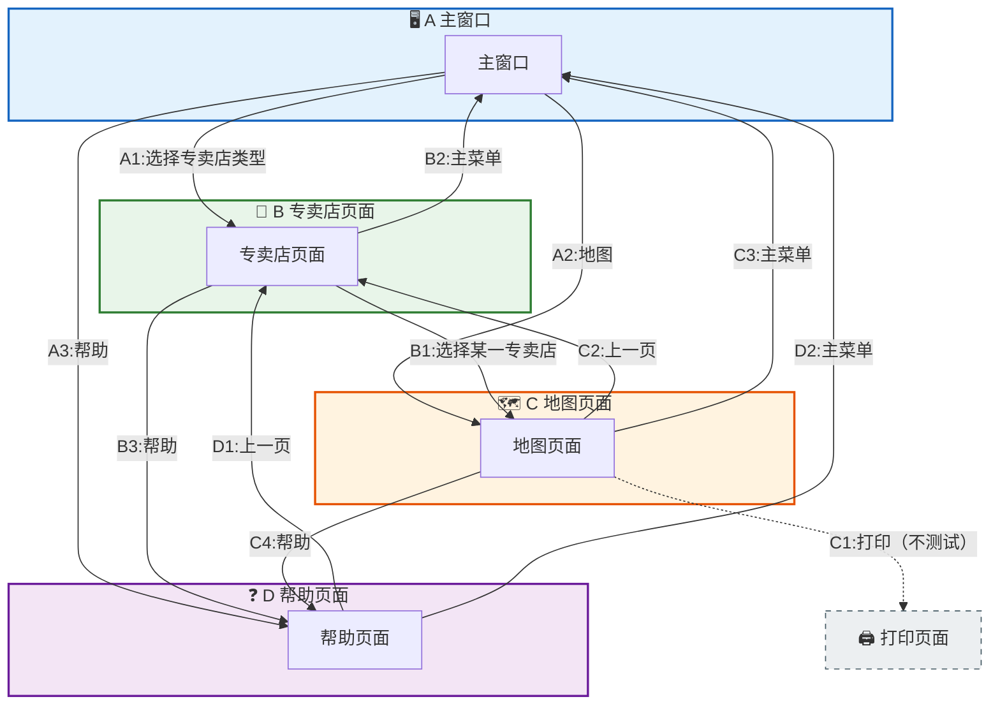

<h1 align="center">吉林大学软件学院</h1>

<h1 align="center">案例作业报告</h1>

**课程名称：软件质量保证与测试**

**案例主题：黑盒测试方法—测试大纲法**

**案例题目：17-信息查询系统**

**学生学号：55000000**

**学生姓名：**

**提交日期：**

【案例主题】黑盒测试方法—测试大纲法

【案例题目】17-信息查询系统

【案例目标】

通过"信息查询系统"案例学习采用测试大纲法设计测试用例。

【案例内容】

使用测试大纲法对信息查询系统进行测试，下面是信息查询系统需求说明。

1 主窗口

主窗口中有"请选择专卖店类型"下拉菜单、"地图"和"帮助"按钮。

（1）请选择专卖店类型：有服装专卖店、家电专卖店、手机专卖店三类。

（2）地图：点击地图按钮，进入地图页面。

（3）帮助：点击帮助按钮，进入帮助页面。

2 某类专卖店页面

某类专卖店页面有"选择某专卖店"、"主菜单"按钮、"帮助"按钮。

（1）选择某一专卖店：选择某一专卖店后，会进入显示该专卖店位置的地图页面。

（2）主菜单：点击主菜单按钮，进入主窗口页面。

（3）帮助：点击帮助按钮,进入帮助页面。

3 地图页面

地图页面包括"打印"按钮、"上一页"按钮、"主菜单"按钮、"帮助"按钮、和地图显示区。

（1）打印：点击打印按钮，弹出打印页面，进行打印（打印功能另有测试，本次不测试该功能）。

（2）上一页：点击上一页按钮，返回上一页。

（3）主菜单：点击主菜单按钮，返回主窗口页面。

（4）帮助：点击帮助按钮，进入帮助页面。

（5）地图显示区：显示地图。

4 帮助页面

帮助页面包括：上一页按钮、主菜单按钮和帮助信息显示区。

（1）上一页：点击上一页按钮，返回上一页。

（2）主菜单：点击主菜单按钮，返回主窗口页面。

【案例作业步骤】

1、找出所有窗口及窗口的输入动作

注意窗口之间的先后顺序，将找出的窗口及窗口的输入动作填入表1-1。

表1-1

|  |  |  |  |  |
| --- | --- | --- | --- | --- |
| 编号 | A主窗口 | B专卖店 | C地图 | D帮助 |
| 1 | 选择专卖店类型 | 选择某一专卖店 | 打印 | 上一页 |
| 2 | 地图 | 主菜单 | 上一页 | 主菜单 |
| 3 | 帮助 | 帮助 | 主菜单 | - |
| 4 | **-** | - | 帮助 | - |

2、找到各个窗口之间的联系，编写测试大纲

窗口的标号+动作的编号代表对应的动作，如：A1代表"选择专卖店类型"，A2代表"地图"，A3代表"帮助"。

用箭头连接两个动作，代表在一个窗口执行某个动作后可到达另一个窗口并执行某个动作。

注：

这是以动作为节点画一个有向图，缺点是根节点必须是系统主窗口，概念一致性不太好。优点是图面简洁、容易画。

还可以把窗口做为节点、动作做为有向边来画有向图。优点是点集/边集概念一致性好。缺点是有向边必须标注动作，图面略繁杂。

使用画图工具，画出本案例的测试大纲图，保存为.jpg格式文件，粘贴在下方。

答案：

**本测试大纲图以4个窗口（A主窗口、B专卖店页面、C地图页面、D帮助页面）为节点簇，各窗口的输入动作作为有向边，表示执行某个动作后从一个窗口流转到另一个窗口。图中省略了打印功能（C1）因其不在本次测试范围内。**

**上图说明：** 测试大纲图展示了信息查询系统中4个主要窗口之间的页面流转关系。每个子图代表一个窗口节点，有向边上的标注（如A1、B2等）表示触发页面跳转的动作编号。打印功能（C1）用虚线表示，表示该功能不在本次测试范围内。

3、编写测试用例

①依据步骤2中编写的测试大纲，可以设计（ 6 ）个用例？（填入阿拉伯数字）

②将测试用例填入表3-1。

表3-1

|  |  |  |  |
| --- | --- | --- | --- |
| 编号 | 输入数据 | 预期结果 | 实际结果 |
| 1 | A1→B1→C2→B2 | 主窗口→专卖店页面→地图页面→专卖店页面→主窗口 | 主窗口→专卖店页面→地图页面→专卖店页面→主窗口 |
| 2 | A1→B3→D1→B2 | 主窗口→专卖店页面→帮助页面→专卖店页面→主窗口 | 主窗口→专卖店页面→帮助页面→专卖店页面→主窗口 |
| 3 | A2→C3 | 主窗口→地图页面→主窗口 | 主窗口→地图页面→主窗口 |
| 4 | A2→C4→D2 | 主窗口→地图页面→帮助页面→主窗口 | 主窗口→地图页面→帮助页面→主窗口 |
| 5 | A3→D2 | 主窗口→帮助页面→主窗口 | 主窗口→帮助页面→主窗口 |
| 6 | A1→B1→C1 | 主窗口→专卖店页面→地图页面→打印页面 | 主窗口→专卖店页面→地图页面→打印页面 |
|  |  |  |  |
|  |  |  |  |
|  |  |  |  |
|  |  |  |  |
|  |  |  |  |
|  |  |  |  |
|  |  |  |  |
