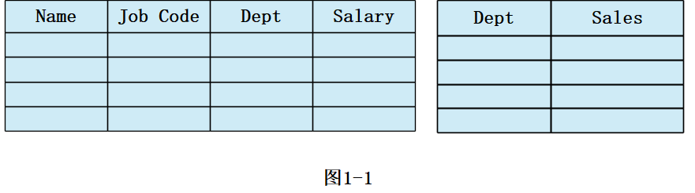
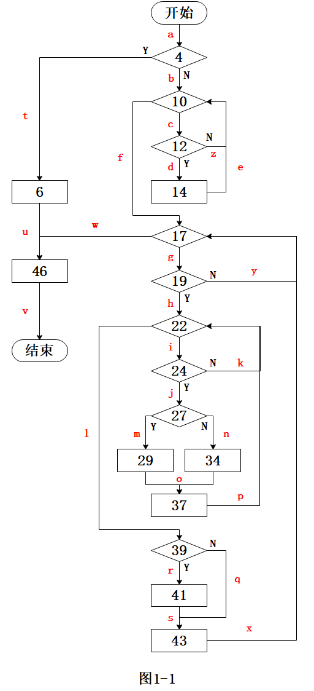

<center></center>

<h1 align="center">吉林大学软件学院</h1>

<h1 align="center">案例作业报告</h1>

**课程名称：软件质量保证与测试**

**案例主题：白盒测试方法—逻辑覆盖**

**案例题目：19-工资管理**

**学生学号：55000000**

**学生姓名：**

**提交日期：**

【案例主题】白盒测试方法—逻辑覆盖

【案例题目】19-工资管理

【案例目标】

以工资管理程序的测试用例设计为例学习逻辑覆盖法的使用方法。

【案例内容】

工资管理程序BONUS的功能是为销售额最高的部门的职员的薪水增加¥200。

但是，如果某个符合条件的职员的当前工资已经达到或超过了¥15000或者职位为经理，则薪水只增加¥100。

模块功能的输入如图1-1表格所示，左为职员表，右为部门表。

如果模块正确完成了其功能，返回错误代码0。

如果职员表或者部门表中不存在任何条目，将返回错误代码1。

如果在某个符合条件的部门中未发现任何职员，将返回错误代码2。



职员表由姓名(Name)、职务(Job Code)、部门(Dept)、工资(Salay)四项组成。

其中“职务”一栏，可填入“E”或“M”（“E”表示一般职员，“M”表示经理）；

“部门”一栏可填入“D42”、“D32”、“D95”、“D44”；

“工资”一栏中的工资精确到小数点后两位。

部门表由部门(Dept)和销售量(Sales)两项组成。

“部门”一栏可填入“D42”、“D32”、“D95”、“D44”；

“销售量”一栏中的销售量精确到小数点后两位。

下面是BONUS的源程序，参数表中EmployeeTable、DepartmentTable分别是职员表和部门表，nESize、nDSize分别表示两个表的长度。

```c
#include "stdafx.h"

#define YX\_MAX\_DEPT 4

{

int Dept;

struct EmployeeTable

}E;

int Dept;

struct DepartmentTable

}D;

//最大销售量初始化为"0"，出错码初始化为"0"；

int nErrCode = 0;

{

else

for( int i = 0; i < nDSize; ++i )

{

}

{

bFound = false;

{

bFound = true;

{

}

pEmpTab->Employees[ k ].Salary = pEmpTab->Employees[ k ].Salary +200.00;

}

if( !bFound )

}

}

}
```
驱动模块：

```c
int main( int argc, char\* argv[] )

strcpy( E.Employees[0].Name, "JONES" );

E.Employees[0].Salary = 21000.00;

E.Employees[1].Dept = 42;

D.Departments[0].Sales = 10000.00;

Bonus( &E, &D, c, d);

}
```

【案例作业步骤】

1、为程序设计“语句覆盖”测试用例

（1）画出程序的流程图

这里直接给出了程序的流程图，如图1-1所示：



（2）根据程序的流程图设计测试用例并填写测试数据

根据表1-1中“覆盖路径”的内容，为工资管理程序设计“语句覆盖”的测试用例。

表1-1

|  |  |  |  |  |
| --- | --- | --- | --- | --- |
| 用例编号 |  | 1 | 2 | |
| 输入 | 覆盖路径 | a-t-u-v | ①a-b-c-d-e-f-g-h-i-k-l-r-s  ②a-b-c-d-e-f-g-h-i-j-m-o-p-l-q-x-w-v  ③a-b-c-d-e-f-g-h-i-j-n-o-p-l-q-x-w-v | |
| nESize |  | 0 | 3 | |
| nDSize |  | 0 | 3 | |
| Employee Table | | | |
| Name |  | — | JONES/SMITH/TOM | |
| Job Code |  | — | M/E/E | |
| Dept |  | — | D42/D42/D44 | |
| Salary |  | — | 21000.00/5000.00/5000.00 | |
| Department Table | | | |
| Dept |  | — | D42/D32/D95 | |
| Sales |  | — | 10000.00/10000.00/5000.00 | |
| 预期输出 | nErrCode | 1 | 2 | |
| Employee Table | | | |
| Name |  | — | JONES/SMITH/TOM | |
| Job Code |  | — | M/E/E | |
| Dept |  | — | D42/D42/D44 | |
| Salary |  | — | 21100.00/5200.00/5000.00 | |
| 实际输出 | nErrCode | 1 | 2 | |
| Employee Table | | | |
| Name |  | — | JONES/SMITH/TOM | |
| Job Code |  | — | M/E/E | |
| Dept |  | — | D42/D42/D44 | |
| Salary |  | — | 21100.00/5200.00/5000.00 | |

（3）计算语句覆盖率

语句覆盖率 = 至少被执行一次的语句数量 / 可执行的语句总数 \* 100% =（ 100.0 ）%（小数点后保留1位）

2、找出所有条件语句

首先列出程序中的判定，考虑所有的条件语句和循环语句。

本例中只要输入表格不空，循环语句总会经历进入循环体和跳过循环体这两种情况（因为循环终值都大于等于循环初值），所以就不必专门考虑了，需要分析的只是六个条件语句中的判定。

```c
if( nESize <= 0 || nDSize <= 0 )

if( pEmpTab->Employees[ k ].Dept == pDeptTab->Departments[ j ].Dept )
```

3、为程序设计“判定覆盖”测试用例

根据上一步找出的所有条件语句的标号，用T/F前缀表示真/假分支，给出需要覆盖的标记：

T4, F4, T12, F12, T19, F19, T24, F24, T27, F27, T39, F39

（1）为工资管理程序设计“判定覆盖”测试用例，根据“覆盖的标记”设计输入数据，并同“预期输出”填入表3-1。

表3-1

|  |  |  |  |  |  |
| --- | --- | --- | --- | --- | --- |
| 用例编号 |  | 1 | 2 | | |
| 输入 | 覆盖标记 | T4 | F4, T12, F12, T19, F19, T24, F24, T27, F27, T39, F39 | | |
| nESize |  | 0 | 3 |  | |
| nDSize |  | 0 | 3 |  | |
| Employee Table | | | | |
| Name |  | — | JONES/SMITH/TOM |  | |
| Job Code |  | — | M/E/E |  | |
| Dept |  | — | D42/D42/D44 |  | |
| Salary |  | — | 5000.00/5000.00/5000.00 |  | |
| Department Table | | | | |
| Dept |  | — | D42/D32/D95 |  | |
| Sales |  | — | 10000.00/10000.00/5000.00 |  | |
| 预期输出 | nErrCode | 1 | 2 |  | |
| Employee Table | | | | |
| Name |  | — | JONES/SMITH/TOM |  | |
| Job Code |  | — | M/E/E |  | |
| Dept |  | — | D42/D42/D44 |  | |
| Salary |  | — | 5100.00/5200.00/5000.00 |  | |
| 实际输出 | nErrCode | 1 | 2 |  | |
| Employee Table | | | | |
| Name |  | — | JONES/SMITH/TOM |  | |
| Job Code |  | — | M/E/E |  | |
| Dept |  | — | D42/D42/D44 |  | |
| Salary |  | — | 5100.00/5200.00/5000.00 |  | |

（2）观察上面的测试用例，思考它们是否能够发现程序其他可能的错误？

①是否检查了“nErrCode为0”的情况？否

②是否检查了“职员是经理”的情况？是

③是否检查了“职员工资大于15000”的情况？否

④是否检查了“部门表为‘空’”的情况？是

（3）计算判定覆盖率

判定覆盖率 = 判定结果被评价的次数 / 判定结果的总数 \* 100% = （ 100.0 ）%（小数点后保留1位）

4、为程序设计“条件覆盖”测试用例

第2步找出的所有条件语句中，语句4和27是复合逻辑判定，各包含两个条件表达式，其它条件语句都只有一个条件表达式。由此给出需要覆盖的标记：

T4-1, F4-1, T4-2, F4-2, T12, F12, T19, F19, T24, F24, T27-1, F27-1, T27-2, F27-2, T39, F39

（1）下面为工资管理程序设计“条件覆盖”测试用例，根据“覆盖的标记”设计输入数据，并同“预期输出”填入表4-1。

表4-1

|  |  |  |  |  |  |
| --- | --- | --- | --- | --- | --- |
| 用例编号 |  | 1 | 2 | | |
| 输入 | 覆盖标记 | T4-1,  T4-2 | F4-1, F4-2, T12, F12, T19, F19, T24, F24,  T27-1, F27-1, T27-2, F27-2, T39, F39 | | |
| nESize |  | 0 | 3 |  | |
| nDSize |  | 0 | 3 |  | |
| Employee Table | | | | |
| Name |  | — | JONES/SMITH/TOM |  | |
| Job Code |  | — | M/E/E |  | |
| Dept |  | — | D42/D42/D44 |  | |
| Salary |  | — | 21000.00/5000.00/5000.00 |  | |
| Department Table | | | | |
| Dept |  | — | D42/D32/D95 |  | |
| Sales |  | — | 10000.00/10000.00/5000.00 |  | |
| 预期输出 | nErrCode | 1 | 2 |  | |
| Employee Table | | | | |
| Name |  | — | JONES/SMITH/TOM |  | |
| Job Code |  | — | M/E/E |  | |
| Dept |  | — | D42/D42/D44 |  | |
| Salary |  | — | 21100.00/5200.00/5000.00 |  | |
| 实际输出 | nErrCode | 1 | 2 |  | |
| Employee Table | | | | |
| Name |  | — | JONES/SMITH/TOM |  | |
| Job Code |  | — | M/E/E |  | |
| Dept |  | — | D42/D42/D44 |  | |
| Salary |  | — | 21100.00/5200.00/5000.00 |  | |

（2）观察上面的测试用例，思考它们是否能够发现程序其他可能的错误？

①是否检查了“nErrCode为0”的情况？否

②如果语句4误写成( nESize > 0 ) AND ( nDSize > 0 )，这个错误是否能被发现？是

③如果语句34中的“+200”被误写成“+300”，这个错误能否被该组测试用例发现？是

（3）计算条件覆盖率

条件覆盖率 = 条件操作数值至少被评价一次的数量 / 条件操作数值的总数 \* 100% = （ 100.0 ）%（小数点后保留1位）

5、为程序设计“判定/条件覆盖”测试用例

（1）下面为程序设计“判定/条件覆盖”测试用例，根据“覆盖的标记”设计输入数据，并同“预期输出”填入表5-1。

表5-1

|  |  |  |  |  |  |
| --- | --- | --- | --- | --- | --- |
| 用例编号 |  | 1 | 2 | | |
| 输入 | 覆盖标记 | T4-1,  T4-2,  T4 | F4-1, F4-2, F4, T12, F12, T19, F19, T24, F24,  T27-1, F27-1, T27-2, F27-2, T27, F27, T39, F39 | | |
| nESize |  | 0 | 3 |  | |
| nDSize |  | 0 | 3 |  | |
| Employee Table | | | | |
| Name |  | — | JONES/SMITH/TOM |  | |
| Job Code |  | — | M/E/E |  | |
| Dept |  | — | D42/D42/D44 |  | |
| Salary |  | — | 21000.00/5000.00/5000.00 |  | |
| Department Table | | | | |
| Dept |  | — | D42/D32/D95 |  | |
| Sales |  | — | 10000.00/10000.00/5000.00 |  | |
| 预期输出 | nErrCode | 1 | 2 |  | |
| Employee Table | | | | |
| Name |  | — | JONES/SMITH/TOM |  | |
| Job Code |  | — | M/E/E |  | |
| Dept |  | — | D42/D42/D44 |  | |
| Salary |  | — | 21100.00/5200.00/5000.00 |  | |
| 实际输出 | nErrCode | 1 | 2 |  | |
| Employee Table | | | | |
| Name |  | — | JONES/SMITH/TOM |  | |
| Job Code |  | — | M/E/E |  | |
| Dept |  | — | D42/D42/D44 |  | |
| Salary |  | — | 21100.00/5200.00/5000.00 |  | |

（2）思考：如果所用的编译系统将含有“OR”的表达式处理成：遇到第一项为“真”就不再检查后面的项，则这样的两个测试用例能否检查到“pEmpTab->Employees[ k ].Code == 'M'”这一部分？

（3）计算判定/条件覆盖率

判淀定/条件覆盖率 = 条件操作数值或判定结果值至少被评价一次的数量 / (条件操作数值总数+判定结果总数) \* 100% = （ 100.0 ）%（小数点后保留1位）

6、为程序设计“条件组合覆盖”测试用例

语句4和27的条件表达式组合各有4种，语句12、19、24、39的条件表达式组合各有2种，所以按条件组合覆盖的标准，需要被覆盖的组合一共有16种，详见“分析帮助”。

注意：在统计条件表达式组合总数时，“条件组合覆盖标准”在各个条件语句之间仅仅做加法，而“组合覆盖标准”才是在各条件语句之间做乘法。

根据第4步“条件覆盖”中给出的条件标记，列出要满足条件组合覆盖所必须覆盖的标记，见下表：

|  |  |  |  |
| --- | --- | --- | --- |
| 判定语句  编号 | 各条件标记的  取值 | 条件组合的标记 | 组合标记  编号 |
| 4 | T4-1：nESize <= 0  F4-1：nESize > 0  T4-2：nDSize <= 0  F4-2：nDSize > 0 | (T4-1, T4-2) | （1） |
| (T4-1, F4-2) | （2） |
| (F4-1, T4-2) | （3） |
| (F4-1, F4-2) | （4） |
| 12 | T12：pDeptTab->Departments[ i ].Sales > nMaxSales  F12：pDeptTab->Departments[ i ].Sales <= nMaxSales | T12 | （5） |
| F12 | （6） |
| 19 | T19：pDeptTab->Departments[ j ].Sales == nMaxSales  F19：pDeptTab->Departments[ j ].Sales != nMaxSales | T19 | （7） |
| F19 | （8） |
| 24 | T24：pEmpTab->Employees[ k ].Dept == pDeptTab->Departments[ j ].Dept  F24：pEmpTab->Employees[ k ].Dept != pDeptTab->Departments[ j ].Dept | T24 | （9） |
| F24 | （10） |
| 27 | T27-1：pEmpTab->Employees[ k ].Salary >= 15000.00 )  F27-1：pEmpTab->Employees[ k ].Salary < 15000.00 )  T27-2：( pEmpTab->Employees[ k ].Code == 'M' )  F27-2：( pEmpTab->Employees[ k ].Code != 'M' ) | (T27-1, T27-2) | （11） |
| (T27-1, F27-2) | （12） |
| (F27-1, T27-2) | （13） |
| (F27-1, F27-2) | （14） |
| 39 | T39：!bFound  F39：bFound | T39 | （15） |
| F39 | （16） |

（1）为程序设计“条件组合覆盖”测试用例，根据“覆盖的标记”设计输入数据，并同“预期输出”填入表6-1。

表6-1

|  |  |  |  |  |  |  |  |  |  |
| --- | --- | --- | --- | --- | --- | --- | --- | --- | --- |
| 用例编号 |  | 1 | 2 | 3 | 4 | 5 | 6 | 7 | 8 |
| 输入 | 覆盖标记  的编号 | （1） | （2） | （3） | （4）  （9）  （11） | （13） | （14） | （12） | （10） |
| nESize |  | 0 | 0 | 1 | 2 | 1 | 1 | 1 | 1 |
| nDSize |  | 0 | 1 | 0 | 2 | 1 | 1 | 1 | 2 |
| Employee Table | | | | | | | | | |
| Name |  | — | — | JONES | JONES/TOM | JONES | SMITH | SMITH | TOM |
| Job Code |  | — | — | E | M/E | M | E | E | E |
| Dept |  | — | — | D42 | D42/D44 | D42 | D42 | D42 | D44 |
| Salary |  | — | — | 5000.00 | 21000.00/5000.00 | 5000.00 | 5000.00 | 21000.00 | 5000.00 |
| Department Table | | | | | | | | | |
| Dept |  | — | D42 | — | D42/D32 | D42 | D42 | D42 | D42/D32 |
| Sales |  | — | 10000.00 | — | 10000.00/5000.00 | 10000.00 | 10000.00 | 10000.00 | 10000.00/10000.00 |
| 预期输出 | nErrCode | 1 | 1 | 1 | 0 | 0 | 0 | 0 | 2 |
| Employee Table | | | | | | | | | |
| Name |  | — | — | JONES | JONES/TOM | JONES | SMITH | SMITH | TOM |
| Job Code |  | — | — | E | M/E | M | E | E | E |
| Dept |  | — | — | D42 | D42/D44 | D42 | D42 | D42 | D44 |
| Salary |  | — | — | 5000.00 | 21100.00/5000.00 | 5100.00 | 5200.00 | 21100.00 | 5000.00 |
| 实际输出 | nErrCode | 1 | 1 | 1 | 0 | 0 | 0 | 0 | 2 |
| Employee Table | | | | | | | | | |
| Name |  | — | — | JONES | JONES/TOM | JONES | SMITH | SMITH | TOM |
| Job Code |  | — | — | E | M/E | M | E | E | E |
| Dept |  | — | — | D42 | D42/D44 | D42 | D42 | D42 | D44 |
| Salary |  | — | — | 5000.00 | 21100.00/5000.00 | 5100.00 | 5200.00 | 21100.00 | 5000.00 |

（2）观察上面的测试用例，思考它们是否能够发现程序其他可能的错误？

①是否检查了“nErrCode为0”的情况？是

②若语句27中15000.00误写成15000.01，这个错误是否能被发现？否

③若pEmpTab->Employees[ k ].Salary >= 15000.00误写成pEmpTab->Employees[ k ].Salary > 15000.00，这个错误是否能被发现？否

④若BONUS程序没有对部门表或职员表的最后一行进行处理，这个错误是否能被发现？是

（3）计算条件组合覆盖率

条件组合覆盖率 = 条件操作数值至少被评价一次的数量 / 条件操作数值的所有组合总数 \* 100% = （ 100.0 ）%（小数点后保留1位）
