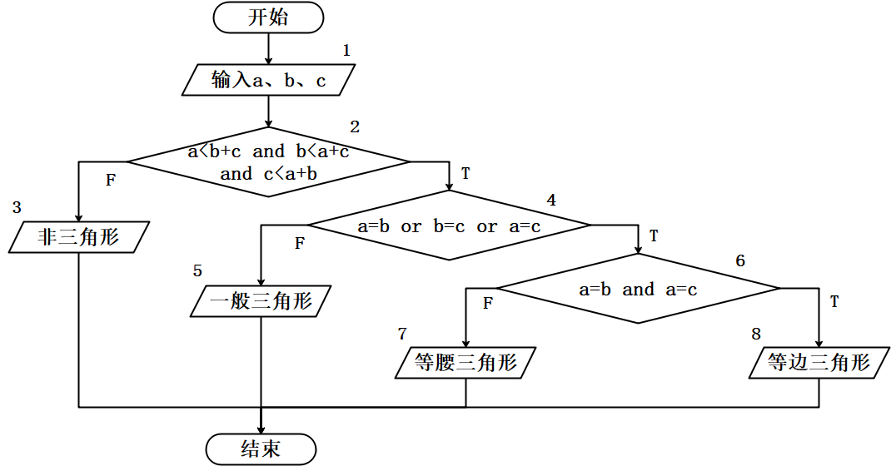

<h1 align="center">吉林大学软件学院</h1>

 <h1 align="center">案例作业报告</h1>

**课程名称：软件质量保证与测试**

**案例主题：白盒测试方法—逻辑覆盖**

**案例题目：20-三角形问题**

**学生学号：55000000**

**学生姓名：**

**提交日期：**

【案例主题】白盒测试方法—逻辑覆盖

【案例题目】20-三角形问题

【案例目标】

通过“三角形问题”案例学习运用逻辑覆盖法设计测试用例。

【案例内容】

输入范围在1~10（包含1和10）的三个整数a、b和c分别作为三角形的三条边，通过程序判断由这三条边构成的三角形类型是等边三角形、等腰三角形、一般三角形或非三角形，下图为三角形问题的流程图：

【案例作业步骤】

1、为程序设计“语句覆盖”测试用例

（1）画出程序的流程图

【案例内容】中三角形问题的流程图已经给出。

（2）根据程序的流程图设计测试用例并填写测试数据

①根据程序的流程图可知，共（ 4 ）（填入阿拉伯数字）条测试用例便可达到“语句覆盖”的标准。

②为三角形问题设计“语句覆盖”的测试用例，填入表1-1。

表1-1

|  |  |  |  |  |  |
| --- | --- | --- | --- | --- | --- |
| **序号** | **输入** | | | **预期输出** | **实际输出** |
| **a** | **b** | **c** |
| 1 | 1 | 2 | 3 | 非三角形 | 非三角形 |
| 2 | 3 | 4 | 5 | 一般三角形 | 一般三角形 |
| 3 | 3 | 3 | 4 | 等腰三角形 | 等腰三角形 |
| 4 | 3 | 3 | 3 | 等边三角形 | 等边三角形 |

③通过计算，本案例的语句覆盖率是多少？

A.75%

B.80%

C.90%

D.100%

|  |  |
| --- | --- |
| 你的答案： | D |

2、找出所有判定节点

（1）请选择出程序中的判定：

A.a<b+c

B.c<a+b

C.a=b or b=c or a=c

D.a=b and a=c

E.a=c

F.b<a+c

G.b=c

H.a=b

I.a<b+c and b<a+c and c<a+b

|  |  |
| --- | --- |
| 你的答案： | CDI |

3、为程序设计“判定覆盖”测试用例

（1）根据程序的流程图可知，共（ 4 ）（填入阿拉伯数字）条测试用例便可达到“判定覆盖”的标准。

（2）根据“覆盖的路径”设计“输入”数据以及“预期输出”，完成表3-1。

表3-1

|  |  |  |  |  |  |
| --- | --- | --- | --- | --- | --- |
| **序号** | **输入** | | | **预期输出** | **实际输出** |
| **a** | **b** | **c** |
| 1 | 1 | 2 | 3 | 非三角形 | 非三角形 |
| 2 | 3 | 4 | 5 | 一般三角形 | 一般三角形 |
| 3 | 3 | 3 | 4 | 等腰三角形 | 等腰三角形 |
| 4 | 3 | 3 | 3 | 等边三角形 | 等边三角形 |

（3）通过计算，请选择本案例的判定覆盖率是多少？

A.75%

B.80%

C.90%

D.100%

|  |  |
| --- | --- |
| 你的答案： | D |

4、为程序设计“条件覆盖”测试用例

（1）根据程序的流程图可知，共（ 8 ）（填入阿拉伯数字）条测试用例便可达到“条件覆盖”的标准。

（2）根据“覆盖的标记”设计输入数据和预期输出，填入表4-1。

表4-1

|  |  |  |  |  |  |
| --- | --- | --- | --- | --- | --- |
| **序号** | **输入** | | | **预期输出** | **实际输出** |
| **a** | **b** | **c** |
| 1 | 1 | 2 | 3 | 非三角形 | 非三角形 |
| 2 | 2 | 1 | 3 | 非三角形 | 非三角形 |
| 3 | 3 | 1 | 2 | 非三角形 | 非三角形 |
| 4 | 3 | 4 | 5 | 一般三角形 | 一般三角形 |
| 5 | 3 | 3 | 4 | 等腰三角形 | 等腰三角形 |
| 6 | 4 | 3 | 3 | 等腰三角形 | 等腰三角形 |
| 7 | 3 | 4 | 3 | 等腰三角形 | 等腰三角形 |
| 8 | 3 | 3 | 3 | 等边三角形 | 等边三角形 |

（3）通过计算，请选择本案例的条件覆盖率是多少？

A.75%

B.80%

C.90%

D.100%

|  |  |
| --- | --- |
| 你的答案： | D |

5、为程序设计“判定/条件覆盖”测试用例

（1）根据程序的流程图可知，共（ 8 ）（填入阿拉伯数字）条测试用例便可达到“判定/条件覆盖”的标准。

（2）根据“覆盖的标记”设计“输入”数据以及“预期结果”，填入表5-1。

表5-1

|  |  |  |  |  |  |
| --- | --- | --- | --- | --- | --- |
| **序号** | **输入** | | | **预期输出** | **实际输出** |
| **a** | **b** | **c** |
| 1 | 1 | 2 | 3 | 非三角形 | 非三角形 |
| 2 | 2 | 1 | 3 | 非三角形 | 非三角形 |
| 3 | 3 | 1 | 2 | 非三角形 | 非三角形 |
| 4 | 3 | 4 | 5 | 一般三角形 | 一般三角形 |
| 5 | 3 | 3 | 4 | 等腰三角形 | 等腰三角形 |
| 6 | 4 | 3 | 3 | 等腰三角形 | 等腰三角形 |
| 7 | 3 | 4 | 3 | 等腰三角形 | 等腰三角形 |
| 8 | 3 | 3 | 3 | 等边三角形 | 等边三角形 |

（3）通过计算，请选择本案例的判定/条件覆盖率是多少？

A.75%

B.80%

C.90%

D.100%

|  |  |
| --- | --- |
| 你的答案： | D |

6、为程序设计“条件组合覆盖”测试用例

（1）根据程序的流程图可知，共（ 8 ）（填入阿拉伯数字）条测试用例便可达到“条件组合覆盖”的标准。

（2）根据“覆盖的标记”设计“输入”数据以及“预期结果”，填入表6-1。

表6-1

|  |  |  |  |  |  |
| --- | --- | --- | --- | --- | --- |
| **序号** | **输入** | | | **预期输出** | **实际输出** |
| **a** | **b** | **c** |
| 1 | 1 | 2 | 3 | 非三角形 | 非三角形 |
| 2 | 2 | 1 | 3 | 非三角形 | 非三角形 |
| 3 | 3 | 1 | 2 | 非三角形 | 非三角形 |
| 4 | 3 | 4 | 5 | 一般三角形 | 一般三角形 |
| 5 | 3 | 3 | 4 | 等腰三角形 | 等腰三角形 |
| 6 | 4 | 3 | 3 | 等腰三角形 | 等腰三角形 |
| 7 | 3 | 4 | 3 | 等腰三角形 | 等腰三角形 |
| 8 | 3 | 3 | 3 | 等边三角形 | 等边三角形 |
|  |  |  |  |  |  |
|  |  |  |  |  |  |

（3）通过计算，请选择本案例的条件组合覆盖率是多少？

A.75%

B.80%

C.90%

D.100%

|  |  |
| --- | --- |
| 你的答案： | D |
