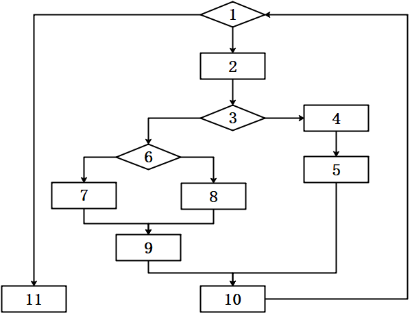
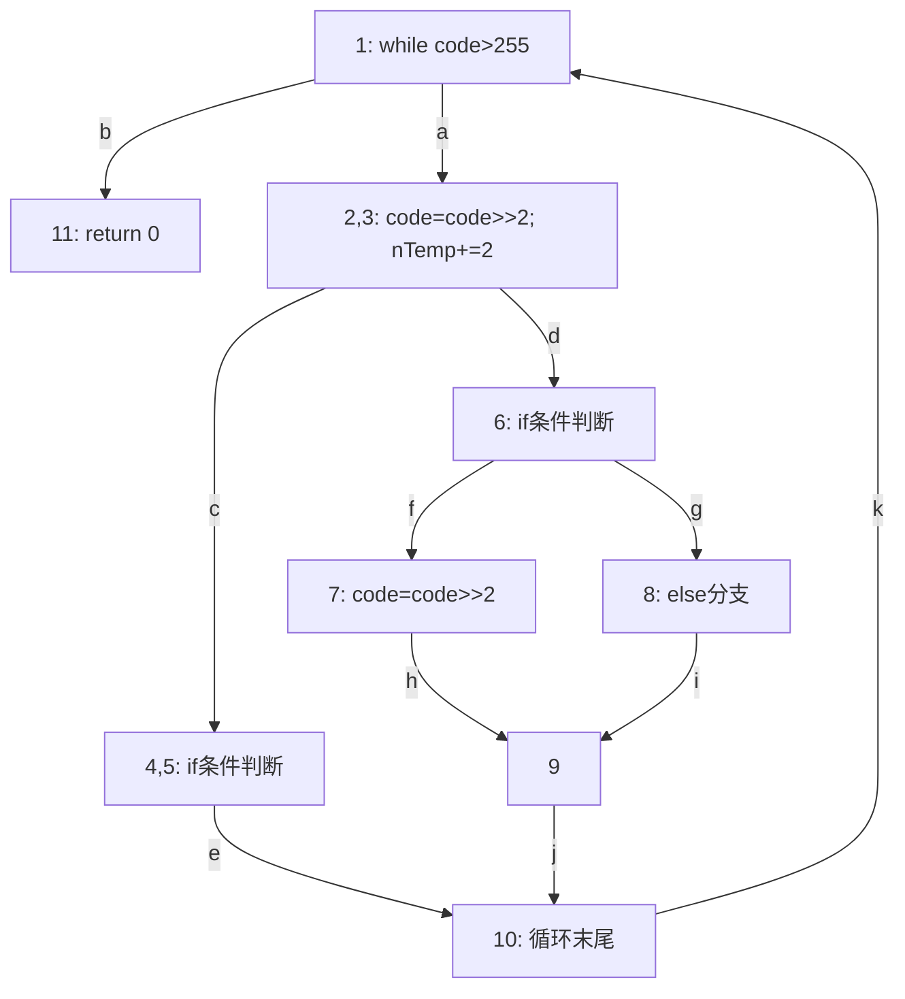

<center></center>

<h1 align="center">吉林大学软件学院</h1>

<h1 align="center">案例作业报告</h1>

**课程名称：软件质量保证与测试**

**案例主题：白盒测试方法—基本路径法**

**案例题目：21-简单小程序**

**学生学号：55000000**

**学生姓名：**

**提交日期：**

【案例主题】白盒测试方法—基本路径法

【案例题目】21-简单小程序

【案例目标】

分析代码设计测试用例，学习基本路径覆盖法的使用方法。

【案例内容】

分析下方代码及程序流程图，绘制相应流图，计算环形复杂度，应用基本路径法给出独立路径集合，设计测试用例。

```c
int fun( int code, int nStop, int \*ptr ) {

while( code > 255 ) {

code = code >> 2;

//6

nTemp += 2;

//9

else{ \*\*； \*\*；}

} // end of while

retun 0;

} // end of fun
```



【案例作业步骤】

1、绘制流图

根据【案例内容】中的程序流程图，画出相应的流图。

注意，流图每个节点间的路径用小写字母（如a，b，c）依次标注。

节点内的标号用整数表示（参见【案例内容】中的程序流程图），一个节点内有多个标号时，数字之间用半角逗号（英文逗号）隔开。

使用画图工具，画完图之后将其截图，保存为（.jpg）格式，再粘贴到下方。

答案：

根据程序流程图和图矩阵分析，绘制如下流图。该流图包含11个节点（节点1至节点11），节点2,3、4,5等为合并节点。边用小写字母a~k标注，反映了while循环结构及内部的if-else分支。



**流图说明：**
- 节点1为while循环条件判断（code > 255），若条件为假则沿边b直接到达节点11返回；若条件为真则沿边a进入循环体节点2,3
- 节点2,3为循环体内顺序语句（code右移2位、nTemp加2），之后分支到节点4,5（边c）或节点6（边d）
- 节点4,5为if条件判断，满足条件时沿边e直接到达节点10
- 节点6为另一if条件判断，满足条件沿边f到节点7，不满足沿边g到节点8
- 节点7和节点8分别沿边h和边i汇聚到节点9
- 节点9沿边j到达节点10，节点10沿边k回到节点1重新判断循环条件

2、确定流图的环形复杂度

（1）将流图转化为图矩阵

①将步骤1绘制的流图，转换为图矩阵填入表2-1。

表格中纵列标题的"节点"表示流图中某个边的起点编号，横行标题表示某个边的终点编号，如果一个节点内有多个数字时，数字之间用半角逗号隔开。根据步骤1绘制的流图中每条边上标注的小写字母，将各小写字母填入表2-1中相应位置，剩余位置空白。

表2-1

|  |  |  |  |  |  |  |  |  |  |
| --- | --- | --- | --- | --- | --- | --- | --- | --- | --- |
|  | 连接到的节点 | | | | | | | | |
| 节点 | 1 | 2,3 | 4,5 | 6 | 7 | 8 | 9 | 10 | 11 |
| 1 |  | a |  |  |  |  |  |  | b |
| 2,3 |  |  | c | d |  |  |  |  |  |
| 4,5 |  |  |  |  |  |  |  | e |  |
| 6 |  |  |  |  | f | g |  |  |  |
| 7 |  |  |  |  |  |  | h |  |  |
| 8 |  |  |  |  |  |  | i |  |  |
| 9 |  |  |  |  |  |  |  | j |  |
| 10 | k |  |  |  |  |  |  |  |  |
| 11 |  |  |  |  |  |  |  |  |  |

②两个节点之间的线段称为一条边，由此可计算本案例共有（ 11 ）条边？（填入阿拉伯数字）

（2）根据图矩阵完成邻接矩阵，并为邻接矩阵计算环形复杂度

将表2-1中代表边的字母替换成"1"，空白处用"0"代替，按照它们在表2-1的位置，填入表2-2，进而由图距阵转化为邻接矩阵。

在邻接矩阵中如果一行中有"1"，则将这一行中所有的"1"相加后再减去1，将得到的值填入"连接"列。

如果一行中不存在"1"，则不予计算，在"连接"列填入"-"。

①根据上面的描述，完成表2-2。

表2-2

|  |  |  |  |  |  |  |  |  |  |  |
| --- | --- | --- | --- | --- | --- | --- | --- | --- | --- | --- |
|  | 连接到的节点 | | | | | | | | | 连接 |
| 节点 | 1 | 2,3 | 4,5 | 6 | 7 | 8 | 9 | 10 | 11 |  |
| 1 | 0 | 1 | 0 | 0 | 0 | 0 | 0 | 0 | 1 | 1 |
| 2,3 | 0 | 0 | 1 | 1 | 0 | 0 | 0 | 0 | 0 | 1 |
| 4,5 | 0 | 0 | 0 | 0 | 0 | 0 | 0 | 1 | 0 | 0 |
| 6 | 0 | 0 | 0 | 0 | 1 | 1 | 0 | 0 | 0 | 1 |
| 7 | 0 | 0 | 0 | 0 | 0 | 0 | 1 | 0 | 0 | 0 |
| 8 | 0 | 0 | 0 | 0 | 0 | 0 | 1 | 0 | 0 | 0 |
| 9 | 0 | 0 | 0 | 0 | 0 | 0 | 0 | 1 | 0 | 0 |
| 10 | 1 | 0 | 0 | 0 | 0 | 0 | 0 | 0 | 0 | 0 |
| 11 | 0 | 0 | 0 | 0 | 0 | 0 | 0 | 0 | 0 | - |
| 总数 | | | | | | | | | | 3 |
| 环形复杂度 | | | | | | | | | | 4 |

②将表2-2"连接"列的所有值相加，得到的总数为（ 3 ）。（填入阿拉伯数字）

环形复杂度 = 连接总数+1。

③根据步骤②，计算本案例的环形复杂度为：

A.3

B.4

C.6

D.7

|  |  |
| --- | --- |
| 你的答案： | B |

3、确定独立路径的一个基本集

①确定独立路径的一个基本集，在下面的选项中，选出本案例所有正确的独立路径：

A.Path1的路径为：1-11

B.Path2的路径为：1-2-3-4-5-10-1-11

C.Path3的路径为：1-2-3-6-7-9-10-1-11

D.Path4的路径为：1-2-3-6-8-9-10-1-11

E.Path5的路径为：1-2-3-4-5-10-1

F.Path6的路径为：1-2-3-6-8-9-10-1

G.Path7的路径为：1-2-3-6-7-9-10-1

|  |  |
| --- | --- |
| 你的答案： | ABCD |

4、设计测试用例并构造测试数据

①通过以上步骤的分析，本案例共设计（ 4 ）条测试用例可满足测试策略？（填入阿拉伯数字）

②将设计的测试用例填入表4-1，预期结果列填写测试用例对应的独立路径，实际结果列暂不填写。

表4-1

|  |  |  |  |
| --- | --- | --- | --- |
| 用例编号 | 测试数据 | 预期结果 | 实际结果 |
| 1 | code=100, nStop=0, ptr=NULL | Path1：1-11 | |
| 2 | code=300, nStop=1, ptr=NULL | Path2：1-2,3-4,5-10-1-11 | |
| 3 | code=400, nStop=2, ptr=NULL | Path3：1-2,3-6-7-9-10-1-11 | |
| 4 | code=500, nStop=3, ptr=NULL | Path4：1-2,3-6-8-9-10-1-11 | |
|  |  |  | |
|  |  |  | |
|  |  |  | |
