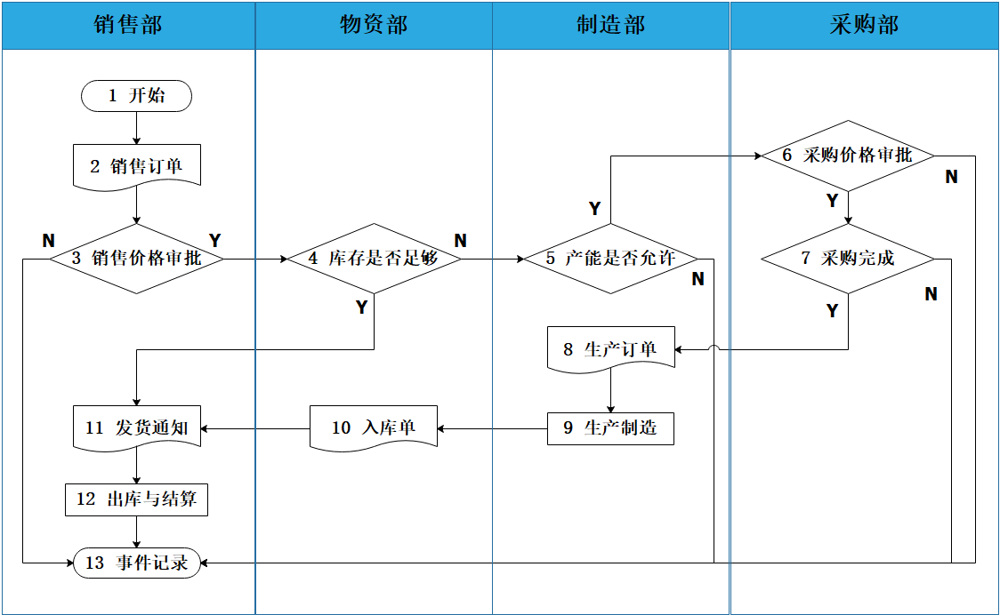
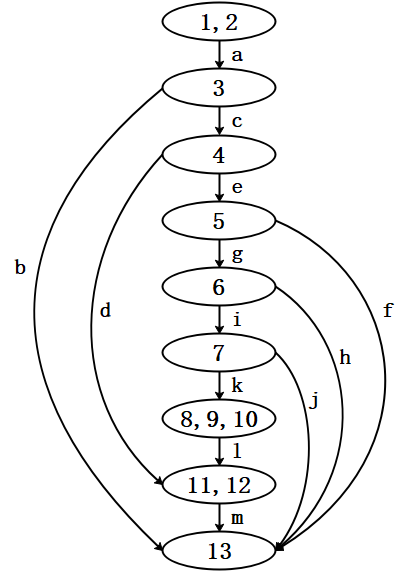
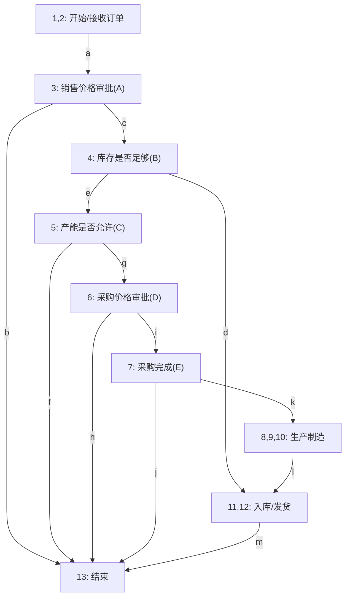

<h1 align="center">吉林大学软件学院</h1>

<h1 align="center">案例作业报告</h1>

**课程名称：软件质量保证与测试**

**案例主题：白盒测试方法—基本路径法**

**案例题目：22-ERP系统**

**学生学号：55000000**

**学生姓名：**

**提交日期：**

【案例主题】白盒测试方法—基本路径法

【案例题目】22-ERP系统

【案例目标】

以ERP业务流程图的测试用例设计为例学习基本路径法的使用方法。

【案例内容】

ERP是企业资源计划（Enterprise Resources Planning）的简称。它将企业的财务、采购、生产、销售、库存和其它业务功能整合到一个信息管理平台上，从而实现信息数据标准化、系统运行集成化、业务流程合理化、绩效监控动态化、管理改善持续化。

ERP系统实际上是与终端到终端（end-to-end）的商业流程相结合的，如果他们想要充分发挥这一工具的优越性，这些公司就必须要重新构建并设计他们的流程。"迈克尔·哈默"和"詹姆斯·钱皮"把流程定义为一系列业务活动，每一活动都可能有投入、有产出、有操作、有记录、有责任、有触发条件；活动之间存在着如串行、平行、选择等不同的关系。流程图分析是指把针对同一目标的一系列活动以及活动之间的关系以图示的方法加以描述与分析。按照描述的对象不同，可以分为工作流程图、数据流程图、系统流程图等。

下图为一个企业的业务流程图。分为销售部、物资部、制造部、采购部四个部门。

假设用A~E分别代表销售价格审批、库存是否足够、产能是否允许、采购价格审批、采购完成五个条件，并且要分别满足如下条件（所有数据取整数）：

1：价格在10元（含）以上审批通过。

2：库存量固定为10个且其成本价格为每个3元。

3：制造部最大产能为50个（含）。

4：采购价格在5元（含）以下通过。

5：供应商每次可提供原材料数量为35个（含）。

【案例作业步骤】

1、根据业务流程图绘制相应的流图

找出ERP业务流程图中的节点，将它们连接起来，画出流图。

节点间的路径用字母标号（如a，b，c）依次标注。

节点内的标号按照业务流程图中事件的标号表示，一个节点内有多个数字时，数字之间用半角逗号隔开，如下图所示。

根据ERP业务流程图及图矩阵分析，绘制如下流图。该流图包含13个节点，涵盖了从接收订单到结束的完整业务流程，包括销售价格审批（A）、库存检查（B）、产能检查（C）、采购价格审批（D）、采购完成（E）五个关键条件判断节点。

**流图说明：**
- 节点1,2为流程开始（接收订单），沿边a到达节点3进行销售价格审批（条件A）
- 节点3若不通过（价格<10元），沿边b直接到节点13结束
- 节点3若通过，沿边c到达节点4检查库存是否足够（条件B）
- 节点4若库存足够，沿边d直接到节点11,12（入库/发货），再经边m到节点13结束
- 节点4若库存不够，沿边e到达节点5检查产能是否允许（条件C）
- 节点5若产能不允许，沿边f到节点13结束
- 节点5若产能允许，沿边g到达节点6进行采购价格审批（条件D）
- 节点6若采购价格审批未通过，沿边h到节点13结束
- 节点6若审批通过，沿边i到达节点7检查采购是否完成（条件E）
- 节点7若采购未完成，沿边j到节点13结束
- 节点7若采购完成，沿边k到达节点8,9,10进行生产制造
- 节点8,9,10完成后沿边l到节点11,12入库/发货，再经边m到节点13结束

2、确定控制流图的环形复杂度

这里采用图矩阵方法来计算环形复杂度。

（1）将控制流图转化为图矩阵

根据节点之间的关系将流图中边的代号填入表2-1。

表格中纵列标题的"节点"表示流图中某个边的起点编号，横行标题表示某个边的终点编号，如果一个节点内有多个数字时，数字之间用半角逗号隔开。

表2-1

|  |  |  |  |  |  |  |  |  |  |
| --- | --- | --- | --- | --- | --- | --- | --- | --- | --- |
|  | 连接到节点 | | | | | | | | |
| 节点 | 1,2 | 3 | 4 | 5 | 6 | 7 | 8,9,10 | 11,12 | 13 |
| 1,2 |  | a |  |  |  |  |  |  |  |
| 3 |  |  | c |  |  |  |  |  | b |
| 4 |  |  |  | e |  |  |  | d |  |
| 5 |  |  |  |  | g |  |  |  | f |
| 6 |  |  |  |  |  | i |  |  | h |
| 7 |  |  |  |  |  |  | k |  | j |
| 8,9,10 |  |  |  |  |  |  |  | l |  |
| 11,12 |  |  |  |  |  |  |  |  | m |
| 13 |  |  |  |  |  |  |  |  |  |

（2）绘制邻接矩阵并计算环形复杂度

将表2-1中代表边的字母替换成"1"，空白处用"0"代替，按照其在表2-1的位置，填入表2-2中，从而得到图矩阵对应的邻接矩阵。

在邻接矩阵中如果一行中存在"1"，则将这一行中所有的"1"相加后减去1，得到一个值。

如果一行中不存在"1"，则不予计算，以"-"表示。

将上述的值或"-"填入表的最右边"连接"列。

将连接的值相加得到连接总数，环形复杂度 = 连接总数+1。

表2-2

|  |  |  |  |  |  |  |  |  |  |  |
| --- | --- | --- | --- | --- | --- | --- | --- | --- | --- | --- |
|  | 连接到节点 | | | | | | | | | 连接 |
| 节点 | 1,2 | 3 | 4 | 5 | 6 | 7 | 8,9,10 | 11,12 | 13 |  |
| 1,2 | 0 | 1 | 0 | 0 | 0 | 0 | 0 | 0 | 0 | 0 |
| 3 | 0 | 0 | 1 | 0 | 0 | 0 | 0 | 0 | 1 | 1 |
| 4 | 0 | 0 | 0 | 1 | 0 | 0 | 0 | 1 | 0 | 1 |
| 5 | 0 | 0 | 0 | 0 | 1 | 0 | 0 | 0 | 1 | 1 |
| 6 | 0 | 0 | 0 | 0 | 0 | 1 | 0 | 0 | 1 | 1 |
| 7 | 0 | 0 | 0 | 0 | 0 | 0 | 1 | 0 | 1 | 1 |
| 8,9,10 | 0 | 0 | 0 | 0 | 0 | 0 | 0 | 1 | 0 | 0 |
| 11,12 | 0 | 0 | 0 | 0 | 0 | 0 | 0 | 0 | 1 | 0 |
| 13 | 0 | 0 | 0 | 0 | 0 | 0 | 0 | 0 | 0 | - |
| 连接总数 | | | | | | | | | | 5 |
| 环形复杂度 | | | | | | | | | | 6 |

3、确定独立路径的一个基本集

在下面选项中选出确定独立路径的一个基本集。

1-2-13

1-2-11-12-13

1-2-3-13

5-6-7-13

1-2-3-4-13

3-4-11-12-13

1-2-3-4-5-13

1-2-3-4-5-6-13

1-2-3-4-5-6-7-13

1-2-3-4-11-12-13

1-2-3-4-5-6-11-12-13

1-2-3-4-5-6-7-8-9-10-11-12-13

|  |  |
| --- | --- |
| 你的答案： | 1-2-13、1-2-3-4-11-12-13、1-2-3-4-5-13、1-2-3-4-5-6-13、1-2-3-4-5-6-7-13、1-2-3-4-5-6-7-8-9-10-11-12-13 |

4、设计测试用例,并构造测试数据

依据步骤3中的独立路径，构造测试用例及数据，将其填入表4-1。

表4-1

|  |  |  |  |  |  |  |  |
| --- | --- | --- | --- | --- | --- | --- | --- |
| 用例号 | 输入 | | | | | 预期输出 | 实际结果 |
| 销售价格 | 订货量 | 产能是否允许  （订货量  -10） | 采购价格 | 采购完成  （订货量  -10） |
| 1 | 5 | 5 | — | — | — | 销售价格审批未通过，事件记录 | 销售价格审批未通过，事件记录 |
| 2 | 10 | 10 | — | — | — | 库存足够，发货通知，出库与结算，事件记录 | 库存足够，发货通知，出库与结算，事件记录 |
| 3 | 10 | 70 | N(60>50) | — | — | 库存不够，产能不允许，事件记录 | 库存不够，产能不允许，事件记录 |
| 4 | 10 | 20 | Y(10≤50) | 6 | — | 库存不够，产能允许，采购价格审批未通过，事件记录 | 库存不够，产能允许，采购价格审批未通过，事件记录 |
| 5 | 10 | 50 | Y(40≤50) | 5 | N(40>35) | 库存不够，产能允许，采购价格通过，采购未完成，事件记录 | 库存不够，产能允许，采购价格通过，采购未完成，事件记录 |
| 6 | 10 | 30 | Y(20≤50) | 5 | Y(20≤35) | 生产订单，生产制造，入库单，发货通知，出库与结算，事件记录 | 生产订单，生产制造，入库单，发货通知，出库与结算，事件记录 |
