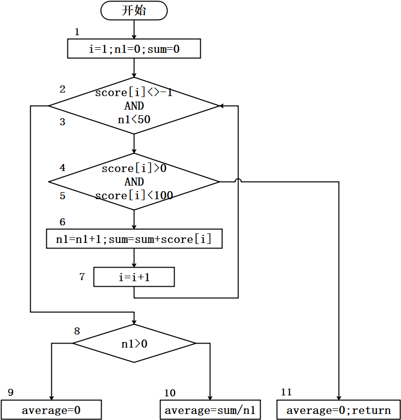
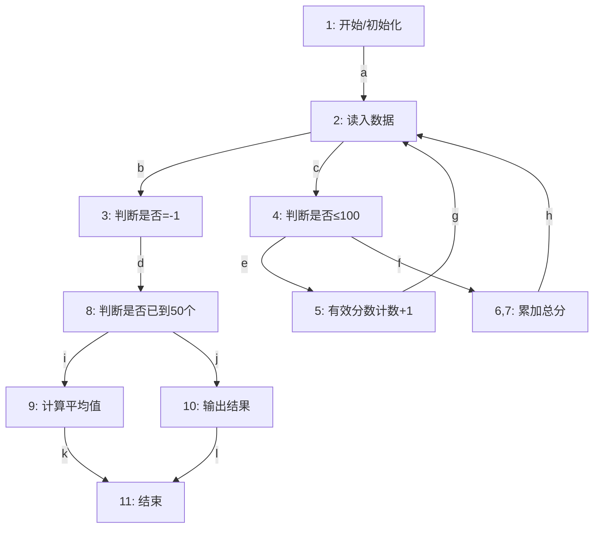

<h1 align="center">吉林大学软件学院</h1>

<h1 align="center">案例作业报告</h1>

**课程名称：软件质量保证与测试**

**案例主题：白盒测试方法—基本路径法**

**案例题目：23-成绩计算问题**

**学生学号：55000000**

**学生姓名：**

**提交日期：**

【案例主题】白盒测试方法—基本路径法

【案例题目】23-成绩计算问题

【案例目标】

通过"成绩计算问题"案例学习运用基本路径覆盖法设计测试用例。

【案例内容】

测试某程序的功能：

最多输入50个值（以-1作为输入结束标志），可以计算其中有效学生分数的个数、总分数和平均值。

下图为程序流程图。

【案例作业步骤】

1、绘制流图

将找到的节点，根据它们的关系连接起来，画出流图。

节点间的路径用字母标号（如a，b，c）依次标注。

节点内的标号用数字表示，一个节点内有多个数字时，数字之间用半角逗号隔开。

使用画图工具，画完图之后将其截图，保存为（.jpg）格式，再粘贴到下方。

答案：

根据程序流程图及图矩阵分析，绘制如下流图。该程序最多读取50个学生成绩（以-1结束），计算有效分数（0~100）的个数、总分和平均值。流图包含11个节点，其中节点6,7为合并节点，反映了输入循环与多条分支判断的结构。

**流图说明：**
- 节点1为程序初始化（设置计数器、累加器初值为0），沿边a到达节点2读入第一个数据
- 节点2读入数据后有两个分支：沿边b到节点3判断是否等于-1（结束标志），或沿边c到节点4判断是否在有效范围（≤100）
- 节点3若读到-1，沿边d到达节点8判断循环结束后的处理路径
- 节点4若数据有效（≤100），沿边e到节点5进行有效分数计数+1，再通过边g回到节点2继续读入下一个数据
- 节点4若数据无效（>100），沿边f到节点6,7累加总分（或进行其他处理），再通过边h回到节点2继续读入下一个数据
- 节点8判断是否已到50个数据，沿边i到节点9计算平均值，或沿边j到节点10直接输出结果
- 节点9计算平均值后沿边k到达节点11结束
- 节点10输出结果后沿边l到达节点11结束

2、确定流图的环形复杂度

（1）将控制流图转化为图矩阵

根据节点之间的关系将流图中边的代号填入表2-1。

表格中纵列标题的"节点"表示流图中某个边的起点编号，横行标题表示某个边的终点编号，如果一个节点内有多个数字时，数字之间用半角逗号隔开。

表2-1

|  |  |  |  |  |  |  |  |  |  |  |
| --- | --- | --- | --- | --- | --- | --- | --- | --- | --- | --- |
|  | 连接到节点 | | | | | | | | | |
| 节点 | 1 | 2 | 3 | 4 | 5 | 6,7 | 8 | 9 | 10 | 11 |
| 1 |  | a |  |  |  |  |  |  |  |  |
| 2 |  |  | b | c |  |  |  |  |  |  |
| 3 |  |  |  |  |  |  | d |  |  |  |
| 4 |  |  |  |  | e | f |  |  |  |  |
| 5 |  | g |  |  |  |  |  |  |  |  |
| 6,7 |  | h |  |  |  |  |  |  |  |  |
| 8 |  |  |  |  |  |  |  | i | j |  |
| 9 |  |  |  |  |  |  |  |  |  | k |
| 10 |  |  |  |  |  |  |  |  |  | l |
| 11 |  |  |  |  |  |  |  |  |  |  |

（2）根据图矩阵完成邻接矩阵，并计算邻接矩阵的环形复杂度

将表2-1中代表边的字母替换成"1"，空白处用"0"代替，按照其在表2-1的位置，填入表2-2中，从而得到图矩阵对应的邻接矩阵。

在邻接矩阵中如果一行中存在"1"，则将这一行中所有的"1"相加后减去1，得到一个值。

如果一行中不存在"1"，则不予计算，以"-"表示。

将上述的值或"-"填入表的最右边"连接"列。

将连接的值相加得到连接总数，环形复杂度 = 连接总数+1。

表2-2

|  |  |  |  |  |  |  |  |  |  |  |  |
| --- | --- | --- | --- | --- | --- | --- | --- | --- | --- | --- | --- |
|  | 连接到节点 | | | | | | | | | | 连接 |
| 节点 | 1 | 2 | 3 | 4 | 5 | 6,7 | 8 | 9 | 10 | 11 |  |
| 1 | 0 | 1 | 0 | 0 | 0 | 0 | 0 | 0 | 0 | 0 | 0 |
| 2 | 0 | 0 | 1 | 1 | 0 | 0 | 0 | 0 | 0 | 0 | 1 |
| 3 | 0 | 0 | 0 | 0 | 0 | 0 | 1 | 0 | 0 | 0 | 0 |
| 4 | 0 | 0 | 0 | 0 | 1 | 1 | 0 | 0 | 0 | 0 | 1 |
| 5 | 0 | 1 | 0 | 0 | 0 | 0 | 0 | 0 | 0 | 0 | 0 |
| 6,7 | 0 | 1 | 0 | 0 | 0 | 0 | 0 | 0 | 0 | 0 | 0 |
| 8 | 0 | 0 | 0 | 0 | 0 | 0 | 0 | 1 | 1 | 0 | 1 |
| 9 | 0 | 0 | 0 | 0 | 0 | 0 | 0 | 0 | 0 | 1 | 0 |
| 10 | 0 | 0 | 0 | 0 | 0 | 0 | 0 | 0 | 0 | 1 | 0 |
| 11 | 0 | 0 | 0 | 0 | 0 | 0 | 0 | 0 | 0 | 0 | - |
| 总数 | | | | | | | | | | | 3 |
| 环形复杂度 | | | | | | | | | | | 4 |

3、确定独立路径的一个基本集

从下面选项中选出独立路径的一个基本集：

1-2-8

1-2-3-10

1-2-8-9

1-2-8-10

5-6-7-13

1-2-3-4-11

1-2-3-4-13

1-2-3-8-10

3-4-11-12-13

1-2-3-4-5-11

1-2-3-4-5-6-13

1-2-3-4-5-6-7

1-2-3-4-11-12-13

1-2-3-4-5-6-11-12-13

1-2-3-4-5-6-7-8-9-10-11-12-13

|  |  |
| --- | --- |
| 你的答案： | 1-2-8-9、1-2-8-10、1-2-3-4-5-6-7、1-2-3-4-11 |

4、设计测试用例，并构造测试数据

依据步骤3中挑选的（ 4 ）条独立路径，构造测试用例及数据，将其填入表4-1。（填入阿拉伯数字）

表4-1

|  |  |  |
| --- | --- | --- |
| 用例编号 | 测试数据 | 预期结果 |
| 1 | -1 | 有效个数0，总分0，平均值0 |
| 2 | 50, -1 | 有效个数1，总分50，平均值50 |
| 3 | 101, 50, -1 | 有效个数1，总分50，平均值50 |
| 4 | 50, 60, -1 | 有效个数2，总分110，平均值55 |
