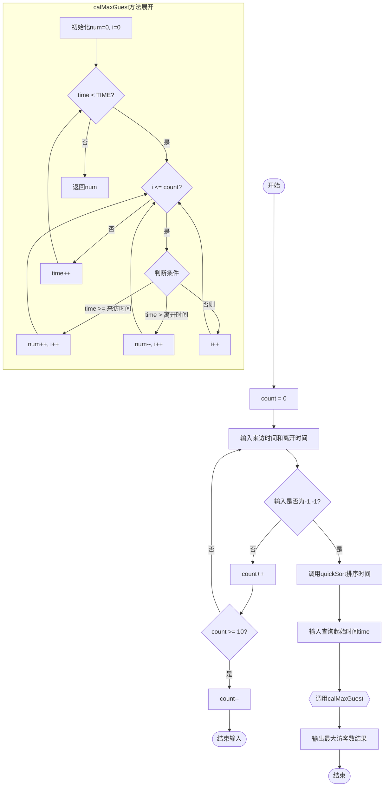
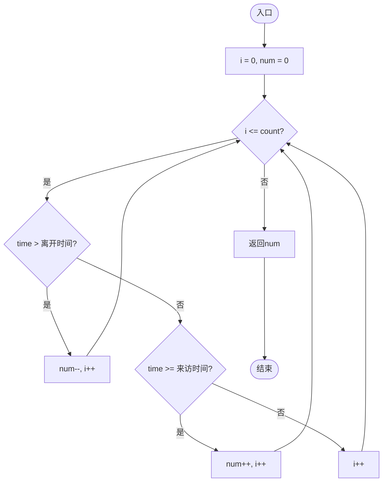

<center></center>

<h1 align="center">吉林大学软件学院</h1>

<h1 align="center">案例作业报告</h1>

**课程名称：软件质量保证与测试**

**案例主题：白盒测试方法—循环测试法**

**案例题目：24-最大访客数**

**学生学号：55000000**

**学生姓名：**

**提交日期：**

【案例主题】白盒测试方法—循环测试法

【案例题目】24-最大访客数

【案例目标】

以"最大访客数案例"为例学习循环测试法。

【案例内容】

现将举行一个餐会，让访客事先填写到达时间与离开时间，为了掌握座位的数目，必须先估计不同时间的最大访客数。

程序说明：

假设访客i的来访时间为x[i]，而离开时间为y[i]。

在资料输入完毕之后，将x[i]与y[i]分别进行排序（由小到大）。

只要先计算某时之前总共来访了多少访客，然后再减去某时之前的离开访客，就可以轻易的计算出最大访客数。

```c
#include "stdafx.h"

#define MAX 10

int partition( int[], int, int );

int calMaxGuest( int[], int[], int, int );

//输入一个起始时间

return time;

{

int time;

//输入来访与离开的时间

printf( "\n输入-1,-1结束" );

printf( "\n>>" );

break;

if( count >= MAX )

count--;

return 0;

{

{

if( time > y[i] )

return num;

{

i = left - 1;

if( number[j] <= s )

SWAP( number[i], number[j] );

SWAP( number[i+1], number[right] );

void quickSort( int number[], int left, int right )

if( left < right )

quickSort( number, left, q-1 );

}

//预先排序

while( time < TIME )

time++;

return 0;

}
```
【案例作业步骤】

1、画出程序流程图

分别为main方法、maxGuest方法画出程序流程图。

注意：这里要特殊处理一下，把main方法中的calMaxGuest方法给展开，从而令整个程序中隐含的一套串接循环显现出来。

使用画图工具，画完图之后将其截图，保存为（.jpg）格式，再粘贴在下方。

（1）main方法的程序流程图（注意要展开其中的calMaxGuest）

答案：

以下是用Mermaid绘制的main方法程序流程图（包含展开的calMaxGuest方法）：



（2） maxGuest方法的程序流程图

答案：

以下是用Mermaid绘制的maxGuest方法程序流程图：



2、制定测试策略

考虑while( count < MAX )循环、while( time < Time )循环、maxGuest方法中的循环，不考虑quicksort方法中的循环。

分析main方法程序流程图，可以发现程序中包含一个串接循环。

串接循环中，while( count < MAX )循环是一个简单循环，它后面跟着的while( time < Time )循环却是一个嵌套循环，里面包含着maxGuest方法中的循环。

仔细观察串接循环中循环的关系，可以发现后面的嵌套循环受前面简单循环的影响。

因为嵌套循环中maxGuest方法中的循环条件为i<=count，count值为简单循环while( count < MAX )所控制。

quicksort：快速排序算法，这里不做考虑。

综上所述，分别对简单循环和嵌套循环进行分析。

3、设计测试用例

"循环次数"填入整数，表示经过循环的次数。

"（来访时间, 离开时间）/ h"填入0~12之间的整数，如：（1, 9）

（1）为简单循环设计测试用例

①根据以上步骤的分析，本案例为简单循环设计的测试用例一共可设计（ 6 ）条？（填入阿拉伯数字）

②设计测试用例及数据填入表3-1。

表3-1

|  |  |  |  |  |  |
| --- | --- | --- | --- | --- | --- |
| 序号 | 循环次数 | 输入 | | 预期输出 | 实际输出 |
| 查询起始时间/h | (来访时间,离开时间) / h |
| 1 | 0 | 5 | — | 5时刻最大访客数0 | 0 |
| 2 | 1 | 5 | (1,3) | 5时刻最大访客数1 | 1 |
| 3 | 2 | 5 | (1,3),(2,4) | 5时刻最大访客数2 | 2 |
| 4 | 5 | 5 | (1,3),(2,4),(3,5),(4,6),(5,7) | 5时刻最大访客数3 | 3 |
| 5 | 9 | 5 | 9组数据 | 根据数据计算 | 根据数据计算 |
| 6 | 10 | 5 | 10组数据 | 根据数据计算 | 根据数据计算 |
| 7 |  |  |  |  |  |
| 8 |  |  |  |  |  |
| 9 |  |  |  |  |  |
| 10 |  |  |  |  |  |

③请填写简单循环测试用例的覆盖率：测试数据条数 / 测试用例条数 * 100% = （ 100.0 ）%（小数点后保留一位）

（2）为嵌套循环设计测试用例

①根据以上步骤的分析，本案例为嵌套循环设计的测试用例一共可设计（ 10 ）条？（填入阿拉伯数字）

②设计测试用例及数据填入表3-2。

表3-2

|  |  |  |  |  |  |  |
| --- | --- | --- | --- | --- | --- | --- |
| 序号 | 循环次数 | | 输入 | | 预期输出 | 实际输出 |
| 外层 | 内层 | 查询起始时间/h | (来访时间,离开时间) / h |
| 1 | 1 | 1 | 11 | (1,3) | 11时刻最大访客数0 | 0 |
| 2 | 1 | 2 | 11 | (1,3),(2,4) | 11时刻最大访客数0 | 0 |
| 3 | 2 | 1 | 10 | (1,3) | 10时刻最大访客数1，11时刻最大访客数0 | 1,0 |
| 4 | 2 | 2 | 10 | (1,3),(2,4) | 10时刻最大访客数2，11时刻最大访客数0 | 2,0 |
| 5 | 6 | 5 | 6 | (1,3),(2,4),(3,5),(4,6),(5,7) | 各时刻最大访客数 | 根据数据计算 |
| 6 | 6 | 10 | 6 | 10组数据 | 各时刻最大访客数 | 根据数据计算 |
| 7 | 11 | 1 | 1 | (1,3) | 各时刻最大访客数 | 根据数据计算 |
| 8 | 11 | 10 | 1 | 10组数据 | 各时刻最大访客数 | 根据数据计算 |
| 9 | 12 | 1 | 0 | (1,3) | 各时刻最大访客数 | 根据数据计算 |
| 10 | 12 | 10 | 0 | 10组数据 | 各时刻最大访客数 | 根据数据计算 |

③请填写嵌套循环测试用例的覆盖率：测试数据条数 / 测试用例条数 * 100 % = （ 100.0 ）%（小数点后保留一位）
