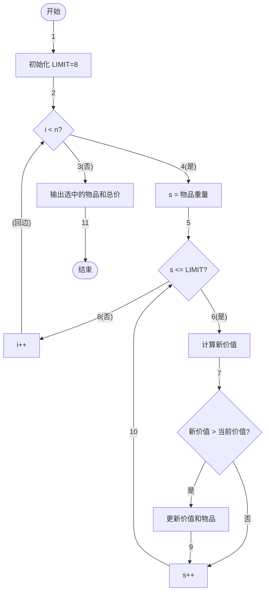

<center></center>

<h1 align="center">吉林大学软件学院</h1>

<h1 align="center">案例作业报告</h1>

**课程名称：软件质量保证与测试**

**案例主题：白盒测试方法—Z路径法**

**案例题目：25-背包负重问题**

**学生学号：55000000**

**学生姓名：**

**提交日期：**

【案例主题】白盒测试方法—Z路径法

【案例题目】25-背包负重问题

【案例目标】

以"背包负重问题"为例学习Z路径覆盖法。

【案例内容】

假设有一个背包的负重最多可达8公斤。在背包负重允许的范围内，选择装入背包的物品，使之获得最高的总价。

假设该物品是水果，水果的编号、单价与重量如下所示：

|  |  |  |  |
| --- | --- | --- | --- |
| 序号 | 物品名称 | 物品重量 | 物品价值 |
| 0 | 李子 | 4KG | 4500 |
| 1 | 苹果 | 5KG | 5700 |
| 2 | 橘子 | 2KG | 2250 |
| 3 | 草莓 | 1KG | 1100 |
| 4 | 甜瓜 | 6KG | 6700 |

程序说明：

背包问题是关于最佳化的问题，要解最佳化问题可以使用"动态规划"（Dynamic programming）。

从空集合开始，每增加一个元素就先求出该阶段的最佳解，直到所有的元素加入至集合中，最后得到的就是最佳解。

```c
#include "stdafx.h"

#define LIMIT 8 //重量限制

struct body

int size;

typedef struct body object;

int item[LIMIT+1] = {0};

object a[] = {{"李子",4,4500},

{"甜瓜",6,6700}};

for( s = a[i].size; s <= LIMIT; s++ )

newvalue = value[p] + a[i].price;

//找到阶段最佳解

}

printf( "物品\t价格\n" );

printf( "%s\t%d\n",

printf( "合计\t%d\n", value[LIMIT] );
```
【案例作业步骤】

1、画出程序流程图

根据【案例内容】中的程序说明和代码，画出程序流程图。

注意，程序流程图中每条边要用数字编号，用于后续表示测试路径。

使用画图工具，画完图之后将其截图，保存为（.jpg）格式，再粘贴到下方。

答案：

以下是用Mermaid绘制的背包负重问题程序流程图，边编号为1~11：



程序流程图说明：
- 节点1为程序开始；节点2为初始化变量（LIMIT=8，item数组和value数组初始化为0）。
- 边2→3为外层循环1的入口，判断"i < n"是否成立，遍历每种水果。
- 边3为循环1条件不成立时的出口，直接到节点11输出结果。
- 边4为循环1条件成立，进入循环体。
- 边5→节点5为中层循环2的入口，判断"s <= LIMIT"，重量从当前物品重量到上限遍历。
- 边6为循环2条件成立，进入内层处理。
- 边7→节点7为条件判断，比较newvalue与value[s]。
- 边8为循环2条件不成立，执行i++后回到外层循环。
- 边9→节点10为循环2的迭代（s++），回到循环2条件判断。
- 边10→节点5形成中层循环。
- 边11为程序结束。

2、制定测试策略

制定测试策略时，针对循环部分和循环以外的部分，可以采用不同的方法进行测试，以达到计划中设定的测试覆盖率。

现在，若计划中设定要达到100%的语句覆盖率，只采用Z路径覆盖法设计测试用例能否满足要求？

A.能

B.不能

|  |  |
| --- | --- |
| 你的答案： | B |

3、确定路径集合

注意，这里用1~3分别代表程序流程图中从上到下的三个循环。

"循环"填入1或0表示经过该循环或者跳过该循环。

本案例可以确定路径有（ 8 ）条。（填入阿拉伯数字）

"路径"填入程序流程图中以数字为标识的路径，如:1-2-3。若没有相应路径，填入"无"。

表3-1

|  |  |  |  |  |
| --- | --- | --- | --- | --- |
| 路径编号 | 循环 | | | 路径 |
| 1 | 2 | 3 |
| 1 | 0 | 0 | 0 | 1-2-3-11 |
| 2 | 0 | 0 | 1 | 1-2-3-10-11 |
| 3 | 0 | 1 | 0 | 无 |
| 4 | 0 | 1 | 1 | 无 |
| 5 | 1 | 0 | 0 | 1-2-4-5-8-11 |
| 6 | 1 | 0 | 1 | 1-2-4-5-8-9-10-11 |
| 7 | 1 | 1 | 0 | 1-2-4-5-6-7-8-11 |
| 8 | 1 | 1 | 1 | 1-2-4-5-6-7-8-9-10-11 |
| 9 |  |  |  |  |
| 10 |  |  |  |  |

4、设计测试用例并构造测试数据

①根据上一步确定的路径集合，本案例的测试用例一共可设计（ 8 ）条？（填入阿拉伯数字）

②设计测试用例及数据填入表4-1。

表4-1

|  |  |  |  |  |  |  |  |
| --- | --- | --- | --- | --- | --- | --- | --- |
| 用例号 | 路径编号 | 输入 | | | | 预期输出 | 实际输出 |
| 物品种类 | 重量限制 | 最小重量 | (物品,重量,价格) |
| 1 | 1 | 0 | 8 | 1 | — | 合计0 | 合计0 |
| 2 | 2 | 0 | 8 | 1 | — | 合计0 | 合计0 |
| 3 | 5 | 1 | 8 | 1 | (李子,9,4500) | 合计0 | 合计0 |
| 4 | 6 | 1 | 8 | 1 | (李子,9,4500) | 合计0 | 合计0 |
| 5 | 7 | 1 | 8 | 1 | (李子,4,4500) | 无输出 | 无输出 |
| 6 | 8 | 1 | 8 | 1 | (李子,4,4500) | 李子\t4500\n合计\t4500 | 李子\t4500\n合计\t4500 |
| 7 | 3 | 0 | 8 | 1 | — | 无 | 无 |
| 8 | 4 | 0 | 8 | 1 | — | 无 | 无 |

③请填写测试用例的覆盖率：执行测试用例条数 / 测试用例总条数 * 100% = （ 100.0 ）%（小数点后保留一位）
