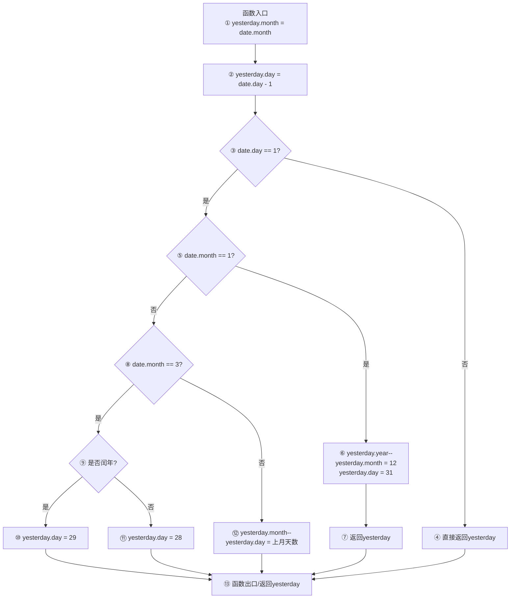

<center></center>

<h1 align="center">吉林大学软件学院</h1>

# 案例报告

**课程名称：软件质量保证与测试**

**案例主题：白盒测试方法—白盒综合**

**案例题目：27-前一天问题**

**学生学号：55000000**

**学生姓名：**

**提交日期：**

【案例主题】白盒测试方法—白盒综合

【案例题目】27-前一天问题

【案例目标】

使用白盒测试方法为"前一天问题"设计测试用例。

【案例内容】

前一日函数PreDate是NextDate的逆函数（代码实现如下），实现功能为：输入1800年到2050年之间的某个日期，函数返回这一天的前一天的日期。（此处不考虑无效输入）

```c
typedef struct MyDate{

int year;

int Leapyear( int year );

//输入日期有效性检查由其他模块实现，此处假设输入日期都是合法数据

yesterday.month = date.month; //initialization

//初始化每月天数，其中2月不确定，初始化为0

yesterday.day = date.day - 1;

if( date.month = 1 )

yesterday.month = 12;

else if( date.month = 3 )

{

}

yesterday.month = 2;

}

yesterday.month = date.month - 1;

}

int Leapyear( int year )

return 1;

Print( MyDate date )

}
```

【案例作业步骤】

1、制定测试策略

分别对程序进行静态测试和动态测试。

基于【案例内容】中程序代码较少，静态测试采取代码走查方法进行测试。

分析程序逻辑结构，可以发现程序中都是包含1个条件的if分支结构，逻辑结构比较简单。

因此，动态测试采取基本路径覆盖法设计测试用例就可以覆盖所有的路径。

最后，采取程序插桩技术验证测试用例。

2、执行静态测试

人工静态分析主要是保证代码算法的逻辑正确性（尽量通过人工检查发现代码的逻辑错误）、清晰度、规范性、一致性、算法高效性。并尽可能的发现程序中没有发现的错误。

本案例中我们采用代码走查方法对程序进行静态测试，根据代码规范将走查结果显示在表2-1。（"BUG数"一列中填入阿拉伯数字）

表2-1

|  |  |  |  |  |
| --- | --- | --- | --- | --- |
| 编号 | 问题 | 是 | 否 | BUG数 |
| 基本要求 | | | | |
| 1 | 程序结构清晰，简单易懂，单个函数的程序行数不得超过200行 | 是 |  | 0 |
| 2 | 使用括号避免二义性 |  | 否 | 2 |
| 可读性要求 | | | | |
| 1 | 保持注释与代码完全一致 |  | 否 | 1 |
| 2 | 每个函数都有函数头说明 |  | 否 | 2 |
| 3 | 主要变量（结构、联合、类或对象）定义或引用时，注释能反映其含义 |  | 否 | 1 |
| 4 | 利用缩进来显示程序的逻辑结构，缩进量一致并以Tab键为单位 |  | 否 | 1 |
| 5 | 循环、分支层次不要超过五层 | 是 |  | 0 |
| 结构化要求 | | | | |
| 1 | 必须明确指明函数的返回类型 |  | 否 | 2 |
| 2 | 不适用条件赋值语句 |  | 否 | 2 |
| 正确性和容错性要求 | | | | |
| 1 | 所有变量在调用前必须被初始化 |  | 否 | 1 |

3、执行动态测试

①依据基本路径法设计测试用例

①画出流图

注意，绘图时要使用【案例内容】中PreDate函数给出的语句标号做为节点名称。

使用画图工具，画完图之后将其截图，保存为（.jpg）格式，再粘贴到下方。

答案：

以下是用Mermaid绘制的PreDate函数控制流图（节点编号1~13）：



控制流图说明：
- 节点1为函数入口，初始化yesterday.month = date.month。
- 节点2将yesterday.day设为date.day - 1。
- 节点3判断date.day是否为1：如果不是1号（否分支→节点4），直接返回前一天。
- 节点5判断date.month是否为1：如果是1月（是分支→节点6），跨年处理，yesterday.year减1，月份设为12，日期设为31。
- 节点8判断date.month是否为3：如果是3月（是分支→节点9），需判断闰年。
- 节点9调用Leapyear判断闰年：闰年则节点10（day=29），平年则节点11（day=28）。
- 如果不是3月（节点8否分支→节点12），月份减1，日期设为上月的最后一天。
- 节点13为函数出口，所有路径最终汇聚于此返回yesterday。

②计算环形复杂度

根据上面的控制流图，计算出环形复杂度 = （ 5 ）（填入阿拉伯数字）

③基本路径集设计

表3-1

|  |  |
| --- | --- |
| 路径编号 | 基本路径 |
| 1 | 1→2→3→4（日期不是1号，直接返回前一天） |
| 2 | 1→2→3→5→6→7（1月1日，跨年到前一年12月31日） |
| 3 | 1→2→3→5→8→9→10（3月1日，闰年返回2月29日） |
| 4 | 1→2→3→5→8→9→11（3月1日，平年返回2月28日） |
| 5 | 1→2→3→5→8→12→13（其他月份1日，返回上月月末） |
| 6 |  |
| 7 |  |
| 8 |  |
| 9 |  |
| 10 |  |

④设计测试用例并确定测试数据

根据以上步骤的分析，本案例的测试用例一共可设计（ 7 ）条？（填入阿拉伯数字）

设计测试用例及数据填入表3-2。

表3-2

|  |  |  |  |  |  |  |  |
| --- | --- | --- | --- | --- | --- | --- | --- |
| 用例号 | 输入 | | | 预期输出 | | | 实际  输出 |
| 年 | 月 | 日 | 年 | 月 | 日 |
| 1 | 2024 | 3 | 15 | 2024 | 3 | 14 | 2024/03/14 |
| 2 | 2024 | 1 | 1 | 2023 | 12 | 31 | 2023/12/31 |
| 3 | 2024 | 3 | 1 | 2024 | 2 | 29 | 2024/02/29 |
| 4 | 2023 | 3 | 1 | 2023 | 2 | 28 | 2023/02/28 |
| 5 | 2024 | 5 | 1 | 2024 | 4 | 30 | 2024/04/30 |
| 6 | 2024 | 4 | 1 | 2024 | 3 | 31 | 2024/03/31 |
| 7 | 2024 | 2 | 1 | 2024 | 1 | 31 | 2024/01/31 |
| 8 |  |  |  |  |  |  |  |
| 9 |  |  |  |  |  |  |  |
| 10 |  |  |  |  |  |  |  |
