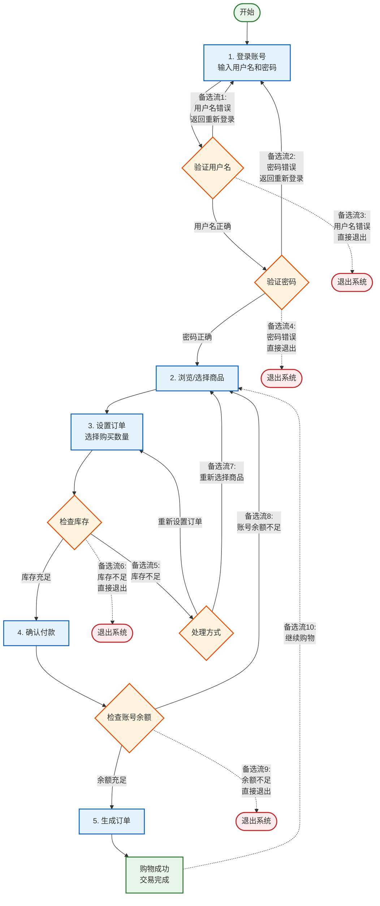

<h1 align="center">吉林大学软件学院</h1>

<h1 align="center">案例作业报告</h1>

**课程名称：软件质量保证与测试**

**案例主题：灰盒测试—场景法**

**案例题目：28-网购流程**

**学生学号：55000000**

**学生姓名：**

**提交日期：**

【案例主题】灰盒测试—场景法

【案例题目】28-网购流程

【案例目标】

以网购流程的案例为例，学习使用场景法设计测试用例的方法。

【案例内容】

用户进入网上购物网站进行购物，这时需要登录帐号，选择商品，设置订单，确认后付款，最后生成订单，完成此次购物。

我们通过这个购物系统来学习场景法基本知识，并通过案例步骤理解场景法的案例操作步骤。

【案例作业步骤】

1、根据案例分析画出事件流示意图

登录网购系统需要输入用户名、密码。验证登录成功后可以浏览商品、设置订单，确认并付款成功后生成订单。生成订单即表示整个网购活动成功。

设置订单时，如果库存不足可以重新设置订单或重新选择商品；付款时，如果账号余额不足，可以返回浏览商品；生成订单后，还可以返回浏览商品，继续购物；另外，登录不成功或遇到库存不足、账号余额不足的情况也可以直接退出登录。

请根据上面的描述，打开画图工具，画出事件流示意图，然后将其截图，保存为（.jpg）格式，再粘贴到下方。

答案：

**下图采用Mermaid流程图(flowchart TD)绘制，自上而下展示网购系统的基本流和10个备选流。矩形节点表示流程步骤，菱形节点表示判断条件，虚线箭头表示备选流的分支路径。**

**上图说明：** 事件流示意图展示了网购系统的完整流程。蓝色矩形表示基本流的5个主要步骤；橙色菱形表示关键判断节点；绿色矩形表示流程起点和成功终点；红色圆角矩形表示退出终点；虚线箭头表示10个备选流的分支路径。基本流为：登录账号→选择商品→设置订单→确认付款→生成订单（成功结束）。

2、根据事件流示意图，确定"基本流"和"备选流"

1）根据上一步骤中画出的事件流示意图，请在下面选出所有备选流的选项。

A.用户名错误

B.用户名错误，直接退出

C.密码错误

D.密码错误，直接退出

E.库存不足

F.库存不足，直接退出

G.重新选择商品

H.账号余额不足

I.账户余额不足，直接退出

J.继续购物

K.修改订单

L.退出系统

|  |  |
| --- | --- |
| 你的答案： | ABCDEFGHIJ |

2）该案例的基本流、备选流已经给出，将选出的备选流按序号大小依次填入表2-1。

注：按次序排列多个备选流，如:备选流1、备选流2……

表2-1

|  |  |
| --- | --- |
| 基本流 | 登录账号，选择商品，设置订单，确认付款，生成订单 |
| 备选流1 | 用户名错误 |
| 备选流2 | 密码错误 |
| 备选流3 | 用户名错误，直接退出 |
| 备选流4 | 密码错误，直接退出 |
| 备选流5 | 库存不足 |
| 备选流6 | 库存不足，直接退出 |
| 备选流7 | 重新选择商品 |
| 备选流8 | 账号余额不足 |
| 备选流9 | 账户余额不足，直接退出 |
| 备选流10 | 继续购物 |
|  |  |
|  |  |

3、根据基本流和各项备选流生成不同的场景

1）设计测试场景

①选取一个合适的测试方法，根据事件流示意图，为"登录、生成订单"设计测试场景。

在下面的选项中选出"登录、生成订单"的测试场景。

A.成功购物

B.密码错误

C.密码错误，直接退出

D.用户名错误，直接退出

E.库存不足，重新选择商品

F.密码错误

G.库存不足

H.成功购物，继续购物

I.库存不足，直接退出

J.账号余额不足，直接退出

|  |  |
| --- | --- |
| 你的答案： | ACDEGHIJ |

根据选出的测试场景，完成表3-1。

表3-1

|  |  |  |
| --- | --- | --- |
| 场景描述 | 基本流 | 备选流 |
| 场景1：成功购物 | 基本流 | - |
| 场景2：用户名错误 | 基本流 | 备选流1 |
| 场景3：密码错误 | 基本流 | 备选流2 |
| 场景4：密码错误，直接退出 | 基本流 | 备选流4 |
| 场景5：用户名错误，直接退出 | 基本流 | 备选流3 |
| 场景6：库存不足 | 基本流 | 备选流5 |
| 场景7：库存不足，重新选择商品 | 基本流 | 备选流5+备选流7 |
| 场景8：成功购物，继续购物 | 基本流 | 备选流10 |

②选取一个合适的测试方法，根据事件流示意图，为"浏览商品、遇到问题、没有成功生成订单"设计测试场景。

在下面的选项中选出"浏览商品、遇到问题、没有成功生成订单"的测试场景。

A.成功购物

B.密码错误，直接退出

C.库存不足，账号余额不足

D.账号余额不足，库存不足，直接退出

E.库存不足

F.成功购物，继续购物

G.库存不足，重新选择商品

H.重新选择商品，账号余额不足，退出

I.密码错误

J.库存不足，直接退出

K.用户名错误，直接退出

L.账号余额不足，直接退出

|  |  |
| --- | --- |
| 你的答案： | BCDEHJKL |

根据选出的测试场景，完成表3-2。

表3-2

|  |  |  |
| --- | --- | --- |
| 场景描述 | 基本流 | 备选流 |
| 场景1：密码错误，直接退出 | 基本流 | 备选流4 |
| 场景2：库存不足 | 基本流 | 备选流5 |
| 场景3：库存不足，直接退出 | 基本流 | 备选流6 |
| 场景4：用户名错误，直接退出 | 基本流 | 备选流3 |
| 场景5：账号余额不足，直接退出 | 基本流 | 备选流9 |
| 场景6：库存不足，账号余额不足 | 基本流 | 备选流5+备选流8 |
| 场景7：重新选择商品，账号余额不足，退出 | 基本流 | 备选流7+备选流8+备选流9 |
| 场景8：账号余额不足，库存不足，直接退出 | 基本流 | 备选流8+备选流5+备选流6 |
|  |  |  |
|  |  |

4、根据场景生成相应的测试用例

①通过上面的步骤的分析，可以设计（ 15 ）条测试用例？（填入阿拉伯数字）

②参照给出的两条测试用例，完成表4-1。

注：用V表示"有效"、用I表示"无效"、用N/A表示"不适用"。

表4-1

|  |  |  |  |  |  |  |
| --- | --- | --- | --- | --- | --- | --- |
| 测试用例号 | 输入 | | | | | 预期输出 |
| 用户名 | 密码 | 购买数量 | 商品库存 | 余额 |
| 1 | V | V | V | V | V | 提示"交易成功" |
| 2 | I | V | N/A | N/A | N/A | 提示"用户名错误！" |
| 3 | V | I | N/A | N/A | N/A | 提示密码错误 |
| 4 | I | V | N/A | N/A | N/A | 提示用户名错误（直接退出） |
| 5 | V | I | N/A | N/A | N/A | 提示密码错误（直接退出） |
| 6 | V | V | V | I | V | 提示库存不足 |
| 7 | V | V | V | I | V | 提示库存不足请重新选择商品 |
| 8 | V | V | V | V | V | 提示交易成功（继续购物） |
| 9 | V | V | V | I | V | 提示库存不足直接退出 |
| 10 | V | V | V | V | I | 提示账号余额不足 |
| 11 | V | V | V | V | I | 提示账号余额不足直接退出 |
| 12 | V | V | V | I | I | 提示库存不足且余额不足 |
| 13 | V | V | I | V | V | 提示购买数量无效 |
| 14 | V | V | V | V | V | 提示交易成功（重新选择后） |
| 15 | V | I | N/A | N/A | N/A | 提示密码错误（重试后成功） |
|  |  |  |  |  |  |  |
|  |  |  |  |  |  |  |

5、对生成的所有测试用例重新复审，去掉多余的测试用例。测试用例确定后，对每一个测试用例确定测试数据。

参照给出的测试数据示例，完成表5-1。

表5-1

|  |  |  |  |  |  |  |  |
| --- | --- | --- | --- | --- | --- | --- | --- |
| 测试用例号 | 输入 | | | | | 预期输出 | 实际结果 |
| 用户名 | 密码 | 购买  数量 | 商品  库存 | 余额 |
| 1 | admin | admin | 2 | 100 | 1000 | 提示"交易成功" |  |
| 2 | Admin | admin | N/A | N/A | N/A | 提示"用户名错误！" |  |
| 3 | admin | wrong | N/A | N/A | N/A | 提示密码错误 | 提示密码错误 |
| 4 | Admin | admin | N/A | N/A | N/A | 提示用户名错误 | 提示用户名错误 |
| 5 | admin | wrong | N/A | N/A | N/A | 提示密码错误 | 提示密码错误 |
| 6 | admin | admin | 2 | 1 | 1000 | 提示库存不足 | 提示库存不足 |
| 7 | admin | admin | 2 | 1 | 1000 | 提示库存不足请重新选择商品 | 提示库存不足请重新选择商品 |
| 8 | admin | admin | 2 | 100 | 1000 | 提示交易成功 | 提示交易成功 |
| 9 | admin | admin | 2 | 1 | 1000 | 提示库存不足直接退出 | 提示库存不足直接退出 |
| 10 | admin | admin | 2 | 100 | 10 | 提示账号余额不足 | 提示账号余额不足 |
| 11 | admin | admin | 2 | 100 | 10 | 提示账号余额不足直接退出 | 提示账号余额不足直接退出 |
| 12 | admin | admin | 2 | 1 | 10 | 提示库存不足且余额不足 | 提示库存不足且余额不足 |
| 13 | admin | admin | 0 | 100 | 1000 | 提示购买数量无效 | 提示购买数量无效 |
| 14 | admin | admin | 2 | 100 | 1000 | 提示交易成功 | 提示交易成功 |
| 15 | admin | wrong | N/A | N/A | N/A | 提示密码错误 | 提示密码错误 |
|  |  |  |  |  |  |  |  |
|  |  |  |  |  |  |  |  |
