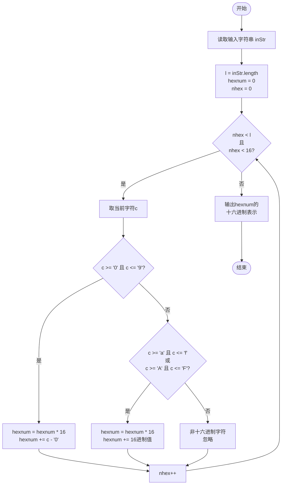
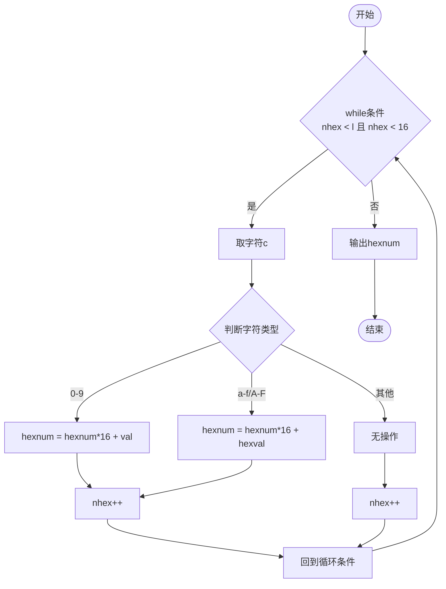

<center></center>

<h1 align="center">吉林大学软件学院</h1>

<h1 align="center">案例作业报告</h1>

**课程名称：软件质量保证与测试**

**案例主题：灰盒测试—控制流测试**

**案例题目：29-字符转换**

**学生学号：55000000**

**学生姓名：**

**提交日期：**

【案例主题】灰盒测试—控制流测试

【案例题目】29-字符转换

【案例目标】

以字符转换为例学习控制流测试法。

【案例内容】

下面是一个简单的程序，把十六进制字符输入转换成一个整型数。它显示了所转换的十六进制字符的数量以及它们的值以十六进制显示，它忽略非十六进制字符。注意，程序最多只能输入16个字符。

```java
import java.io.*;

    public static void main( String[] args ) throws Exception {
    
        BufferedReader strin = new BufferedReader(
    
            new InputStreamReader( System.in )
    
        );
    
        int l = inStr.length();
    
            String c = inStr.substring(
    
                Integer.parseInt( nhex + "" ) - 1,
    
                Integer.parseInt( nhex + "" )
    
            );
    
                case "5": case "6": case "7": case "8": case "9":
    
                    break;
    
                    hexnum \*= 16;
    
                case "A": case "B": case "C":
    
                    hexnum += Integer.parseInt( c, 16 );
    
                    break;
    
        System.out.println( Long.toHexString( hexnum ) );
```

【案例作业步骤】

1、画出程序流程图

打开画图工具，画完图之后，将其截图，保存为（.jpg）格式，再粘贴到下方。

答案：

以下是用Mermaid绘制的字符转换程序流程图：



程序流程图说明：
- 程序从开始节点读取输入字符串。
- 初始化变量：字符串长度l、十六进制数值hexnum=0、字符计数nhex=0。
- 进入while循环（节点3），判断条件为nhex < l 且 nhex < 16。
- 如果条件为假，直接输出hexnum的十六进制表示并结束。
- 如果条件为真，取当前字符c（节点4）。
- 判断字符是否为0-9（节点5）：是则更新hexnum（节点6），然后nhex++（节点9）。
- 如果不是0-9，再判断是否为a-f/A-F（节点7）：是则更新hexnum（节点8），然后nhex++。
- 如果都不是，则为无效字符，直接nhex++（节点9）。
- nhex++后回到循环条件判断（节点3），继续处理下一个字符。

2、画出流图

根据程序流程图画出对应的流图。注意：流图中各节点用阿拉伯数字表示，用于后续标识测试路径。

打开画图工具，画完图之后，将其截图，保存为（.jpg）格式，再粘贴到下方。

答案：

以下是用Mermaid绘制的字符转换程序流图（控制流图），节点编号为1~11：



流图说明：
- 节点1为程序开始。
- 节点2为while循环条件判断（nhex < l 且 nhex < 16）。
- 节点3为取当前字符c。
- 节点4为判断字符类型的分支节点（0-9、a-f/A-F、其他）。
- 节点5为0-9字符处理（hexnum更新）。
- 节点6为a-f/A-F字符处理（hexnum更新）。
- 节点7为其他字符处理（无操作）。
- 节点8为nhex++（5和6之后合并）。
- 节点9为nhex++（7之后）。
- 节点10为循环回边，回到节点2。
- 节点11为输出结果。
- 节点12为程序结束。

3、设计测试用例和测试数据

①确定一个路径集

①为语句、分支、条件和循环的全覆盖创建一套测试用例集。测试用例集中可设计（ 7 ）条测试用例？（填入阿拉伯数字）

②设计测试用例及数据填入表3-1。"路径"填入程序运行的顺序，用流图中各节点的阿拉伯数字来表示，如1-2-3-4-5-6……的形式。

注意，表格不必填满，但不够时要自行增添行数。

表3-1

|  |  |  |  |
| --- | --- | --- | --- |
| 用例编号 | 路径 | 输入 | 预期输出 |
| 语句覆盖 | | | |
| 语句覆盖 | 1-2-3-4-5-6-7-8-9-10-11 | 5A3 | a |
|  | 1-2-3-4-6-7-8-9-10-11 | A | a |
|  | 1-2-3-4-7-8-9-10-11 | a | a |
| 分支覆盖 | 1-2-3-4-5-8-9-2-10-11 | 5 | 5 |
|  | 1-2-3-4-6-8-9-2-10-11 | A | a |
| 分支覆盖 | | | |
|  | 1-2-3-4-7-8-9-2-10-11 | a | a |
|  | 1-2-3-4-8-9-2-10-11 | x | 0 |
|  | 1-2-3-4-8-9-2-10-11 |  | 0 |
| 条件覆盖 | 1-2-3-4-5-8-9-2-10-11 | 5 | 5 |
|  | 1-2-10-11 |  | 0 |
| 条件覆盖 | | | |
|  | 1-2-3-4-5-8-9-2-3-4-6-8-9-2-3-4-7-8-9-2-3-4-8-9-2-10-11 | 5Aax | a |
| 循环 | 1-2-10-11 |  | 0 |
|  | 1-2-3-4-5-8-9-2-10-11 | 5 | 5 |
|  | 1-2-3-4-5-8-9-2-3-4-6-8-9-2-3-4-7-8-9-2-10-11 | 5Aa | 16a |
|  |  |  |  |
| 循环 | | | |
|  |  |  |  |
|  |  |  |  |
|  |  |  |  |
|  |  |  |  |
|  |  |  |  |

②计算流图的McCabe复杂性（环形复杂度），给出基本路径集合，并创建基本路径测试用例。

①计算McCabe复杂性（环形复杂度）

环形复杂度 = （ 5 ）（填入阿拉伯数字）

②列出基本路径，创建基本路径测试用例

"路径"填入程序运行的顺序，用流图中各节点的阿拉伯数字来表示，如1-2-3-4-5-6……的形式。

注意，表格不必填满，但不够时要自行增添行数。

表3-2

|  |  |  |  |  |
| --- | --- | --- | --- | --- |
| 用例编号 | 路径 | 输入 | 预期输出 | 实际输出 |
| 1 | 1-2-10-11 |  | 0 | 0 |
| 2 | 1-2-3-4-5-8-9-2-10-11 | 5 | 5 | 5 |
| 3 | 1-2-3-4-6-8-9-2-10-11 | A | a | a |
| 4 | 1-2-3-4-7-8-9-2-10-11 | a | a | a |
| 5 | 1-2-3-4-8-8-9-2-10-11 | x | 0 | 0 |
|  |  |  |  |  |
|  |  |  |  |  |
|  |  |  |  |  |
|  |  |  |  |  |
|  |  |  |  |  |
