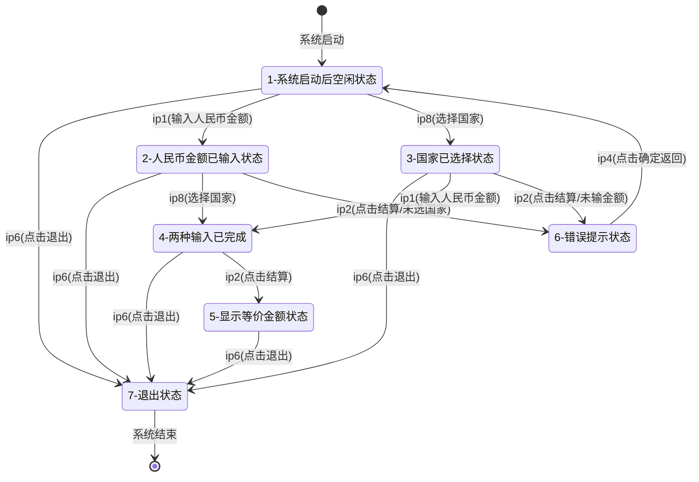

<h1 align="center">吉林大学软件学院</h1>

<h1 align="center">案例作业报告</h1>

**课程名称：软件质量保证与测试**

**案例主题：灰盒测试—状态图法**

**案例题目：31-货币转换器**

**学生学号：55000000**

**学生姓名：**

**提交日期：**

【案例主题】灰盒测试—状态图法

【案例题目】31-货币转换器

【案例目标】

以货币转换器案例为例学习采用状态图法设计测试用例。

【案例内容】

货币转换器实现把"人民币"按照汇率转换成对等的"加拿大"、"英国"、"美国"、"法国"的货币。

货币转换器的组成：

货币转换器由三部分组成。第一部分为人民币金额的输入和等价金额的显示；第二部分为国家的选择；第三部分为结算按钮和退出按钮。

人民币金额：用户在人民币金额输入框中输入人民币金额。

等价金额：显示用户输入人民币金额和选择国家后通过汇率计算的等价金额。

选择国家：国家有"加拿大"、"英国"、"美国"、"法国"等国家，用户必须在其中任选一种国家。

结算按钮：用户在输入人民币金额和选择完国家后，点击结算按钮，会在等价金额中显示相应金额。

退出按钮：点击退出按钮，退出货币转换器。

【案例作业步骤】

1、找出程序的所有动作，并进行编号

在下面的选项中找出用户能够向软件输入的每一个独立的动作：

注：画状态图时，动作编号用ip+下列选项前面的数字表示，如ip1。

①在人民币金额框中输入数据

②点击"结算"按钮

③显示等价金额

④在提示错误消息中点击"确定"按钮

⑤系统启动后,处于空闲状态

⑥点击"退出"按钮

⑦两种输入已完

⑧选择国家

|  |  |
| --- | --- |
| 你的答案： | ①②④⑥⑧ |

2、找出程序的所有状态

可以认为用户每输入一个动作就会使程序的状态发生变化。

在下面的选项中找出程序的所有状态：

注：画状态图时，状态编号用下列选项前面的数字表示，如1。

①系统启动后,处于空闲状态

②人民币金额已输入状态

③国家已选择状态

④两种输入已完成

⑤显示等价金额状态

⑥错误提示状态

⑦退出状态

⑧国家未选择状态

⑨人民币金额未输入状态

⑩系统未启动,处于空闲状态

|  |  |
| --- | --- |
| 你的答案： | ①②③④⑤⑥⑦ |

3、找出什么动作会导致什么状态发生，画出状态图

动作用箭头表示,箭头上标记该动作的编号。

使用画图工具，画完图之后将其截图，保存为（.jpg）格式，再粘贴在下方。

答案：

**下图采用Mermaid状态图(stateDiagram-v2)绘制，展示了货币转换器的7个状态及其之间的转换关系。状态用节点表示，箭头上的标注（如ip1、ip2等）表示触发状态转换的动作编号。**

**上图说明：** 状态转换图展示了货币转换器的7个状态和13条状态转换路径。状态1为系统启动后的初始空闲状态；状态2和3分别表示单一输入完成；状态4表示两种输入均已完成；状态5为显示等价金额的正常结束状态之一；状态6为错误提示状态，用户点击确定后返回空闲状态；状态7为退出状态，表示系统结束。箭头上标注的ip编号对应用户的输入动作。

4、确定所有的状态序列

①根据状态转换图，用基本路径覆盖法找出所有的状态序列。

②在下面的选项中，选出本案例所有的状态序列。注意，一条状态序列就是一条独立路径。

A.1-7

B.1-3-7

C.1-3-4-7

D.1-3-4-5-7

E.1-6-7

F.1-3-6-7

G.1-2-4-5-7

H.1-2-7

I.1-2-6-7

J.1-3-4-5-6-7

K.1-2-4-5-7-8-9-10

L.1-6-7-8-9-10

|  |  |
| --- | --- |
| 你的答案： | ABCDFGHI |

5、设计测试用例并构造测试数据

①根据步骤4中找出的独立路径设计测试用例，一共可设计（ 8 ）条测试用例？（填入阿拉伯数字）

②设计测试用例及数据填入表5-1。

对于人民币和汇率内容输入错误的情况没有考虑，所以需要补充两条测试数据。

表5-1
| 标号 | 输入动作 | 预期结果 | 实际结果 |
| --- | --- | --- | --- |
| 1 | 启动系统，点击退出按钮 | 系统退出 | 系统退出 |
| 2 | 启动系统，选择国家，点击退出按钮 | 系统退出 | 系统退出 |
| 3 | 启动系统，选择国家，输入人民币金额，点击退出按钮 | 系统退出 | 系统退出 |
| 4 | 启动系统，选择国家，输入人民币金额，点击结算按钮 | 显示等价金额 | 显示等价金额 |
| 5 | 启动系统，输入人民币金额，选择国家，点击结算按钮 | 显示等价金额 | 显示等价金额 |
| 6 | 启动系统，输入人民币金额，点击退出按钮 | 系统退出 | 系统退出 |
| 7 | 启动系统，输入人民币金额，点击结算按钮 | 提示错误信息 | 提示错误信息 |
| 8 | 启动系统，选择国家，点击结算按钮 | 提示错误信息 | 提示错误信息 |
| 9 | 启动系统，输入非数字人民币金额，选择国家，点击结算按钮 | 提示输入错误 | 提示输入错误 |
| 10 | 启动系统，输入负数人民币金额，选择国家，点击结算按钮 | 提示输入错误 | 提示输入错误 |
