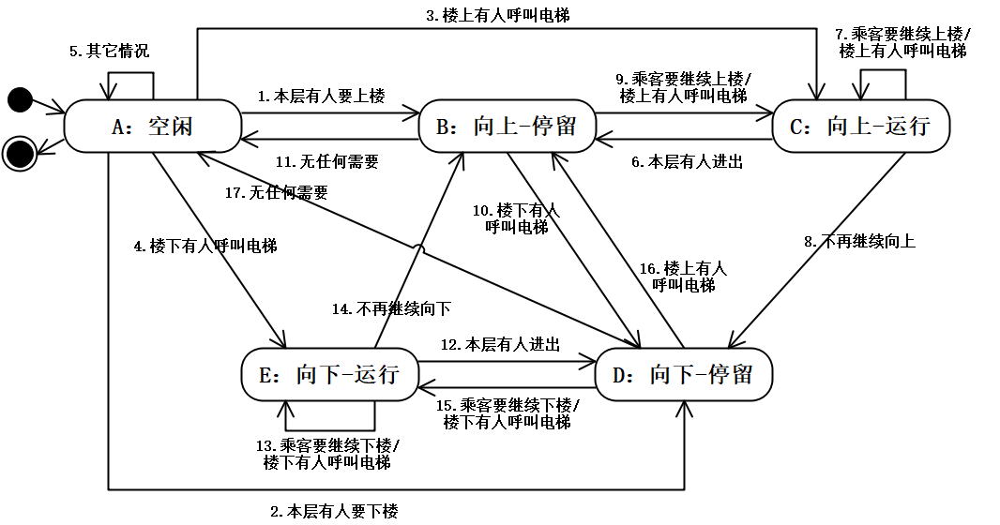

<h1 align="center">吉林大学软件学院</h1>

<h1 align="center">案例作业报告</h1>

**课程名称：软件质量保证与测试**

**案例主题：面向对象类级测试**

**案例题目：35-乘电梯问题**

**学生学号：55000000**

**学生姓名：**

**提交日期：**

【案例主题】面向对象类级测试

【案例题目】35-乘电梯问题

【案例目标】

为电梯程序中的类Elevator设计单元测试用例

【案例内容】

Elevator类的说明如下：

电梯有5种状态：“空闲”，“向上-运行”，“向上-停留”，“向下-运行”，“向下-停留”。

其中：

当无人要乘坐电梯时，电梯为空闲状态；

当电梯向上运行且有人进入电梯时，电梯为“向上-停留”状态；

当电梯向上运行且无人进入电梯时，电梯为“向上-运行”状态；

当电梯向下运行且有人进入电梯时，电梯为“向下-停留”状态；

当电梯向下运行且无人进入电梯时，电梯为“向下-运行”状态。

每个楼层乘客有3种情况：“<无>”，“等待中”，“电梯中”。

本题约束：电梯程序设计用于5层楼房，一次最多可载4人。

【案例作业步骤】

1、使用状态转换图法设计测试用例

（1）找出程序的所有状态

①根据【案例内容】中的描述，请在下面的选项中找出电梯的所有状态：

A.空闲

B.进入电梯

C.向上运行

D.向下停留

E.运行

F.向下运行

G.向上停留

H.无人乘坐

|  |  |
| --- | --- |
| 你的答案： | ACDFG |

（2）画出状态图

本案例将状态图直接给出，如图1-1。

图1-1

（3）找出所有状态序列

根据状态转换图，用基本路径法找出所有的状态序列，填入表1-2。填入“状态序列”时，状态以图1-1中状态的代号表即可。如:A-C-B。

注意,一条状态序列就是一条测试用例。

表1-2

|  |  |
| --- | --- |
| **编号** | **状态序列** |
| **1** | A-B-A |
| **2** | A-B-C-A |
| **3** | A-B-C-B-A |
| **4** | A-B-C-B-C-A |
| **5** | A-D-A |
| **6** | A-D-E-A |
| **7** | A-D-E-D-A |
| **8** | A-D-E-D-E-A |
| **9** | A-B-A-D-A |
| **10** | A-D-A-B-A |
| **11** | A-B-C-A-D-E-A |
| **12** | A-D-E-A-B-C-A |
| **13** | A-B-C-B-A-D-E-A |
| **14** | A-B-B-A |
| **15** | A-D-D-A |
| **16** | A-B-C-D-E-A |

（4）设计测试用例并构造测试数据

①根据上面步骤的分析，本案例可设计（ 15 ）条测试用例？（填入阿拉伯数字）

②根据测试用例设计测试数据，完成表1-3。

“前提条件”填入电梯所在楼层，这时电梯处于空闲状态；

“情景描述”填入电梯运行的情况描述。

没有测试数据的测试用例，在“输入”栏填入“无数据”。

表1-3

|  |  |  |  |  |
| --- | --- | --- | --- | --- |
| **用例编号** | **输入** | | **预期输出** | **实际输出** |
| **前提条件** | **情景描述** |
| 1 | 1楼空闲 | 无请求，电梯保持空闲 | 电梯保持空闲 | 电梯保持空闲 |
| 2 | 1楼空闲 | 3楼上行请求，运行中无人进入 | 电梯上行运行后回空闲 | 电梯上行运行后回空闲 |
| 3 | 1楼空闲 | 3楼上行请求，运行中有人进入 | 电梯上行停留后回空闲 | 电梯上行停留后回空闲 |
| 4 | 1楼空闲 | 3楼、5楼上楼请求，停留后继续上行 | 上行停留后继续上行，到5楼后空闲 | 上行停留后继续上行，到5楼后空闲 |
| 5 | 1楼空闲 | 5楼上楼请求，电梯上行运行 | 电梯上行运行后回空闲 | 电梯上行运行后回空闲 |
| 6 | 5楼空闲 | 3楼下楼请求，运行中无人进入 | 电梯下行运行后回空闲 | 电梯下行运行后回空闲 |
| 7 | 5楼空闲 | 3楼下楼请求，运行中有人进入 | 电梯下行停留后回空闲 | 电梯下行停留后回空闲 |
| 8 | 5楼空闲 | 3楼、1楼下楼请求，停留后继续下行 | 下行停留后继续下行，到1楼后空闲 | 下行停留后继续下行，到1楼后空闲 |
| 9 | 5楼空闲 | 1楼下楼请求，电梯下行运行 | 电梯下行运行后回空闲 | 电梯下行运行后回空闲 |
| 10 | 1楼空闲 | 3楼上楼请求，有人进入，继续到5楼 | 上行停留后继续上行到5楼后空闲 | 上行停留后继续上行到5楼后空闲 |
| 11 | 5楼空闲 | 3楼下楼请求，有人进入，继续到1楼 | 下行停留后继续下行到1楼后空闲 | 下行停留后继续下行到1楼后空闲 |
| 12 | 3楼空闲 | 5楼上楼请求，电梯上行运行 | 电梯上行运行后回空闲 | 电梯上行运行后回空闲 |
| 13 | 3楼空闲 | 1楼下楼请求，电梯下行运行 | 电梯下行运行后回空闲 | 电梯下行运行后回空闲 |
| 14 | 1楼空闲 | 3楼上楼请求，停留后乘客全部离开 | 电梯上行停留后空闲 | 电梯上行停留后空闲 |
| 15 | 5楼空闲 | 3楼下楼请求，停留后乘客全部离开 | 电梯下行停留后空闲 | 电梯下行停留后空闲 |
