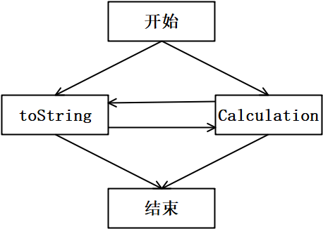

<center></center>

<h1 align="center">吉林大学软件学院</h1>

<h1 align="center">案例作业报告</h1>

**课程名称：软件质量保证与测试**

**案例主题：面向对象类簇级测试**

**案例题目：36-日期设置问题**

**学生学号：55000000**

**学生姓名：**

**提交日期：**

【案例主题】面向对象类簇级测试

【案例题目】36-日期设置问题

【案例目标】

通过“日期设置问题”案例学习采用面向对象单元测试（类簇）设计测试用例。

【案例内容】

本程序为输出不同国家日期表示形式。下面是实现类：

```c
import java.text.SimpleDateFormat;

//StandardDate类

curDate = aDate;

Calendar calendar = Calendar.getInstance();

curDate = calendar.getTime();

public String toString() {

SimpleDateFormat df =

new SimpleDateFormat( "yyyy-MM-dd" );

}

//ChinaDate类

"甲", "乙", "丙", "丁", "戊",

"已", "庚", "辛", "壬", "癸" };

public static final String[] earthBranch =

new String[] {

"子", "丑", "寅", "卯", "辰", "巳",

"午", "未", "申", "酉", "戌", "亥" };

}

public String toString() {

SimpleDateFormat df =

new SimpleDateFormat( "yyyy年MM月dd日 ");

public String Calculation() {

int year = calendar.get( Calendar.YEAR );

String s = skyBranch[t-1] + earthBranch[d-1];

}

public AmericaDate( Date aDate ) {

public String toString() {

SimpleDateFormat df =

new SimpleDateFormat( "MM-dd-yyyy" );

}

import java.util.Calendar;

int year = 2014;

Calendar calendar = Calendar.getInstance();

calendar.set( Calendar.DAY\_OF\_MONTH, day );

StandardDate sDate =

new StandardDate( calendar.getTime() );

System.out.println( sDate.toString() );
```

【案例作业步骤】

查看【案例内容】可以了解到：“ChinaDate”类和“AmericaDate”类这两个类都继承自“StandardDate”类。

所以【整体的测试策略】可以制定为：

1）首先测试“StandardDate”这个父类：可采用黑盒测试方法、白盒测试方法或灰盒测试方法设计父类的测试用例。

2）其次测试一个子类：

①首先将父类中的测试用例在子类的环境中执行；

②然后对子类特有的方法进行测试；

③最后对子类进行类级测试；

3）继续测试另一个子类：测试过程同上一个子类。

1、测试StandardDate父类

（1）制定测试策略

“StandardDate”类中的“toString”方法实现了输出有格式要求的日期，可采用等价类划分法设计测试用例；而“addDays”方法实现了在日期基础上添加相应天数，得到新的日期，对它可采取等价类划分法和边界值分析法设计测试用例。

（2）为“toString”方法设计测试用例并构造测试数据

案例描述中输入的year没有限制、1≤month≤12、1≤day≤31，因此划分有效等价类如下：

表1-1

|  |  |
| --- | --- |
| 编号 | 有效等价类 |
| 1 | 平年大月日期（如2024-01-15） |
| 2 | 平年小月日期（如2024-04-20） |
| 3 | 闰年2月日期（如2024-02-29） |
| 4 | 平年2月日期（如2023-02-28） |

①采用弱一般等价类划分法可设计（ 4 ）条测试用例？（填入阿拉伯数字）

②设计测试用例并构造测试数据填入表1-2。

表1-2

|  |  |  |  |
| --- | --- | --- | --- |
| 编号 | 输入数据 | 预期结果 | 实际结果 |
| 1 | 1984-02-02 | 甲子年 | 甲子年 |
| 2 | 2024-01-01 | 甲辰年 | 甲辰年 |
| 3 | 2025-01-01 | 乙巳年 | 乙巳年 |
| 4 | 2014-01-01 | 甲午年 | 甲午年 |

（3）为addDays方法设计测试用例并构造测试数据

①针对输入域，在弱一般等价类划分法的基础上，采用健壮性边界值分析法可设计（ 8 ）条测试用例？（填入阿拉伯数字）

②设计测试用例并构造测试数据填入表1-3。

表1-3

|  |  |  |  |
| --- | --- | --- | --- |
| 编号 | 输入数据 | 预期结果 | 实际结果 |
| 1 | -1001 | 日期向前1001天 | 日期向前1001天 |
| 2 | -1 | 日期向前1天 | 日期向前1天 |
| 3 | 0 | 日期不变 | 日期不变 |
| 4 | 1 | 日期向后1天 | 日期向后1天 |
| 5 | 30 | 日期向后30天 | 日期向后30天 |
| 6 | 365 | 日期向后365天 | 日期向后365天 |
| 7 | 366 | 闰年日期向后366天 | 闰年日期向后366天 |
| 8 | -365 | 日期向前365天 | 日期向前365天 |

2、增加一个子类ChinaDate，测试该子类

（1）制定测试策略

首先将父类的测试用例在ChinaDate子类的环境中重新测试一遍，然后选取一条有效的日期数据测试calculation方法中天干地支的计算是否正确,再对ChinaDate子类进行类级测试。

（2）在子类ChinaDate的环境中，重新执行父类StandardDate的测试用例

（3）为Calculation方法设计测试用例并构造测试数据

表2-1

|  |  |  |  |
| --- | --- | --- | --- |
| 编号 | 输入数据 | 预期结果 | 实际结果 |
| 1 | 1984-02-02 | 甲子年 | 甲子年 |
| 2 | 2024-01-01 | 甲辰年 | 甲辰年 |
| 3 | 2025-01-01 | 乙巳年 | 乙巳年 |
| 4 | 2014-01-01 | 甲午年 | 甲午年 |

（4）对子类ChinaDate进行类级测试

ChinaDate类中的函数调用图如下所示：



图2-1

根据上面的函数调用图，采用基本路径覆盖法对ChinaDate进行测试。因为前面已经对toString方法和calculation方法单独进行测试，因此我们只需再设计（ 2 ）条测试用例即可。（填入阿拉伯数字）

表2-2

|  |  |  |  |
| --- | --- | --- | --- |
| 编号 | 输入数据 | 预期结果 | 实际结果 |
| 1 | 构造ChinaDate(2024-06-05)，调用toString() | 输出2024年06月05日 | 输出2024年06月05日 |
| 2 | 构造ChinaDate(2024-06-05)，调用calculation() | 输出甲辰年 | 输出甲辰年 |
| 3 | 构造ChinaDate(2024-06-05)，先toString()后calculation() | 两者输出均正确 | 两者输出均正确 |
| 4 | 构造ChinaDate(2024-06-05)，先calculation()后toString() | 两者输出均正确 | 两者输出均正确 |

3、增加子类AmericaDate，测试该子类

（1）制定测试策略

AmericaDate只有toString方法，所以只需要在子类AmericaDate的环境中，重新执行父类StandardDate的测试用例即可。
